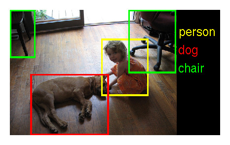
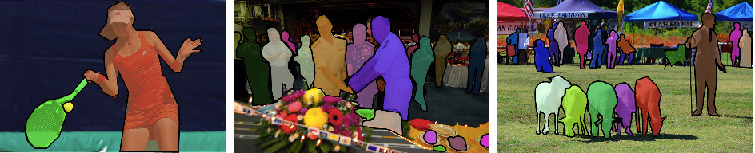
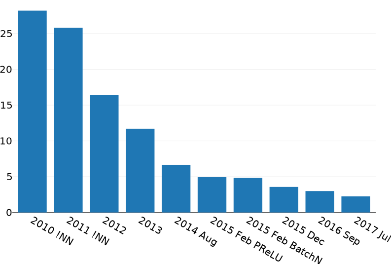
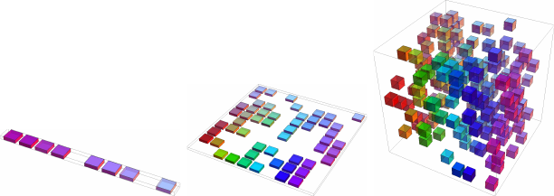
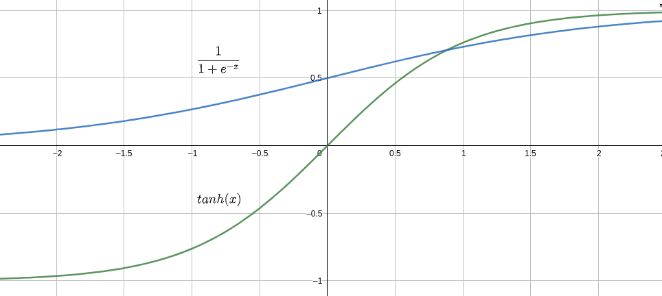
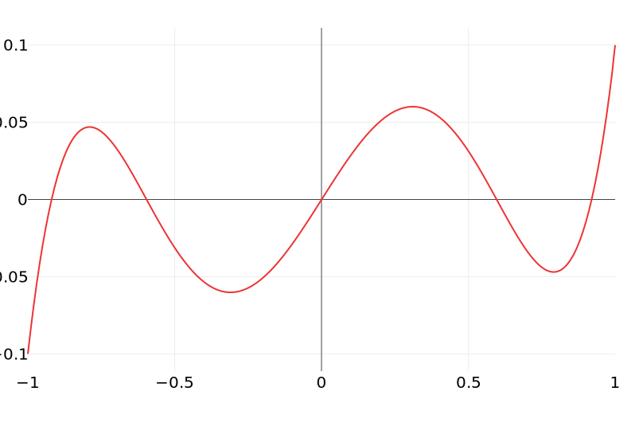
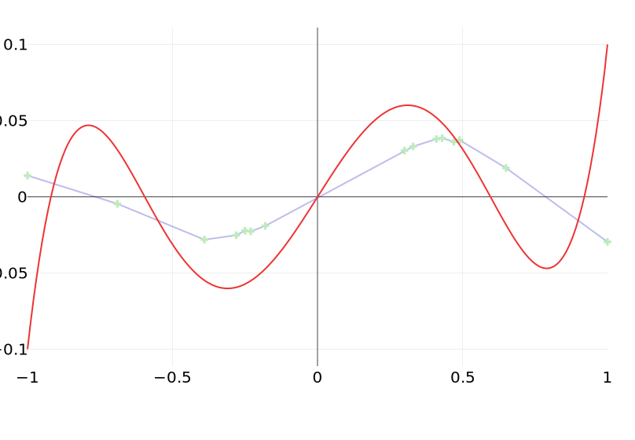
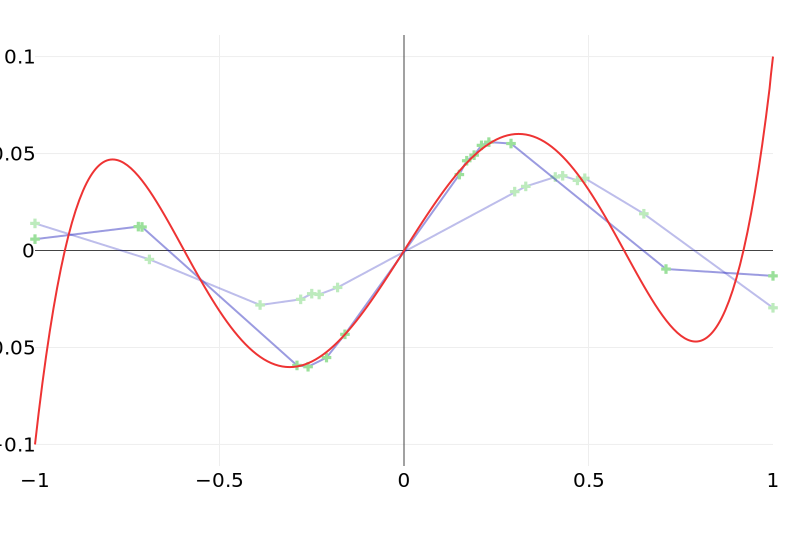
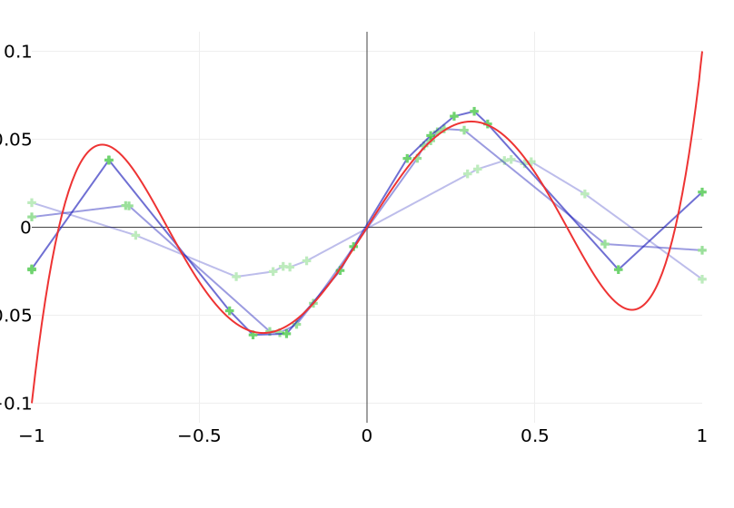
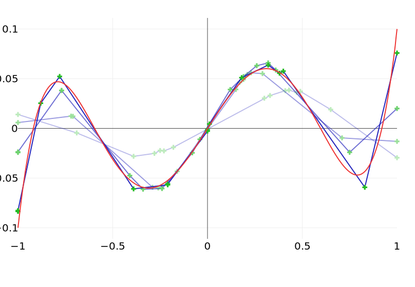

title: NPFL114, Lecture 1
class: title, langtech, cc-by-nc-sa
# Introduction to Deep Learning

## Milan Straka

### March 04, 2019

---
# Deep Learning Highlights
- Image recognition

~~~ ~
# Deep Learning Highlights

~~~ ~~
- Object detection
~~~ ~
# Deep Learning Highlights

~~~ ~~
- Image segmentation,
~~~ ~
# Deep Learning Highlights

~~~ ~~
- Human pose estimation
~~~ ~
# Deep Learning Highlights

~~~ ~~
- Image labeling
~~~ ~
# Deep Learning Highlights

~~~ ~~
- Visual question answering
~~~ ~
# Deep Learning Highlights

~~~ ~~
- Speech recognition and generation
~~~ ~
# Deep Learning Highlights

~~~ ~~
- Lip reading
~~~ ~
# Deep Learning Highlights

~~~ ~~
- Machine translation
~~~ ~
# Deep Learning Highlights

~~~ ~~
- Machine translation without parallel data
~~~ ~
# Deep Learning Highlights

~~~ ~~
- Chess, Go and Shogi
~~~ ~
# Deep Learning Highlights

~~~ ~~
- Multiplayer Capture the flag
~~~ ~
# Deep Learning Highlights

~~~ ~~

---
section: Notation
# Notation

- $a$, $→a$, $⇉A$, $⇶A$: scalar (integer or real), vector, matrix, tensor

- $⁇a$, $⁇→a$, $⁇⇉A$: scalar, vector, matrix random variable

~~~
- $\frac{df}{dx}$: derivative of $f$ with respect to $x$

- $\frac{∂f}{∂x}$: partial derivative of $f$ with respect to $x$

~~~
- $∇_→x f$: gradient of $f$ with respect to $→x$, i.e.,
  $\left(\frac{∂f(→x)}{∂x_1}, \frac{∂f(→x)}{∂x_2}, \ldots, \frac{∂f(→x)}{∂x_n}\right)$

---
section: Random Variables
# Random Variables
A random variable $⁇x$ is a result of a random process. It can be discrete or
continuous.

~~~
## Probability Distribution
A probability distribution describes how likely are individual values a random
variable can take.

The notation $⁇x ∼ P$ stands for a random variable $⁇x$ having a distribution $P$.

~~~
For discrete variables, the probability that $⁇x$ takes a value $x$ is denoted as
$P(x)$ or explicitly as $P(⁇x = x)$.

~~~
For continuous variables, the probability that the value of $⁇x$ lies in the interval
$[a, b]$ is given by $∫_a^b p(x)\d x$.

---
# Random Variables

## Expectation
The expectation of a function $f(x)$ with respect to discrete probability
distribution $P(x)$ is defined as:
$$𝔼_{⁇x ∼ P}[f(x)] ≝ ∑_x P(x)f(x)$$

For continuous variables it is computed as:
$$𝔼_{⁇x ∼ p}[f(x)] ≝ ∫_x p(x)f(x)\d x$$

~~~
Expectation is linear, i.e.,
$$𝔼_⁇x [αf(x) + βg(x)] = α𝔼_⁇x [f(x)] + β𝔼_⁇x [g(x)]$$

---
# Random Variables

## Variance
Variance measures how much the values of a random variable differ from the
expectation.
$$\Var(f(x)) ≝ 𝔼\left[\left(f(x) - 𝔼[f(x)]\right)^2\right]$$

---
# Common Probability Distributions
## Bernoulli Distribution
The Bernoulli distribution is a distribution over a binary random variable.
It has a single parameter $φ ∈ [0, 1]$, which specifies the probability of the random
variable being equal to 1.

~~~
## Categorical Distribution
Extension of the Bernoulli distribution to random variables taking one of $k$ different
discrete outcomes. It is parametrized by $→p ∈ [0, 1]^k$ such that $∑_{i=1}^{k} p_{i} = 1$.

---
section: Information Theory
# Information Theory

## Self Information

Amount of _surprise_ when a random variable is sampled.
~~~
- Should be zero for events with probability 1.
~~~
- Less likely events are more surprising.
~~~
- Independent events should have _additive_ information.

~~~
$$I(x) ≝ -\log P(x) = \log \frac{1}{P(x)}$$

~~~
## Entropy

Amount of _surprise_ in the whole distribution.
$$H(P) ≝ 𝔼_{⁇x∼P}[I(x)] = -𝔼_{⁇x∼P}[\log P(x)]$$

~~~
- for discrete $P$: $H(P) = -∑_x P(x) \log P(x)$
- for continuous $P$: $H(P) = -∫ P(x) \log P(x)\,\mathrm dx$

---
# Information Theory

## Cross-Entropy

$$H(P, Q) ≝ -𝔼_{⁇x∼P}[\log Q(x)]$$

~~~
- Gibbs inequality
    - $H(P, Q) ≥ H(P)$
    - $H(P) = H(P, Q) ⇔ P = Q$
~~~
    - Proof: Using Jensen's inequality, we get
      $$∑_x P(x) \log \frac{Q(x)}{P(x)} ≤ \log ∑_x P(x) \frac{Q(x)}{P(x)} = \log ∑_x Q(x) = 0.$$
~~~
    - Corollary: For a categorical distribution with $n$ outcomes, $H(P) ≤ \log n$,
    because for $Q(x) = 1/n$ we get $H(P) ≤ H(P, Q) = -∑_x P(x) \log Q(x) = \log n.$
~~~
- generally $H(P, Q) ≠ H(Q, P)$

---
# Information Theory

## Kullback-Leibler Divergence (KL Divergence)

Sometimes also called _relative entropy_.

$$D_\textrm{KL}(P || Q) ≝ H(P, Q) - H(P) = 𝔼_{⁇x∼P}[\log P(x) - \log Q(x)]$$

~~~
- consequence of Gibbs inequality: $D_\textrm{KL}(P || Q) ≥ 0$
- generally $D_\textrm{KL}(P || Q) ≠ D_\textrm{KL}(Q || P)$

---
# Nonsymmetry of KL Divergence

---
# Common Probability Distributions
## Normal (or Gaussian) Distribution
Distribution over real numbers, parametrized by a mean $μ$ and variance $σ^2$:
$$𝓝(x; μ, σ^2) = \sqrt{\frac{1}{2πσ^2}} \exp \left(-\frac{(x - μ)^2}{2σ^2}\right)$$

For standard values $μ=0$ and $σ^2=1$ we get $𝓝(x; 0, 1) = \sqrt{\frac{1}{2π}} e^{-\frac{x^2}{2}}$.

---
# Why Normal Distribution

## Central Limit Theorem
The sum of independent identically distributed random variables
with finite variance converges to normal distribution.

~~~
## Principle of Maximum Entropy
Given a set of constraints, a distribution with maximal entropy fulfilling the
constraints can be considered the most general one, containing as little
additional assumptions as possible.

~~~
Considering distributions with a given mean and variance, it can be proven
(using variational inference) that such a distribution with _maximal entropy_
is exactly the normal distribution.

---
section: Machine Learning
# Machine Learning

A possible definition of learning from Mitchell (1997):
>  A computer program is said to learn from experience E with respect to some
>  class of tasks T and performance measure P, if its performance at tasks in
>  T, as measured by P, improves with experience E.

~~~
- Task T
    - _classification_: assigning one of $k$ categories to a given input
    - _regression_: producing a number $x∈ℝ$ for a given input
    - _structured prediction_, _denoising_, _density estimation_, …
- Experience E
    - _supervised_: usually a dataset with desired outcomes (_labels_ or
      _targets_)
    - _unsupervised_: usually data without any annotation (raw text, raw images, …)
    - _reinforcement learning_, _semi-supervised learning_, …
- Measure P
    - _accuracy_, _error rate_, _F-score_, …

---
# Well-known Datasets

| Name | Description | Instances |
| ------ | ------------- | ----------- |
| [MNIST](http://yann.lecun.com/exdb/mnist/) | Images (28x28, grayscale) of handwritten digits. | 60k |
| [CIFAR-10](https://www.cs.toronto.edu/~kriz/cifar.html) | Images (32x32, color) of 10 classes of objects. | 50k |
| [CIFAR-100](https://www.cs.toronto.edu/~kriz/cifar.html) | Images (32x32, color) of 100 classes of objects (with 20 defined superclasses). | 50k |
| [ImageNet](http://image-net.org/) | Labeled object image database (labeled objects, some with bounding boxes). | 14.2M |
| [ImageNet-ILSVRC](http://image-net.org/challenges/LSVRC/) | Subset of ImageNet for Large Scale Visual Recognition Challenge, annotated with 1000 object classes and their bounding boxes. | 1.2M |
| [COCO](http://cocodataset.org/) | _Common Objects in Context_: Complex everyday scenes with descriptions (5) and highlighting of objects (91 types). | 2.5M |

---
class: middle
# Well-known Datasets
## ImageNet-ILSVRC

---
class: middle
# Well-known Datasets
## COCO

---
# Well-known Datasets

| Name | Description | Instances |
| ------ | ------------- | ----------- |
| [IAM-OnDB](http://www.fki.inf.unibe.ch/databases/iam-on-line-handwriting-database) | Pen tip movements of handwritten English from 221 writers. | 86k words |
| [TIMIT](https://catalog.ldc.upenn.edu/LDC93S1) | Recordings of 630 speakers of 8 dialects of American English. | 6.3k sents |
| [CommonVoice](https://voice.mozilla.org/data) | 400k recordings from 20k people, around 500 hours of speech. | 400k
| [PTB](https://catalog.ldc.upenn.edu/LDC99T42) | _Penn Treebank_: 2500 stories from Wall Street Journal, with POS tags and parsed into trees. | 1M words |
| [PDT](https://ufal.mff.cuni.cz/prague-dependency-treebank) | _Prague Dependency Treebank_: Czech sentences annotated on 4 layers (word, morphological, analytical, tectogrammatical). | 1.9M words |
| [UD](http://universaldependencies.org/) | _Universal Dependencies_: Treebanks of 76 languages with consistent annotation of lemmas, POS tags, morphology and syntax. | 129 treebanks |
| [WMT](http://statmt.org/) | Aligned parallel sentences for machine translation. | gigawords |

---
# ILSVRC Image Recognition Error Rates

~~~ ~
# ILSVRC Image Recognition Error Rates

---
# ILSVRC Image Recognition Error Rates

In summer 2017, a paper came out describing automatic generation of
neural architectures using reinforcement learning.

---
class: wide
# Introduction to Machine Learning History

---
# Curse of Dimensionality

---
# Machine and Representation Learning

---
section: Neural Nets '80s
# Neural Network Architecture à la '80s

---
# Neural Network Architecture

There is a weight on each edge, and an activation function $f$ is performed on the
hidden layers, and optionally also on the output layer.
$$h_i = f\left(∑_j w_{i,j} x_j\right)$$

If the network is composed of layers, we can use matrix notation and write:
$$→h = f\left(⇉W →x\right)$$

---
# Neural Network Activation Functions
## Output Layers
- none (linear regression if there are no hidden layers)

~~~
- $σ$ (sigmoid; logistic regression if there are no hidden layers)
  $$σ(x) ≝ \frac{1}{1 + e^{-x}}$$

~~~
- $\softmax$ (maximum entropy model if there are no hidden layers)
  $$\softmax(→x) ∝ e^→x$$
  $$\softmax(→x)_i ≝ \frac{e^{x_i}}{∑_j e^{x_j}}$$

---
# Neural Network Activation Functions
## Hidden Layers
- none (does not help, composition of linear mapping is a linear mapping)

~~~
- $σ$ (but works badly – nonsymmetrical, $\frac{dσ}{dx}(0) = 1/4$)

~~~
- $\tanh$
    - result of making $σ$ symmetrical and making derivation in zero 1
    - $\tanh(x) = 2σ(2x) - 1$
  

~~~
- ReLU
    - $\max(0, x)$

---
# Universal Approximation Theorem '89

Let $φ(x)$ be a nonconstant, bounded and monotonically-increasing continuous function.

Then for any $ε > 0$ and any continuous function $f$ on $[0, 1]^m$ there exists
an $N ∈ ℕ, v_i ∈ ℝ, b_i ∈ ℝ$ and $→{w_i} ∈ ℝ^m$, such that if we denote
$$F(→x) = ∑_{i=1}^N v_i φ(→{w_i} \cdot →x + b_i)$$
then for all $x ∈ [0, 1]^m$
$$|F(→x) - f(→x)| < ε.$$

---
# Evolving ReLU Approximation

~~~ ~
# Evolving ReLU Approximation

~~~ ~
# Evolving ReLU Approximation

~~~ ~
# Evolving ReLU Approximation

~~~ ~
# Evolving ReLU Approximation

