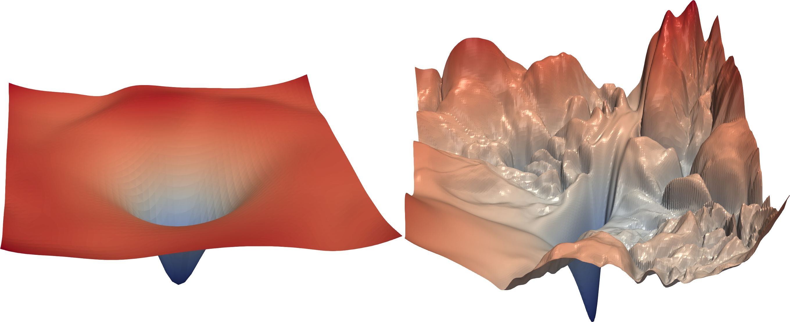
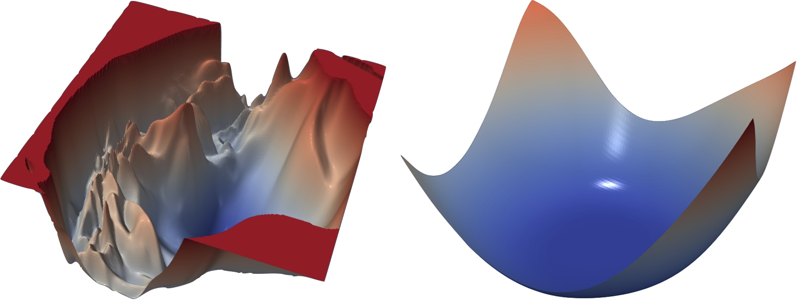
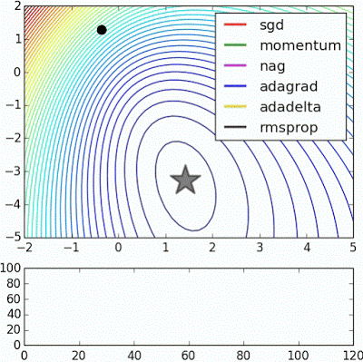
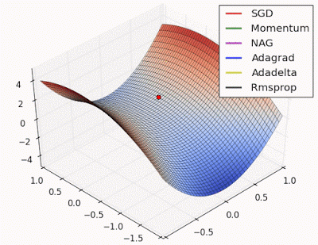
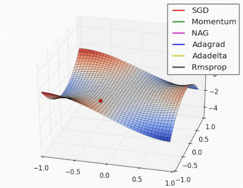

title: NPFL114, Lecture 2
class: title, langtech, cc-by-nc-sa
style: .algorithm { background-color: #eee; padding: .5em }
# Training Neural Networks

## Milan Straka

### March 2, 2020

---
section: ML Basics
# Estimators and Bias

An _estimator_ is a rule for computing an estimate of a given value, often an
expectation of some random value(s).

~~~
_Bias_ of an estimator is the difference of the expected value of the estimator
and the true value being estimated.

~~~
If the bias is zero, we call the estimator _unbiased_, otherwise we call it
_biased_.

~~~
If we have a sequence of estimates, it also might happen that the bias converges
to zero. Consider the well known sample estimate of variance. Given $⁇x_1,
\ldots, ⁇x_n$ idenpendent and identically distributed random variables, we might
estimate mean and variance as
$$μ̂ = \frac{1}{n} ∑\nolimits_i x_i,~~~σ̂_2 = \frac{1}{n} ∑\nolimits_i (x_i - μ̂)^2.$$
~~~
Such estimate is biased, because $𝔼[σ̂^2] = (1 - \frac{1}{n})σ^2$, but the bias
converges to zero with increasing $n$.

~~~
Also, an unbiased estimator does not necessarily have small variance – in some
cases it can have large variance, so a biased estimator with smaller variance
might be preferred.

---
# Machine Learning Basics

We usually have a **training set**, which is assumed to consist of examples
generated independently from a **data generating distribution**.

The goal of _optimization_ is to match the training set as well as possible.

~~~
However, the main goal of _machine learning_ is to perform well on _previously
unseen_ data, so called **generalization error** or **test error**. We typically
estimate the generalization error using a **test set** of examples independent
of the training set, but generated by the same data generating distribution.

---
# Machine Learning Basics

Challenges in machine learning:
- _underfitting_
- _overfitting_

~~~

---
# Machine Learning Basics

We can control whether a model underfits or overfits by modifying its _capacity_.
~~~
- representational capacity
- effective capacity

~~~

~~~
The **No free lunch theorem** (Wolpert, 1996) states that averaging over
_all possible_ data distributions, every classification algorithm achieves
the same _overall_ error when processing unseen examples. In a sense, no machine
learning algorithm is _universally_ better than others.

---
# Machine Learning Basics

Any change in a machine learning algorithm that is designed to _reduce
generalization error_ but not necessarily its training error is called
**regularization**.

~~~

$L_2$ regularization (also called weighted decay) penalizes models
with large weights (i.e., penalty of $||→θ||^2$).

---
# Machine Learning Basics

_Hyperparameters_ are not adapted by learning algorithm itself.

Usually a **validation set** or **development set** is used to
estimate the generalization error, allowing to update hyperparameters accordingly.

---
# Why do Neural Networks Generalize so Well

---
# Why do Neural Networks Generalize so Well

---
# Why do Neural Networks Generalize so Well

---
# Why do Neural Networks Generalize so Well

---
section: Loss
# Loss Function

A model is usually trained in order to minimize the _loss_ on the training data.

~~~

Assuming that a model computes $f(→x;→θ)$ using parameters $→θ$,
the _mean square error_ is computed as
$$\frac{1}{m} ∑_{i=1}^m \left(f(→x^{(i)}; →θ) - y^{(i)}\right)^2.$$

~~~

A common principle used to design loss functions is the _maximum likelihood
principle_.

---
# Maximum Likelihood Estimation

Let $𝕏 = \{→x^{(1)}, →x^{(2)}, \ldots, →x^{(m)}\}$ be training data drawn
independently from the data-generating distribution $p_\textrm{data}$. We denote
the empirical data distribution as $p̂_\textrm{data}$.

Let $p_\textrm{model}(→x; →θ)$ be a family of distributions. The
*maximum likelihood estimation* of $→θ$ is:

$$\begin{aligned}
→θ_\mathrm{ML} &= \argmax_→θ p_\textrm{model}(\mathbb X; →θ) \\
               &= \argmax_→θ ∏\nolimits_{i=1}^m p_\textrm{model}(→x^{(i)}; →θ) \\
               &= \argmin_→θ ∑\nolimits_{i=1}^m -\log p_\textrm{model}(→x^{(i)}; →θ) \\
               &= \argmin_→θ 𝔼_{⁇→x ∼ p̂_\textrm{data}} [-\log p_\textrm{model}(→x; →θ)] \\
               &= \argmin_→θ H(p̂_\textrm{data}, p_\textrm{model}(→x; →θ)) \\
               &= \argmin_→θ D_\textrm{KL}(p̂_\textrm{data}||p_\textrm{model}(→x; →θ)) \color{gray} + H(p̂_\textrm{data})
\end{aligned}$$

---
# Maximum Likelihood Estimation

MLE can be easily generalized to a conditional case, where our goal is to predict $y$ given $→x$:
$$\begin{aligned}
→θ_\mathrm{ML} &= \argmax_→θ p_\textrm{model}(\mathbb Y | \mathbb X; →θ) \\
               &= \argmax_→θ ∏\nolimits_{i=1}^m p_\textrm{model}(y^{(i)} | →x^{(i)}; →θ) \\
               &= \argmin_→θ ∑\nolimits_{i=1}^m -\log p_\textrm{model}(y^{(i)} | →x^{(i)}; →θ) \\
\end{aligned}$$

~~~
The resulting _loss function_ is called _negative log likelihood_, or
_cross-entropy_ or _Kullback-Leibler divergence_.

---
# Properties of Maximum Likelihood Estimation

Assume that the true data generating distribution $p_\textrm{data}$ lies within the model
family $p_\textrm{model}(⋅; →θ)$, and assume there exists a unique
$→θ_{p_\textrm{data}}$ such that $p_\textrm{data} = p_\textrm{model}(⋅; →θ_{p_\textrm{data}})$.

~~~
- MLE is a _consistent_ estimator. If we denote $→θ_m$ to be the parameters
  found by MLE for a training set with $m$ examples generated by the data
  generating distribution, then $→θ_m$ converges in probability to
  $→θ_{p_\textrm{data}}$.

  Formally, for any $ε > 0$, $P(||→θ_m - →θ_{p_\textrm{data}}|| > ε) → 0$
  as $m → ∞$.

~~~
- MLE is in a sense most _statistic efficient_. For any consistent estimator, we
  might consider the average distance of $→θ_m$ and $→θ_{p_\textrm{data}}$,
  formally $𝔼_{⁇→x_1, \ldots, ⁇→x_m ∼ p_\textrm{data}} [||→θ_m - →θ_{p_\textrm{data}}||_2^2]$.
  It can be shown (Rao 1945, Cramér 1946) that no consistent estimator has
  a lower mean squared error than the maximum likelihood estimator.

~~~
Therefore, for reasons of consistency and efficiency, maximum likelihood is
often considered the preferred estimator for machine learning.

---
# Mean Square Error as MLE

Assume our goal is to perform a regression, i.e., to predict $p(y | →x)$ for $y ∈ ℝ$.

~~~
Let $ŷ(→x; →θ)$ give a prediction of mean of $y$.

~~~
We define $p(y | →x)$ as $\N(y; ŷ(→x; →θ), σ^2)$ for a given fixed $σ$.
~~~
Then:
$$\begin{aligned}
\argmax_→θ p(y | →x; →θ) =& \argmin_→θ ∑_{i=1}^m -\log p(y^{(i)} | →x^{(i)} ; →θ) \\
                         =& -\argmin_→θ ∑_{i=1}^m \log \sqrt{\frac{1}{2πσ^2}}
                            e ^ {\normalsize -\frac{(y^{(i)} - ŷ(→x^{(i)}; →θ))^2}{2σ^2}} \\
                         =& -\argmin_→θ {\color{gray} m \log (2πσ^2)^{-1/2} +}
                            ∑_{i=1}^m -\frac{(y^{(i)} - ŷ(→x^{(i)}; →θ))^2}{2σ^2} \\
                         =& \argmin_→θ ∑_{i=1}^m \frac{(y^{(i)} - ŷ(→x^{(i)}; →θ))^2}{2σ^2} = \argmin_→θ ∑_{i=1}^m (y^{(i)} - ŷ(→x^{(i)}; →θ))^2.
\end{aligned}$$

---
section: Gradient Descent
# Gradient Descent

Let a model compute $f(→x;→θ)$ using parameters $→θ$, and for a given loss
function $L$ denote
$$J(→θ) = 𝔼_{(→x, y)∼p̂_\textrm{data}} L\big(f(→x; →θ), y\big).$$
~~~

Assuming we are minimizing an error function
$$\argmin_→θ J(→θ)$$
we may use _gradient descent_:
$$→θ ← →θ - α∇_→θJ(→θ)$$

~~~
The constant $α$ is called a _learning rate_ and specifies the “length”
of a step we perform in every iteration of the gradient descent.

---
# Gradient Descent Variants

## (Regular) Gradient Descent

We use all training data to compute $J(→θ)$.

~~~
## Online (or Stochastic) Gradient Descent

We estimate the expectation in $J(→θ)$ using a single randomly sampled example
from the training data. Such an estimate is unbiased, but very noisy.

$$J(→θ) ≈ L\big(f(→x; →θ), y\big)\textrm{~~for randomly chosen~~}(→x, y)\textrm{~~from~~}p̂_\textrm{data}.$$

~~~
## Minibatch SGD

The minibatch SGD is a trade-off between gradient descent and SGD – the
expectation in $J(→θ)$ is estimated using $m$ random independent examples from
the training data.

$$J(→θ) ≈ \frac{1}{m} ∑_{i=1}^m L\big(f(→x^{(i)}; →θ), y^{(i)}\big)
          \textrm{~~for randomly chosen~~}(→x^{(i)}, y^{(i)})\textrm{~~from~~}p̂_\textrm{data}.$$

---
# Stochastic Gradient Descent Convergence

It can be proven (under some reasonable conditions; see Robbins and Monro
algorithm, 1951) that if the loss function is convex and continuous, then SGD
converges to the unique optimum almost surely if the sequence of learning rates
$α_i$ fulfills the following conditions:
$$∑_i α_i = ∞,~~~∑_i α_i^2 < ∞.$$

~~~
For non-convex loss functions, we can get guarantees of converging to a _local_
optimum only.

~~~
Note that finding a global minimum of an arbitrary function is _at least NP-hard_.

---
# Stochastic Gradient Descent Convergence

Convex functions mentioned on a previous slide are such that for $x_1, x_2$
and real $0 ≤ t ≤ 1$,
$$f(tx_1 + (1-t)x_2) ≤ tf(x_1) + (1-t)f(x_2).$$

~~~
A twice-differentiable function is convex iff its second derivative is always
non-negative.

~~~
A local minimum of a convex function is always the unique global minimum.

~~~
Well-known examples of convex functions are $x^2$, $e^x$ and $-\log x$.

---
# Stochastic Gradient Descent Convergence

In 2018, there have been several improvements:
- Under some models with high capacity, it can be proven that SGD will reach
  global optimum by showing it will reach zero training error.
~~~

- Neural networks can be easily modified so that the augmented version has
  no local minimums. Therefore, if such a network converges, it converged
  to a global minimum. However, the training process can still fail to converge
  by increasing the size of the parameters $||→θ||$ beyond any limit.

---
class: wide
# Loss Function Visualization

Visualization of loss function of ResNet-56 (0.85 million parameters)
with/without skip connections:

---
class: wide
# Loss Function Visualization

Visualization of loss function of ResNet-110 without skip connections and DenseNet-121.

---
section: Backpropagation
# Backpropagation

Assume we want to compute partial derivatives of a given loss function $J$ and
let $\frac{∂J}{∂z}$ be known.

$$\begin{gathered}
\frac{∂J}{∂y_i} = \frac{∂J}{∂z} \frac{∂z}{∂y_i} = \frac{∂J}{∂z} \frac{∂g(→y)}{∂y_i} \\
\frac{∂J}{∂→x_i} = \frac{∂J}{∂z} \frac{∂z}{∂y_i} \frac{∂y_i}{∂→x_i} = \frac{∂J}{∂z} \frac{∂g(→y)}{∂y_i} \frac{∂f(→x_i)}{∂→x_i}
\end{gathered}$$

---
# Backpropagation Example

---
# Backpropagation Example

---
class: wide, center
# Backpropagation Example

~~~
This is meant to be frightening – you do **not** do this manually when training.

---
class: middle
# Backpropagation Algorithm

#### Forward Propagation

**Input**: Network with nodes $u^{(1)}, u^{(2)}, \ldots, u^{(n)}$ numbered in
topological order.  
Each node's value is computed as $u^{(i)} = f^{(i)}(\mathbb A^{(i)})$
for $\mathbb A^{(i)}$ being a set of values of the predecessors $P(u^{(i)})$ of
$u^{(i)}$.  
**Output**: Value of $u^{(n)}$.
- For $i = 1, \ldots, n$:
    - $\mathbb A^{(i)} ← \lbrace u^{(j)} | j ∈ P(u^{(i)})\rbrace$
    - $u^{(i)} ← f^{(i)}(\mathbb A^{(i)})$
- Return $u^{(n)}$

---
class: middle
# Backpropagation Algorithm

#### Simple Variant of Backpropagation

**Input**: The network as in the Forward propagation algorithm. 
**Output**: Partial derivatives $g^{(i)} = \frac{∂u^{(n)}}{∂u^{(i)}}$ of $u^{(n)}$ with respect to all $u^{(i)}$.
- Run forward propagation to compute all $u^{(i)}$
- $g^{(n)} = 1$
- For $i = n-1, \ldots, 1$:
    - $g^{(i)} ← ∑_{j:i∈P(u^{(j)})} g^{(j)} \frac{∂u^{(j)}}{∂u^{(i)}}$
- Return $→g$

In practice, we do not usually represent networks as collections of scalar
nodes; instead we represent them as collections of tensor functions – most
usually functions $f: ℝ^n → ℝ^m$. Then $\frac{∂f(→x)}{∂→x}$ is a Jacobian.
However, the backpropagation algorithm is analogous.

---
section: NN Training
# Neural Network Architecture à la '80s

---
# Neural Network Architecture à la '80s
There is a weight on each edge, and an activation function $f$ is performed on the
hidden layers, and optionally also on the output layer.
$$h_i = f\left(∑_j w_{i,j} x_j + b_i\right)$$

If the network is composed of layers, we can use matrix notation and write:
$$→h = f\left(⇉W →x + →b\right)$$

---
# Neural Networks and Biases

---
# Neural Network Activation Functions

## Hidden Layers Derivatives
- $σ$:
  $$\frac{dσ(x)}{dx} = σ(x) ⋅ (1-σ(x))$$
~~~
- $\tanh$:
  $$\frac{d\tanh(x)}{dx} = 1 - \tanh(x)^2$$
~~~
- ReLU:
  $$ \frac{d\ReLU(x)}{dx} = \begin{cases} 1 &\text{if } x > 0 \\ \textrm{NaN} &\text{if }x = 0 \\ 0 &\text{if } x < 0 \end{cases}$$

---
section: SGDs
class: middle
# Stochastic Gradient Descent

#### Stochastic Gradient Descent (SGD) Algorithm

**Input**: NN computing function $f(→x; →θ)$ with initial value of parameters $→θ$.  
**Input**: Learning rate $α$.  
**Output**: Updated parameters $→θ$.
- Repeat until stopping criterion is met:
    - Sample a minibatch of $m$ training examples $(→x^{(i)}, y^{(i)})$
    - $→g ← \frac{1}{m} ∇_{→θ} ∑_i L(f(→x^{(i)}; →θ), y^{(i)})$
    - $→θ ← →θ - α→g$

---
# SGD With Momentum

#### SGD With Momentum

**Input**: NN computing function $f(→x; →θ)$ with initial value of parameters $→θ$.  
**Input**: Learning rate $α$, momentum $β$.  
**Output**: Updated parameters $→θ$.
- Repeat until stopping criterion is met:
    - Sample a minibatch of $m$ training examples $(→x^{(i)}, y^{(i)})$
    - $→g ← \frac{1}{m} ∇_{→θ} ∑_i L(f(→x^{(i)}; →θ), y^{(i)})$
    - $→v ← β→v - α→g$
    - $→θ ← →θ + →v$

---
# SGD With Nesterov Momentum

#### SGD With Nesterov Momentum

**Input**: NN computing function $f(→x; →θ)$ with initial value of parameters $→θ$. 
**Input**: Learning rate $α$, momentum $β$. 
**Output**: Updated parameters $→θ$.
- Repeat until stopping criterion is met:
    - Sample a minibatch of $m$ training examples $(→x^{(i)}, y^{(i)})$
    - $→θ ← →θ + β→v$
    - $→g ← \frac{1}{m} ∇_{→θ} ∑_i L(f(→x^{(i)}; →θ), y^{(i)})$
    - $→v ← β→v - α→g$
    - $→θ ← →θ - α→g$

---
section: Adaptive LR
class: middle
# Algorithms with Adaptive Learning Rates

#### AdaGrad (2011)

**Input**: NN computing function $f(→x; →θ)$ with initial value of parameters $→θ$.  
**Input**: Learning rate $α$, constant $ε$ (usually $10^{-8}$).  
**Output**: Updated parameters $→θ$.
- Repeat until stopping criterion is met:
    - Sample a minibatch of $m$ training examples $(→x^{(i)}, y^{(i)})$
    - $→g ← \frac{1}{m} ∇_{→θ} ∑_i L(f(→x^{(i)}; →θ), y^{(i)})$
    - $→r ← →r + →g^2$
    - $→θ ← →θ - \frac{α}{\sqrt{→r + ε}}→g$

---
# Algorithms with Adaptive Learning Rates

AdaGrad has favourable convergence properties (being faster than regular SGD)
for convex loss landscapes. In this settings, gradients converge to zero
reasonably fast.

~~~
However, for non-convex losses, gradients can stay quite large for a long time.
In that case, the algorithm behaves as if decreasing learning rate by a factor
of $1/\sqrt{t}$, because if each
$$→g ≈ →g_0,$$
then after $t$ steps
$$→r ≈ t ⋅ →g_0^2$$
and therefore
$$\frac{α}{\sqrt{→r + ε}} ≈ \frac{α / \sqrt{t}}{\sqrt{→g_0^2 + ε/t}}.$$

---
# Algorithms with Adaptive Learning Rates

#### RMSProp (2012)

**Input**: NN computing function $f(→x; →θ)$ with initial value of parameters $→θ$.  
**Input**: Learning rate $α$, momentum $β$ (usually $0.9$), constant $ε$ (usually $10^{-8}$).  
**Output**: Updated parameters $→θ$.
- Repeat until stopping criterion is met:
    - Sample a minibatch of $m$ training examples $(→x^{(i)}, y^{(i)})$
    - $→g ← \frac{1}{m} ∇_{→θ} ∑_i L(f(→x^{(i)}; →θ), y^{(i)})$
    - $→r ← β→r + (1-β)→g^2$
    - $→θ ← →θ - \frac{α}{\sqrt{→r + ε}}→g$

~~~
However, after first step, $→r = (1-β)→g^2$, which for default $β=0.9$ is
$$→r = 0.1 →g^2,$$
a biased estimate (but the bias converges to zero exponentially fast).

---
# Algorithms with Adaptive Learning Rates

#### Adam (2014)

**Input**: NN computing function $f(→x; →θ)$ with initial value of parameters $→θ$.  
**Input**: Learning rate $α$ (default 0.001), constant $ε$ (usually $10^{-8}$).  
**Input**: Momentum $β_1$ (default 0.9), momentum $β_2$ (default 0.999).  
**Output**: Updated parameters $→θ$.
- $→s ← 0$, $→r ← 0$, $t ← 0$
- Repeat until stopping criterion is met:
    - Sample a minibatch of $m$ training examples $(→x^{(i)}, y^{(i)})$
    - $→g ← \frac{1}{m} ∇_{→θ} ∑_i L(f(→x^{(i)}; →θ), y^{(i)})$
    - $t ← t + 1$
    - $→s ← β_1→s + (1-β_1)→g$      _(biased first moment estimate)_
    - $→r ← β_2→r + (1-β_2)→g^2$   _(biased second moment estimate)_
    - $→ŝ ← →s / (1 - β_1^t)$, $→r̂ ← →r / (1 - β_2^t)$
    - $→θ ← →θ - \frac{α}{\sqrt{→r̂ + ε}}→ŝ$

---
# Algorithms with Adaptive Learning Rates

#### Adam (2014)

**Input**: NN computing function $f(→x; →θ)$ with initial value of parameters $→θ$.  
**Input**: Learning rate $α$ (default 0.001), constant $ε$ (usually $10^{-8}$).  
**Input**: Momentum $β_1$ (default 0.9), momentum $β_2$ (default 0.999).  
**Output**: Updated parameters $→θ$.
- $→s ← 0$, $→r ← 0$, $t ← 0$
- Repeat until stopping criterion is met:
    - Sample a minibatch of $m$ training examples $(→x^{(i)}, y^{(i)})$
    - $→g ← \frac{1}{m} ∇_{→θ} ∑_i L(f(→x^{(i)}; →θ), y^{(i)})$
    - $t ← t + 1$
    - $→s ← β_1→s + (1-β_1)→g$      _(biased first moment estimate)_
    - $→r ← β_2→r + (1-β_2)→g^2$   _(biased second moment estimate)_
    - $α_t ← α \sqrt{1 - β_2^t} / (1-β_1^t)$
    - $→θ ← →θ - \frac{α_t}{\sqrt{→r + ε}}→s$

---
# Adam Bias Correction

After $t$ steps, we have
$$→r_t = (1 - β_2) ∑_{i=1}^t β_2^{t-i}→g_i^2.$$

Assuming that the second moment $𝔼[→g_i^2]$ is stationary, we have
$$\begin{aligned}
𝔼[→r_t] &=  𝔼\left[(1 - β_2) ∑_{i=1}^t β_2^{t-i}→g_i^2\right] \\
        &=  𝔼[→g_t^2] ⋅ (1 - β_2) ∑_{i=1}^t β_2^{t-i} \\
        &=  𝔼[→g_t^2] ⋅ (1 - β_2^t)
\end{aligned}$$

and analogously for correction of $→s$.

---
# Adaptive Optimizers Animations

---
# Adaptive Optimizers Animations

---
# Adaptive Optimizers Animations

---
# Adaptive Optimizers Animations

---
section: LR Schedules
# Learning Rate Schedules

Even if RMSProp and Adam are adaptive, they still usually require carefully tuned
decreasing learning rate for top-notch performance.

~~~
- _Exponential decay_: learning rate is multiplied by a constant each
  batch/epoch/several epochs.

  - $α = α_\textrm{initial} ⋅ c^t$
  - Often used for convolutional networks (image recognition etc.).

~~~
- _Polynomial decay_: learning rate is multiplied by some polynomial of $t$.
~~~
  - _Inverse time decay_ uses $α = α_\textrm{initial} ⋅ \frac{1}{t}$ and has
    theoretical guarantees of convergence, but is usually too fast for deep
    neural networks.
~~~
  - _Inverse-square decay_ uses $α = α_\textrm{initial} ⋅ \frac{1}{\sqrt{t}}$
    and is currently used by best machine translation models.

~~~
- Cosine decay, restarts, warmup, …

~~~
The `tf.optimizers.schedules` offers several such learning rate schedules,
which can be passed to any Keras optimizer directly as a learning rate.
