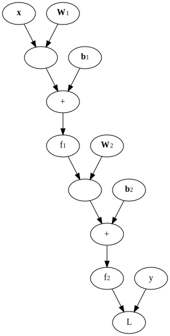
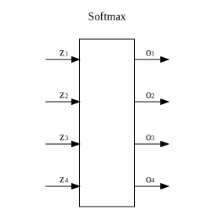
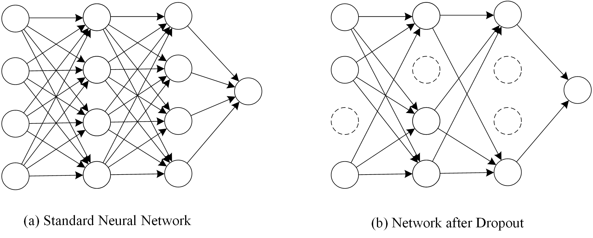

title: NPFL114, Lecture 3
class: title, langtech, cc-by-nc-sa

# Training Neural Networks II

## Milan Straka

### February 28, 2022

---
section: NNTraining
# Putting It All Together

Let us have a dataset with training, validation and test sets, each containing
examples $(→x, y)$. Depending on $y$, consider one of the following output
activation functions:
$$\begin{cases}
  \textrm{none} & \textrm{ if } y ∈ ℝ,\\
  σ & \textrm{ if } y \textrm{ is a probability of an outcome},\\
  \softmax & \textrm{ if } y \textrm{ is a gold class index out of $K$ classes (or a full distribution)}.
\end{cases}$$

If $→x ∈ ℝ^D$, we can use a neural network with an input layer of size $D$,
hidden layer of size $H$ with a non-linear activation function, and an output
layer of size $O$ (either 1 or number of classification classes) with the
mentioned output function.

~~~
_BTW, there are of course many functions, which could be used as output
activations instead of $σ$ and $\softmax$; however, $σ$ and $\softmax$ are
almost universally used. One of the reason is that they can be derived
using the maximum-entropy principle from a set of conditions, see the
[Machine Learning for Greenhorns (NPFL129) lecture 5 slides](https://ufal.mff.cuni.cz/~straka/courses/npfl129/2122/slides/?05).
Additionally, they are the inverses of [canonical link functions](https://en.wikipedia.org/wiki/Generalized_linear_model#Link_function)
of the Bernoulli and categorical distributions, respectively._

---
# Putting It All Together


~~~
We have
$$h_i = f^{(1)}\left(∑_j W^{(1)}_{i,j} x_j + b^{(1)}_i\right)$$
where
- $⇉W^{(1)} ∈ ℝ^{H×D}$ is a matrix of _weights_,
- $→b^{(1)} ∈ ℝ^H$ is a vector of _biases_,
- $f^{(1)}$ is an activation function.

~~~
The weights are sometimes also called a _kernel_.

~~~
The biases define general behaviour in case of zero/very small input.

~~~
Transformations of type $⇉W^{(1)} →x + →b$ are called _affine_ instead of _linear_.

--- -----
Similarly
$$o_i = f^{(2)}\left(∑_j W^{(2)}_{i,j} h_j + b^{(2)}_i\right)$$
with
- $⇉W^{(2)} ∈ ℝ^{O×H}$ another matrix of weights,
- $→b^{(2)} ∈ ℝ^O$ another vector of biases,
- $f^{(2)}$ being an output activation function.

---
# Putting It All Together

The parameters of the model are therefore $⇉W^{(1)}, ⇉W^{(2)}, →b^{(1)}, →b^{(2)}$ of total size
$D×H + H×O + H + O$.

~~~
To train the network, we repeatedly sample $m$ training examples and perform
SGD (or any of its adaptive variants), updating the parameters to minimize the
loss:

$$θ_i ← θ_i - α\frac{∂L}{∂θ_i},\textrm{~~or in vector notation,~~}→θ ← →θ - α\frac{∂L}{∂→θ}.$$

~~~
We set the hyperparameters (size of the hidden layer, hidden layer activation
function, learning rate, …) using performance on the validation set and evaluate
generalization error on the test set.

---
# Practical Issues

- Processing all data in _batches_.

~~~
- Vector representation of the network.

~~~
  Instead of $h_i = f^{(1)}\left(∑_j W^{(1)}_{i,j} x_j + b^{(1)}_i\right)$,
  we compute
  $$→h = f^{(1)}\left(⇉W^{(1)} →x + →b^{(1)}\right)$$
  $$→o = f^{(2)}\left(⇉W^{(2)} →h + →b^{(2)}\right) = f^{(2)}\left(⇉W^{(2)} \left(f^{(1)}\left(⇉W^{(1)} →x + →b^{(1)}\right)\right) + →b^{(2)}\right)$$

~~~
  The derivatives
  $$\frac{∂f^{(1)}\left(⇉W^{(1)} →x + →b^{(1)}\right)}{∂→x},
  \frac{∂f^{(1)}\left(⇉W^{(1)} →x + →b^{(1)}\right)}{∂⇉W^{(1)}}$$
  are then matrices (called _Jacobians_) or even higher-dimensional tensors.

---
class: center, middle
# Computation Graph


→


---
class: tablefull
# High Level Overview

|                 | Classical ('90s) | Deep Learning |
|-----------------|------------------|---------------|
|Architecture     | $\vdots\,\,\vdots\,\,\vdots$ | $\vdots\,\,\vdots\,\,\vdots\,\,\vdots\,\,\vdots\,\,\vdots\,\,\vdots\,\,\vdots\,\,\vdots\,\,\vdots$ &nbsp; CNN, RNN, Transformer, VAE, GAN, …
|Activation func. | $\tanh, σ$    | $\tanh$, ReLU, PReLU, ELU, GELU, Swish (SiLU), Mish, …
|Output function  | none, $σ$     | none, $σ$, $\softmax$
|Loss function    | MSE           | NLL (or cross-entropy or KL-divergence)
|Optimization     | SGD, momentum | SGD (+ momentum), RMSProp, Adam, SGDW, AdamW, …
|Regularization   | L2, L1        | L2, Dropout, Label smoothing, BatchNorm, LayerNorm, MixUp, WeightStandardization, …

---
section: Metrics&Losses
# Metrics and Losses

During training and evaluation, we use two kinds of error functions:
~~~
- **loss** is a _differentiable_ function used during training,
~~~
  - NLL, MSE, Huber loss, Hinge, …
~~~
- **metric** is any (and very often non-differentiable) function used during
  evaluation,
~~~
  - any loss, accuracy, F-score, BLEU, …
~~~
  - possibly even human evaluation.

~~~
In TensorFlow, the losses and metrics are available in `tf.losses` and
`tf.metrics` (aliases for `tf.keras.losses` and `tf.keras.metrics`).

---
# TF Losses

The `tf.losses` offer two sets of APIs. The current ones are loss classes like
```python
tf.losses.MeanSquaredError(
    reduction=tf.losses.Reduction.AUTO, name='mean_squared_error'
)
```

~~~
The created objects are subclasses of `tf.losses.Loss` and can be always called
with three arguments:
```python
__call__(y_true, y_pred, sample_weight=None)
```
which returns the loss of the given data, _reduced_ using the specified
reduction. If `sample_weight` is given, it is used to weight (multiply) the
individual batch example losses before reduction.

~~~
- `tf.losses.Reduction.SUM_OVER_BATCH_SIZE`, which is the default of `.AUTO`;
~~~
- `tf.losses.Reduction.SUM`;
~~~
- `tf.losses.Reduction.NONE`.

---
# TF Cross-entropy Losses

The cross-entropy losses need to specify also the distribution in question:
~~~
- `tf.losses.BinaryCrossentropy`: the gold and predicted distributions are
  Bernoulli distributions (i.e., a single probability);
~~~
- `tf.losses.CategoricalCrossentropy`: the gold and predicted distributions are
  categorical distributions;
~~~
- `tf.losses.SparseCategoricalCrossentropy`: a special case, where the gold
  distribution is one-hot distribution (i.e., a single correct class), which
  is represented as the gold _class index_; therefore, it has one less dimension
  than the predicted distribution.

~~~
These losses expect probabilities on input, but offer `from_logits` argument,
which can be used to indicate that logits are used instead of probabilities.

~~~
## Old losses API

In addition to the loss objects, `tf.losses` offers methods like
`tf.losses.mean_squared_error`, which process two arguments `y_true` and
`y_pred` and do not reduce the batch example losses.

---
# TF Metrics

There are two important differences between metrics and losses.
1. metrics may be non-differentiable;
~~~
1. metrics **aggregate** results over multiple batches.

~~~
The metric objects are subclasses of `tf.losses.Metric` and offer the following
methods:
- `update_state(y_true, y_pred, sample_weight=None)` updates the value of the
  metric and stores it;
~~~
- `result()` returns the current value of the metric;
~~~
- `reset_states()` clears the stored state of the metric.

~~~
The most common pattern is using the provided
```python
__call__(y_true, y_pred, sample_weight=None)
```
method, which is a combination of `update_state` followed by a `result()`.

---
# TF Metrics

Apart from analogues of the losses
- `tf.metrics.MeanSquaredError`
- `tf.metrics.BinaryCrossentropy`
- `tf.metrics.CategoricalCrossentropy`
- `tf.metrics.SparseCategoricalCrossentropy`

the `tf.metrics` module provides
~~~
- `tf.metrics.Mean` computing averaged mean;
~~~
- `tf.metrics.Accuracy` returning accuracy, which is an average number of examples
  where the prediction is equal to the gold value;
~~~
- `tf.metrics.BinaryAccuracy` returning accuracy of predicting a Bernoulli
  distribution (the gold value is 0/1, the prediction is a probability);
~~~
- `tf.metrics.CategoricalAccuracy` returning accuracy of predicting a Categorical
  distribution (the argmaxes of gold and predicted distributions are equal);
~~~
- `tf.metrics.SparseCategoricalAccuracy` is again a special case of
  `CategoricalAccuracy`, where the gold distribution is represented as the gold
  class _index_.

---
section: ∂Loss
# Derivative of MSE Loss

Given the MSE loss of
$$L = \big(y - ŷ(→x; →θ)\big)^2 = \big(ŷ(→x; →θ) - y\big)^2,$$
the derivative with respect to $ŷ$ is simply:
$$\frac{∂L}{ŷ(→x; →θ)} = 2\big(ŷ(→x; →θ) - y\big).$$

---
# Derivative of Softmax MLE Loss



Let us have a softmax output layer with
$$o_i = \frac{e^{z_i}}{∑_j e^{z_j}}.$$

---
# Derivative of Softmax MLE Loss

Consider now the MLE estimation. The loss for gold class index $\textit{gold}$ is then
$$L(\softmax(→z), \textit{gold}) = - \log o_\textit{gold}.$$

~~~
The derivation of the loss with respect to $→z$ is then
$$\begin{aligned}
\frac{∂L}{∂z_i} = \frac{∂}{∂z_i} \left[-\log \frac{e^{z_\textit{gold}}}{∑_j e^{z_j}}\right] 
                 =& -\frac{∂z_\textit{gold}}{∂z_i} + \frac{∂\log(∑_j e^{z_j})}{∂z_i} \\
                 =& -[\textit{gold} = i] + \frac{1}{∑_j e^{z_j}} e^{z_i} \\
                 =& -[\textit{gold} = i] + o_i.
\end{aligned}$$

~~~
Therefore, $\frac{∂L}{∂→z} = →o - →1_\textit{gold}$, where $→1_\textit{gold}$
is 1 at index $\textit{gold}$ and 0 otherwise.

---
# Derivative of Softmax MLE Loss


---
# Derivative of Softmax and Sigmoid MLE Losses

In the previous case, the gold distribution was _sparse_, with only one
target probability being 1.

In the case of general gold distribution $→g$, we have
$$L(\softmax(→z), →g) = -∑_i g_i \log o_i.$$
Repeating the previous procedure for each target probability, we obtain
$$\frac{∂L}{∂→z} = →o - →g.$$

~~~
## Sigmoid

Analogously, for $o = σ(z)$ we get $\frac{∂L}{∂z} = o - g$,
where $g$ is the target gold probability.

---
# Derivative of Softmax MLE Loss


---
section: Regularization
# Regularization

As already mentioned, regularization is any change in the machine learning
algorithm that is designed to reduce generalization error but not necessarily
its training error.

Regularization is usually needed only if training error and generalization error
are different. That is often not the case if we process each training example
only once. Generally the more training data, the better generalization
performance.

- Early stopping

- L2, L1 regularization

- Dataset augmentation

- Ensembling

- Dropout

- Label smoothing

---
# Regularization – Early Stopping


---
# L2 Regularization

We prefer models with parameters small under L2 metric.

The L2 regularization, also called _weight decay_, _Tikhonov regularization_ or
_ridge regression_ therefore minimizes
$$J̃(→θ; 𝕏) = J(→θ; 𝕏) + λ \|→θ\|_2^2$$
for a suitable (usually very small) $λ$.

During the parameter update of SGD, we get
$$θ_i ← θ_i - α\frac{∂J}{∂θ_i} - 2αλθ_i,\textrm{~~or in vector notation,~~}→θ ← →θ - α\frac{∂L}{∂→θ} - 2αλ→θ.$$

~~~
This can be also written as
$$θ_i ← θ_i (1 - 2αλ) - α\frac{∂J}{∂θ_i},\textrm{~~or in vector notation,~~}→θ ← →θ(1 - 2αλ) - α\frac{∂L}{∂→θ}.$$

---
# L2 Regularization


---
# L2 Regularization as MAP

Another way to arrive at L2 regularization is to utilize Bayesian inference.

~~~
With MLE we have
$$→θ_\mathrm{MLE} = \argmax_{→θ} p(𝕏; →θ).$$

~~~
Instead, we may want to maximize **maximum a posteriori (MAP)** point estimate:
$$→θ_\mathrm{MAP} = \argmax_{→θ} p(→θ; 𝕏)$$

~~~
Using Bayes' theorem
$$p(→θ; 𝕏) = p(𝕏; →θ) p(→θ) / p(𝕏),$$
we get
$$→θ_\mathrm{MAP} = \argmax_{→θ} p(𝕏; →θ)p(→θ).$$

---
# L2 Regularization as MAP

The $p(→θ)$ are prior probabilities of the parameter values (our _preference_).

A common choice of the preference is the _small weights preference_, where the mean is assumed to
be zero, and the variance is assumed to be $σ^2$. Given that we have no further
information, we employ the maximum entropy principle, which results in
$p(θ_i) = 𝓝(θ_i; 0, σ^2)$, so that $p(→θ) = ∏_i 𝓝(θ_i; 0, σ^2) = 𝓝(→θ; ⇉0, σ^2
⇉I).$
~~~
Then
$$\begin{aligned}
→θ_\mathrm{MAP} &= \argmax\nolimits_{→θ} p(𝕏; →θ)p(→θ) \\
                &= \argmax\nolimits_{→θ} ∏\nolimits_{i=1}^m p(→x^{(i)}; →θ)p(→θ) \\
                &= \argmin\nolimits_{→θ} ∑\nolimits_{i=1}^m -\log p(→x^{(i)}; →θ) - \log p(→θ).
\end{aligned}$$

~~~
By substituting the probability of the Gaussian prior, we get
$$→θ_\mathrm{MAP} = \argmin_{→θ} ∑_{i=1}^m -\log p(→x^{(i)}; →θ) {\color{gray} - \frac{c}{2} \log(2πσ^2)} + \frac{\|→θ\|_2^2}{2σ^2}.$$

---
# L1 Regularization

Similar to L2 regularization, but we prefer low L1 metric of parameters. We
therefore minimize
$$J̃(→θ; 𝕏) = J(→θ; 𝕏) + λ \|→θ\|_1$$

The corresponding SGD update is then
$$θ_i ← θ_i - α\frac{∂J}{∂→θ_i} - \operatorname{sign}(θ_i)αλ.$$

---
# Regularization – Dataset Augmentation

For some data, it is cheap to generate slightly modified examples.

- Image processing: translations, horizontal flips, scaling, rotations, color
  adjustments, …

~~~
  - Mixup (appeared in 2017)

  

~~~
- Speech recognition: noise, frequency change, …

~~~
- More difficult for discrete domains like text.

---
# Regularization – Ensembling

**Ensembling** (also called **model averaging** or in some contexts _bagging_) is a general technique
for reducing generalization error by combining several models. The models are
usually combined by averaging their outputs (either distributions or output
values in case of a regression).

~~~
The main idea behind ensembling it that if models have uncorrelated
(independent) errors, then by averaging model outputs the errors will cancel
out. If we denote the prediction of a model $y_i$ on a training example $(→x, y)$ as
$y_i(→x) = y + ε_i(→x)$, so that $ε_i(→x)$ is the model error on example $→x$,
the mean square error of the model is $𝔼\big[(y_i(→x) - t)^2\big] = 𝔼\big[ε_i^2(→x)\big].$

~~~
Because for uncorrelated identically distributed random values $⁇x_i$ we have
$$\Var\left(∑ ⁇x_i\right) = ∑ \Var(⁇x_i), \Var(a ⋅ ⁇x) = a^2 \Var(⁇x),$$
~~~
we get that $\Var\left(\frac{1}{n}∑ ⁇ε_i\right) = \frac{1}{n} ⋅ ∑ \frac{1}{n} \Var(⁇ε_i),$ so
the errors should decrease with the increasing number of models.

~~~
However, ensembling usually has high performance requirements.

---
# Regularization – Ensembling

There are many possibilities how to train the models to average:

- Generate different datasets by sampling with replacement (bagging).


~~~
- Use random different initialization.

~~~
- Average models from last hours/days of training.

---
section: Dropout
# Regularization – Dropout

How to design good universal features?

- In reproduction, evolution is achieved using gene swapping. The genes must not
  be just good with combination with other genes, they need to be universally
  good.

~~~
Idea of **dropout** by (Srivastava et al., 2014), in preprint since 2012.

~~~
When applying dropout to a layer, we drop each neuron independently with
a probability of $p$ (usually called **dropout rate**). To the rest of the
network, the dropped neurons have value of zero.

~~~


---
# Regularization – Dropout

Dropout is performed only when training, during inference no nodes are
dropped. However, in that case we need to _scale the activations down_
by a factor of $1-p$ to account for more neurons than usual.


---
# Regularization – Dropout

Alternatively, we might _scale the activations up_ during training by a factor
of $1/(1-p)$.


---
# Regularization – Dropout as Ensembling


---
# Regularization – Dropout Implementation

```python
def dropout(inputs, rate=0.5, training=False):
    def do_inference():
        return inputs

    def do_train():
        random_noise = tf.random.uniform(tf.shape(inputs))
        mask = tf.cast(random_noise >= rate, tf.float32)
        return inputs * mask / (1 - rate)

    if training:
        return do_train()
    else:
        return do_inference()
```

---
# Regularization – Dropout Effect


---
section: LabelSmoothing
# Regularization – Label Smoothing

Problem with softmax MLE loss is that it is _never satisfied_, always pushing
the gold label probability higher (but it saturates near 1).

~~~
This behaviour can be responsible for overfitting, because the network is always
commanded to respond more strongly to the training examples, not respecting
similarity of different training examples.

~~~
Ideally, we would like a full (non-sparse) categorical distribution of classes
for training examples, but that is usually not available.

~~~
We can at least use a simple smoothing technique, called _label smoothing_, which
allocates some small probability volume $α$ uniformly for all possible classes.

~~~
The target distribution is then
$$(1-α)→1_\textit{gold} + α \frac{→1}{\textrm{number~of~classes}}.$$

---
# Regularization – Label Smoothing


---
# Regularization – Good Defaults

When you need to regularize (your model is overfitting), then a good default strategy is to:

~~~
- use data augmentation if possible;

~~~
- use dropout on all hidden dense layers (not on the output layer), good default
  dropout rate is 0.5 (or use 0.3 if the model is underfitting);
~~~
- use L2 regularization for your convolutional networks;
~~~
- use label smoothing (start with 0.1);
~~~
- if you require best performance and have a lot of resources, also
  perform ensembling.

---
section: Convergence
# Convergence

The training process might or might not converge. Even if it does, it might
converge slowly or quickly.

~~~
A major issue of convergence of deep networks is to make sure that the gradient
with respect to all parameters is reasonable at all times, i.e., it does not
decrease or increase too much with depth or in different batches.

~~~
There are _many_ factors influencing the gradient, convergence and its speed, we
now mention three of them:
- saturating non-linearities,
- parameter initialization strategies,
- gradient clipping.

---
class: middle
# Convergence – Saturating Non-linearities


~~~


---
# Convergence – Parameter Initialization

Neural networks usually need random initialization to _break symmetry_.

- Biases are usually initialized to a constant value, usually 0.

~~~

- Weights are usually initialized to small random values, either with uniform or
  normal distribution.
   - The scale matters for deep networks!

~~~
   - Originally, people used $U\left[-\frac{1}{\sqrt n}, \frac{1}{\sqrt n}\right]$ distribution.

~~~
   - Xavier Glorot and Yoshua Bengio, 2010:
     _Understanding the difficulty of training deep feedforward neural networks_.

     The authors theoretically and experimentally show that a suitable way to
     initialize a $ℝ^{n×m}$ matrix is
     $$U\left[-\sqrt{\frac{6}{m+n}}, \sqrt{\frac{6}{m+n}}\right].$$

---
# Convergence – Parameter Initialization


---
# Convergence – Parameter Initialization


---
# Convergence – Gradient Clipping


---
# Convergence – Gradient Clipping


Using a given maximum norm, we may _clip_ the gradient.

~~~
$$→g ← \begin{cases}
  →g & \textrm{ if }\|→g\| ≤ c, \\
  c \frac{→g}{\|→g\|} & \textrm{ if }\|→g\| > c.
\end{cases}$$

~~~
Clipping can be performed per weight (parameter `clipvalue` of
`tf.optimizers.Optimizer`), per variable (`clipnorm`) or for the gradient as
a whole (`global_clipnorm`).
