title: NPFL114, Lecture 4
class: title, langtech, cc-by-nc-sa
style: .algorithm { background-color: #eee; padding: .5em }

# Convolutional Neural Networks

## Milan Straka

### March 7, 2022

---
section: Convolution
class: middle, center
# Going Deeper

# Going Deeper

---
# Convolutional Networks

Consider data with some structure (temporal data, speech, images, …).

~~~
Unlike densely connected layers, we might want:
~~~
- local interactions only;
~~~
- shift invariance (equal response everywhere);

  
~~~
- parameter sharing.

---
# 1D Convolution

---
# 2D Convolution

---
# 2D Convolution

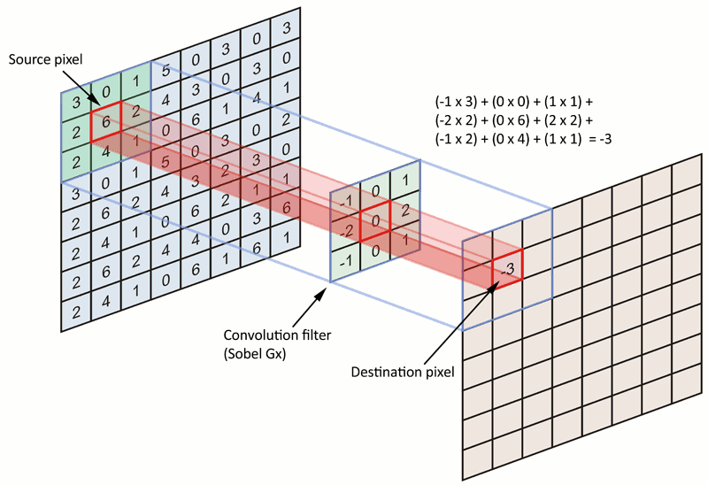

---
# Convolution Operation

For a functions $x$ and $w$, _convolution_ $w * x$ is defined as
$$(w * x)(t) = ∫x(t - a)w(a)\d a.$$

~~~
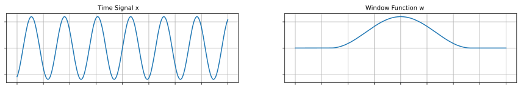

~~~
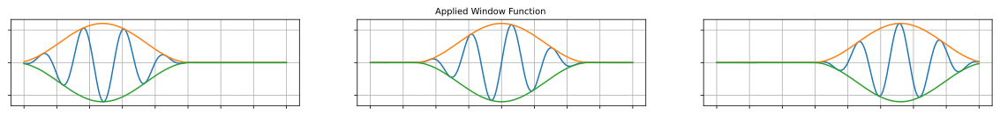

---
# Convolution Operation

For a functions $x$ and $w$, _convolution_ $w * x$ is defined as
$$(w * x)(t) = ∫x(t - a)w(a)\d a.$$

~~~

---
# Convolution Operation

For a functions $x$ and $w$, _convolution_ $w * x$ is defined as
$$(w * x)(t) = ∫x(t - a)w(a)\d a.$$

For vectors, we have
$$(→w * →x)_t = ∑\nolimits_i x_{t-i} w_i.$$

~~~
Convolution operation can be generalized to two dimensions by
$$(⇉K * ⇉I)_{i, j} = ∑\nolimits_{m, n} ⇉I_{i-m, j-n} ⇉K_{m, n}.$$

~~~
Closely related is _cross-correlation_, where $K$ is flipped:
$$(⇉K \star ⇉I)_{i, j} = ∑\nolimits_{m, n} ⇉I_{i+m, j+n} ⇉K_{m, n}.$$

---
section: CNNs
# Convolution Layer

The $K$ is usually called a **kernel** or a **filter**.

~~~
Note that usually we have a whole vector of values for a single pixel,
the so-called **channels**. These single pixel channel values have no longer any
spacial structure, so the kernel contains a different set of weights for every
input dimension, obtaining

$$(⇶K \star ⇶I)_{i, j} = ∑_{m, n, c} ⇶I_{i + m, j + n, c} ⇶K_{m, n, c}.$$

~~~
Furthermore, we usually want to be able to specify the output dimensionality
similarly to for example a fully connected layer – the number of **output
channels** for every pixel. Each output channel is then the output of an
independent convolution operation, so we can consider $⇶K$ to be
a four-dimensional tensor and the convolution if computed as

$$(⇶K \star ⇶I)_{i, j, o} = ∑_{m, n, c} ⇶I_{i + m, j + n, c} ⇶K_{m, n, c, o}.$$

---
# Convolution Layer

To arrive at the complete convolution layer, we need to specify:
- the width $W$ and height $H$ of the kernel;
~~~
- the number of output channels $F$;
~~~
- the **stride** denoting that every output pixel is computed for
  every every **stride**-th input pixel (i.e., the output is half
  the size if stride is 2).

~~~
Considering an input image with $C$ channels, the convolution layer is then
parametrized by a kernel $⇶K$ of total size $W × H × C × F$ and is computed as
$$(⇶K \star ⇶I)_{i, j, o} = ∑_{m, n, c} ⇶I_{i⋅S + m, j⋅S + n, c} ⇶K_{m, n, c, o}.$$

~~~
Note that while only local interactions are performed in the image spacial dimensions
(width and height), we combine input channels in a fully connected manner.

---
class: tablewide
style: 
# Convolution Layer

There are multiple padding schemes, most common are:
- `valid`: Only use valid pixels, which causes the result to be smaller than the input.
- `same`: Pad original image with zero pixels so that the result is exactly
  the size of the input.

Illustration of the padding schemes and different strides for a $3×3$ kernel:
- **valid** padding, stride=1: 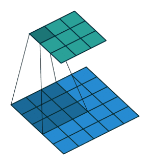
  stride=2: 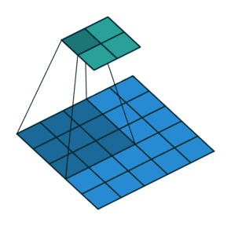
- **same** padding, stride=1: 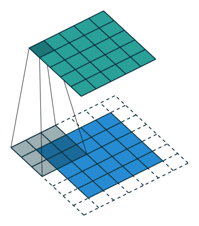
  stride=2: 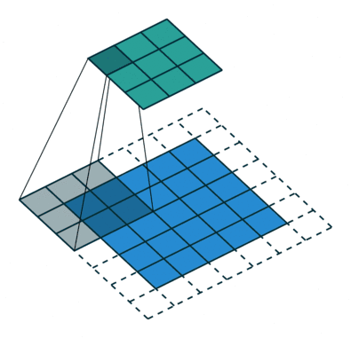

|Padding| No stride (stride=1) | Stride=2 |
|-------|:--------------------:|:--------:|
| Valid |  |  |
| Same  |   |  |

---
# Convolution Layer Representation

There are two prevalent image formats (called `data_format` in TensorFlow):
- `channels_last`: The dimensions of the 4-dimensional image tensor are batch,
  height, width, and channels.

  The original TensorFlow format, faster on CPU.

~~~
- `channels_first`: The dimensions of the 4-dimensional image tensor are batch,
  channel, height, and width.

  Usual GPU format (used by CUDA and nearly all frameworks); on TensorFlow, not
  all CPU kernels are available with this layout.

~~~
In TensorFlow, data is represented using the `channels_last` approach and the
runtime will automatically convert it to `channels_first` if it is more suitable
for available hardware (especially for a GPU).

---
# Pooling

Pooling is an operation similar to convolution, but we perform a fixed operation
instead of multiplying by a kernel.

- Max pooling (minor translation invariance)
- Average pooling

---
section: AlexNet
# High-level CNN Architecture

We repeatedly use the following block:
1. Convolution operation
2. Non-linear activation (usually ReLU)
3. Pooling

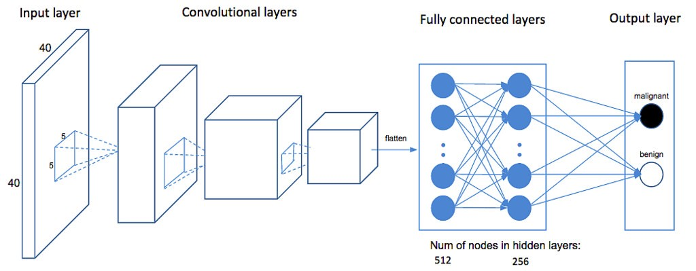

---
# AlexNet – 2012 (16.4% error)

---
# AlexNet – 2012 (16.4% error)

Training details:
- 2 GPUs for 5-6 days

~~~
- SGD with batch size 128, momentum 0.9, L2 regularization strength (weight
  decay) 0.0005
~~~
  - $→v ← 0.9 ⋅ →v - α ⋅ \frac{∂L}{∂→θ} - 0.0005 ⋅ α ⋅ →θ$
  - $→θ ← →θ + →v$

~~~
- initial learning rate 0.01, manually divided by 10 when validation error rate
  stopped improving

~~~
- ReLU non-linearities

~~~
- dropout with rate 0.5 on the fully-connected layers (except for the output layer)

~~~
- data augmentation using translations and horizontal reflections (choosing random
  $224 × 224$ patches from $256 × 256$ images)
~~~
  - during inference, 10 patches are used (four corner patches and a center
    patch, as well as their reflections)

---
# AlexNet – ReLU vs tanh

---
# LeNet – 1998

AlexNet built on already existing CNN architectures, mostly on LeNet, which
achieved 0.8% test error on MNIST.

---
class: middle
# Similarities in Primary Visual Cortex (V1) and CNNs

The primary visual cortex recognizes Gabor functions.

---
# Similarities in Primary Visual Cortex (V1) and CNNs

Similar functions are recognized in the first layer of a CNN.

---
section: Deep Prior
# CNNs as Regularizers – Deep Prior

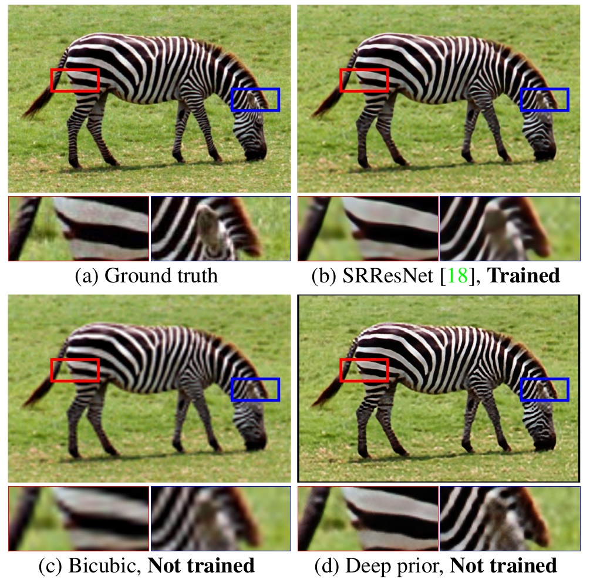

---
# CNNs as Regularizers – Deep Prior

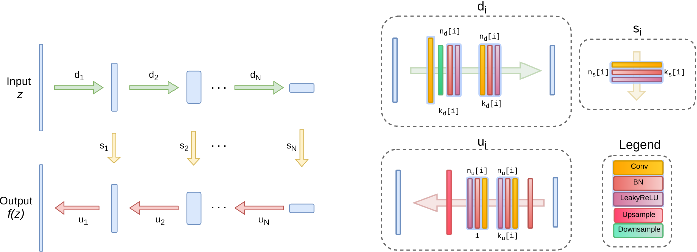

Random noise from $U[0, \frac{1}{10}]$ used on input; in large inpainting,
meshgrid is used instead and the skip-connections are not used.

---
# CNNs as Regularizers – Deep Prior

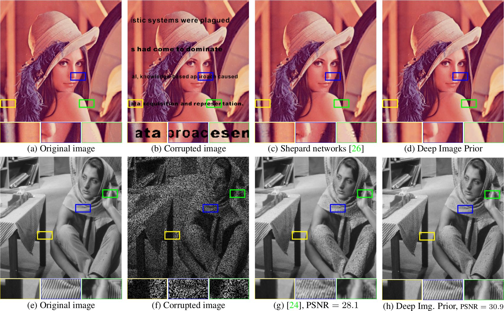

---
# CNNs as Regularizers – Deep Prior

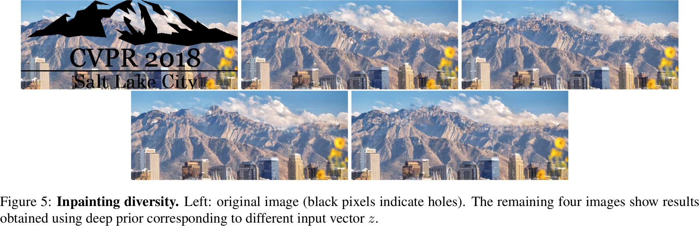

~~~
[Deep Prior paper website with supplementary material](https://dmitryulyanov.github.io/deep_image_prior)

---
section: VGG
# VGG – 2014 (6.8% error)

---
# VGG – 2014 (6.8% error)

Training detail similar to AlexNet:
- SGD with batch size ~~128~~ 256, momentum 0.9, weight decay 0.0005

- initial learning rate 0.01, manually divided by 10 when validation error rate
  stopped improving

- ReLU non-linearities

- dropout with rate 0.5 on the fully-connected layers (except for the output layer)

- data augmentation using translations and horizontal reflections (choosing random
  $224 × 224$ patches from $256 × 256$ images)

~~~
  - additionally, a multi-scale training and evaluation was performed. During
    training, each image was resized so that its smaller size was equal
    to $S$, which was sampled uniformly from $[256, 512]$
~~~
  - during test time, the image was rescaled three times so that the smaller
    size was $256, 384, 512$, respectively, and the results on the three images
    were averaged

---
# VGG – 2014 (6.8% error)

~~~

---
# VGG – 2014 (6.8% error)

---
section: Inception
# Inception (GoogLeNet) – 2014 (6.7% error)

Inception block:

---
# Inception (GoogLeNet) – 2014 (6.7% error)

Inception block with dimensionality reduction:

---
# Inception (GoogLeNet) – 2014 (6.7% error)

---
# Inception (GoogLeNet) – 2014 (6.7% error)

---
# Inception (GoogLeNet) – 2014 (6.7% error)

Training details:
- SGD with momentum 0.9

~~~
- fixed learning rate schedule of decreasing the learning rate by 4% each
  8 epochs
~~~
- during test time, the image was rescaled four times so that the smaller
  size was $256, 288, 320, 352$, respectively.

~~~
  For each image, the left, center and right square was considered, and from
  each square six crops of size $224 × 224$ were extracted (4 corners, middle
  crop and the whole scaled-down square) together with their horizontal flips,
  arriving at $4 ⋅ 3 ⋅ 6 ⋅ 2 = 144$ crops per image

~~~
- 7 independently trained models were ensembled

---
# Inception (GoogLeNet) – 2014 (6.7% error)

---
section: BatchNorm
# Batch Normalization

_Internal covariate shift_ refers to the change in the distributions
of hidden node activations due to the updates of network parameters
during training.

~~~
Let $→x = (x_1, \ldots, x_d)$ be $d$-dimensional input. We would like to
normalize each dimension as
$$x̂_i = \frac{x_i - 𝔼[x_i]}{\sqrt{\Var[x_i]}}.$$

~~~
Furthermore, it may be advantageous to learn suitable scale $γ_i$ and shift $β_i$ to
produce normalized value
$$y_i = γ_i x̂_i + β_i.$$

---
# Batch Normalization

Consider a mini-batch of $m$ examples $(→x^{(1)}, \ldots, →x^{(m)})$.

_Batch normalizing transform_ of the mini-batch is the following transformation.

**Inputs**: Mini-batch $(→x^{(1)}, \ldots, →x^{(m)})$, $ε ∈ ℝ$ 
**Outputs**: Normalized batch $(→y^{(1)}, \ldots, →y^{(m)})$
~~~
- $→μ ← \frac{1}{m} ∑_{i = 1}^m →x^{(i)}$
~~~
- $→σ^2 ← \frac{1}{m} ∑_{i = 1}^m (→x^{(i)} - →μ)^2$
~~~
- $→x̂^{(i)} ← (→x^{(i)} - →μ) / \sqrt{→σ^2 + ε}$
~~~
- $→y^{(i)} ← →γ →x̂^{(i)} + →β$

~~~
Batch normalization is added just before a nonlinearity, and it is useless to
add bias before it (because it will cancel out). Therefore, we replace
$f(⇉W→x + →b)$ by $f(\textit{BN}(⇉W→x))$.

~~~
During inference, $→μ$ and $→σ^2$ are fixed. They are either precomputed
after training on the whole training data, or an exponential moving average is
updated during training (usually with momentum 0.99).

---
# Batch Normalization

When a batch normalization is used on a fully connected layer, each neuron
is normalized individually across the minibatch.

~~~
However, for convolutional networks we would like the normalization to
honour their properties, most notably the shift invariance. We therefore
normalize each channel across not only the minibatch, but also across
all corresponding spacial/temporal locations.

---
# Inception with BatchNorm (4.8% error)

~~~
The BN-x5 and BN-x30 use 5/30 times larger initial learning rate, faster
learning rate decay, no dropout, weight decay smaller by a factor of 5,
and several more minor changes.

---
# Inception v2 and v3 – 2015 (3.6% error)

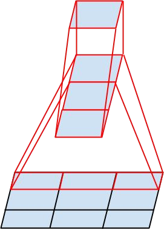

---
class: middle
# Inception v2 and v3 – 2015 (3.6% error)

---
# Inception v2 and v3 – 2015 (3.6% error)

---
# Inception v2 and v3 – 2015 (3.6% error)

Training details:
- RMSProp with momentum of $β=0.9$ and $ε=1.0$

~~~
- batch size of 32 for 100 epochs

~~~
- initial learning rate of 0.045, decayed by 6% every two epochs

~~~
- gradient clipping with threshold 2.0 was used to stabilize the training

~~~
- label smoothing was first used in this paper, with $α=0.1$

~~~
- input image size enlarged to $299 × 299$

---
# Inception v2 and v3 – 2015 (3.6% error)

---
# Inception v2 and v3 – 2015 (3.6% error)

~~~

---
section: ResNet
# ResNet – 2015 (3.6% error)

---
# ResNet – 2015 (3.6% error)

---
# ResNet – 2015 (3.6% error)

---
# ResNet – 2015 (3.6% error)

---
# ResNet – 2015 (3.6% error)

~~~
The residual connections cannot be applied directly when
number of channels increases.

The authors considered several alternatives, and chose the one where in case of
channels increase a $1×1$ convolution + BN is used on the projections to match the
required number of channels. The required spacial resolution is achieved by
using stride 2.

---
# ResNet – 2015 (3.6% error)

---
# ResNet – 2015 (3.6% error)

---
# ResNet – 2015 (3.6% error)

Training details:
- batch normalizations after each convolution and before activation

~~~
- SGD with batch size 256 and momentum of 0.9

~~~
- learning rate starts with 0.1 and is divided by 10 when error plateaus

~~~
- no dropout, weight decay 0.0001

~~~
- during testing, 10-crop evaluation strategy is used, averaging scores across
  multiple scales – the images are resized so that their smaller size is in
  $\{224, 256, 384, 480, 640\}$

---
class: middle
# ResNet – 2015 (3.6% error)

The ResNet-34 B uses the $1×1$ convolution on residual connections with
different number of input and output channels; ResNet-34 C uses this
convolution on all residual connections. Variant B is used for
ResNet-50/101/152.

---
# Main Takeaways

- Convolutions can provide

  - local interactions in spacial/temporal dimensions
  - shift invariance
  - _much_ less parameters than a fully connected layer

~~~
- Usually repeated $3×3$ convolutions are enough, no need for larger filter
  sizes.

~~~
- When pooling is performed, double the number of channels (i.e., the first
  convolution following the pooling layer will have twice as many output
  channels).

~~~
- If your network is deep enough (the last hidden neurons have a large receptive
  fields), final fully connected layers are not needed, and global average pooling
  is enough.

~~~
- Batch normalization is a great regularization method for CNNs, allowing
  removal/decrease of dropout and L2 regularization.

~~~
- Small weight decay (i.e., L2 regularization) of usually 1e-4 is still useful
  for regularizing convolutional kernels.
