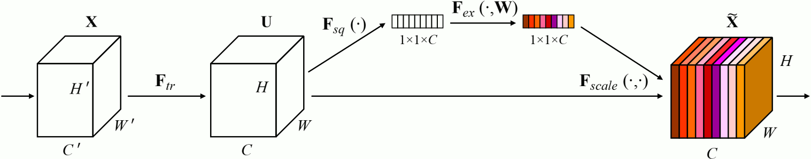
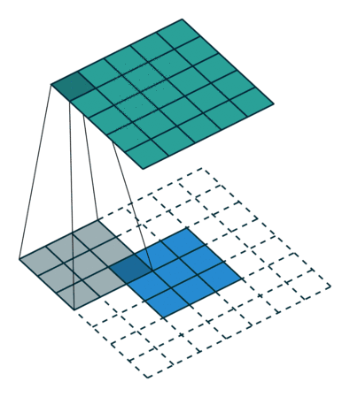
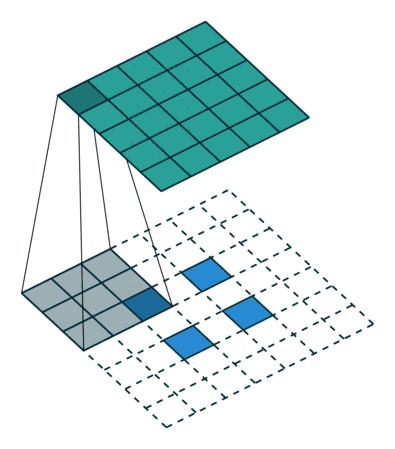
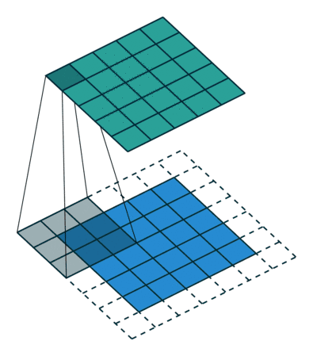
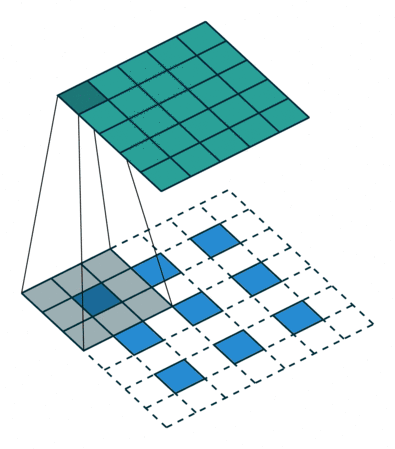

title: NPFL114, Lecture 5
class: title, langtech, cc-by-nc-sa

# Convolutional Neural Networks II

## Milan Straka

### March 14, 2022

---
section: Refresh
# Designing and Training Neural Networks

Designing and training a neural network is not a one-shot action,
but instead an iterative procedure.

~~~
- When choosing hyperparameters, it is important to verify that the model
  does not underfit and does not overfit.

~~~
- Underfitting can be checked by trying increasing model capacity or training longer,
  and observing whether the training performance increases.

~~~
- Overfitting can be tested by observing train/dev difference, or by trying
  stronger regularization and observing whether the development performance
  improves.

~~~
Regarding hyperparameters:
- We need to set the number of training epochs so that development performance
  stops increasing during training (usually later than when the training
  performance plateaus).

~~~
- Generally, we want to use large enough batch size, but such a one which does
  not slow us down too much (GPUs sometimes allow larger batches without slowing
  down training). However, because larger batch size implies less noise in the
  gradient, small batch size sometimes work as regularization (especially for
  vanilla SGD algorithm).

---
# Main Takeaways From Previous Lecture

- Convolutions can provide

  - local interactions in spacial/temporal dimensions
  - shift invariance
  - _much_ less parameters than a fully connected layer

~~~
- Usually repeated $3×3$ convolutions are enough, no need for larger filter
  sizes.

~~~
- When pooling is performed, double the number of channels (i.e., the first
  convolution following the pooling layer will have twice as many output
  channels).

~~~
- If your network is deep enough (the last hidden neurons have a large receptive
  fields), final fully connected layers are not needed, and global average pooling
  is enough.

~~~
- Batch normalization is a great regularization method for CNNs, allowing
  removal/decrease of dropout and L2 regularization.

~~~
- Small weight decay (i.e., L2 regularization) of usually 1e-4 is still useful
  for regularizing convolutional kernels.

---
# ResNet – 2015 (3.6% error)

---
# ResNet – 2015 (3.6% error)

---
# ResNet – 2015 (3.6% error)

---
# ResNet – 2015 (3.6% error)

---
# ResNet – 2015 (3.6% error)

~~~
The residual connections cannot be applied directly when
number of channels increases.

The authors considered several alternatives, and chose the one where in case of
channels increase a $1×1$ convolution + BN is used on the projections to match the
required number of channels. The required spacial resolution is achieved by
using stride 2.

---
# ResNet – 2015 (3.6% error)

---
# ResNet – 2015 (3.6% error)

---
# ResNet – 2015 (3.6% error)

Training details:
- batch normalizations after each convolution and before activation

~~~
- SGD with batch size 256 and momentum of 0.9

~~~
- learning rate starts with 0.1 and is divided by 10 when error plateaus

~~~
- no dropout, weight decay 0.0001

~~~
- during training, an image is resized with its shorter side randomly sampled
  in the range $[256, 480]$, and a random $224×224$ crop is used

~~~
- during testing, 10-crop evaluation strategy is used

~~~
  - for the best results, the scores across multiple scales are averaged – the
    images are resized so that their smaller size is in
    $\{224, 256, 384, 480, 640\}$

---
class: middle
# ResNet – 2015 (3.6% error)

The ResNet-34 B uses the $1×1$ convolution on residual connections with
different number of input and output channels; ResNet-34 C uses this
convolution on all residual connections. Variant B is used for
ResNet-50/101/152.

---
section: ResNetModifications
# ResNet Ablations – Shortcuts

The authors of ResNet published an ablation study several months after the
original paper.

~~~

---
# ResNet Ablations – Activations

---
# ResNet Ablations – Pre-Activation Results

The _pre-activation_ architecture was evaluated also on ImageNet, in a single-crop
regime.

---
# WideNet

---
# WideNet

- Authors do not consider bottleneck blocks. Instead, they experiment with
  different _block types_, e.g., $B(1, 3, 1)$ or $B(3, 3)$.

The $B(3, 3)$ is used in further experiments, unless specified otherwise.

---
# WideNet

- Authors evaluate various _widening factors_ $k$

---
# WideNet

- Authors measure the effect of _dropping out_ inside the residual block
  (but not the residual connection itself)

---
style: table { line-height: 1; } table td { padding-bottom: 0; }
# WideNet – Results

| Dataset  | Results |
|----------|:-------:|
| CIFAR    |  |
| ImageNet |  |

---
# DenseNet

---
# DenseNet – Architecture

The initial convolution generates 64 channels, each $1×1$ convolution in dense
block 256, each $3×3$ convolution in dense block 32, and the transition layer
reduces the number of channels in the initial convolution by half.

---
class: middle
# DenseNet – Results

---
# PyramidNet

---
# PyramidNet – Growth Rate

In architectures up until now, number of filters doubled when spacial
resolution was halved.

~~~
Such exponential growth would suggest gradual widening rule
$D_k = \lfloor D_{k-1} ⋅ α^{1/N}\rfloor$.

~~~
However, the authors employ a linear widening rule
$D_k = \lfloor D_{k-1} + α/N\rfloor$, where $D_k$ is number of filters
in the $k$-th out of $N$ convolutional block and $α$ is number of filters
to add in total.

---
# PyramidNet – Residual Connections

No residual connection can be a real identity – the authors propose
to zero-pad missing channels, where the zero-pad channels correspond
to newly computed features.

---
class: middle
# PyramidNet – CIFAR Results

---
# PyramidNet – ImageNet Results

---
# ResNeXt

---
# ResNeXt

---
# ResNeXt

---
# ResNeXt

---
# ResNeXt

~~~

~~~

---
section: CNNRegularization
# Deep Networks with Stochastic Depth

We drop a whole block (but not the residual connection) with probability $1-p_l$.
During inference, we multiply the block output by $p_l$ to compensate; or we can
use the alternative approach like in regular dropout, where we divide the
activation by $p_l$ during training only.

~~~
All $p_l$ can be set to a constant, but more effective approach is to utilize
a simple linear decay $p_l = 1 - l/L(1-p_L)$, where $p_L$ is the final
probability of the last layer, motivated by the intuition that the initial
blocks extract low-level features utilized by the later layers, and should
therefore be present.

---
# Deep Networks with Stochastic Depth

~~~
According to the ablation experiments, linear decay with $p_L=0.5$ was selected.

---
# Deep Networks with Stochastic Depth

---
# Cutout

Drop $16×16$ square in the input image, with randomly chosen center.
The pixels are replaced by a their mean value from the dataset.

---
# Cutout

---
# DropBlock

Dropout drops individual values, SpatialDropout drops whole channels, DropBlock
drops rectangular areas in all channels at the same time.

~~~
The authors mention that they also tried applying DropBlock in every channel
separately, but that masking all channels equally “tends to work better in our
experiments”.

---
# DropBlock

---
# DropBlock

The authors have chosen _block size=7_ and also employ linear schedule of the
_keep probability_, which starts at 1 and linearly decays until the target value
is reached at the end of training.

---
class: middle
# DropBlock

The results are averages of three runs.

---
section: EfficientNet
# Squeeze and Excitation

The ILSVRC 2017 winner was SENet, _Squeeze and Excitation Network_,
augmenting existing architectures by a **squeeze and excitation** block,
which learns to emphasise informative channels and suppress less useful
ones according to global information.

~~~
- **squeeze (global information embedding)** computes the average value of every
  channel;

~~~
- **excitation (adaptive recalibration)** computes a weight for every channel
  using a sigmoid activation function and multiplies the corresponding channel
  with it. To not increase the number of parameters too much (by $C^2$), an
  additional small hidden layer with $C/16$ neurons is employed (to reduce the
  additional parameters to $C^2/8$ only).

---
# Mobile Inverted Bottleneck Convolution

When designing convolutional neural networks for mobile phones, the following
**mobile inverted bottleneck** block was proposed.

~~~
- Regular convolution is replaced by **separable convolution**,
  which consists of
  - a **depthwise separable** convolution (for example $3×3$) acting on each channel
    separately (which reduces time and space complexity of a regular convolution
    by a factor equal to the number of channels);
  - a **pointwise** $1×1$ convolution acting on each position independently (which reduces
    time and space complexity of a regular convolution by a factor of $3⋅3$).
~~~
- The residual connections connect bottlenecks (layers with least channels).
~~~
- There is no non-linear activation on the bottlenecks (it would lead to
  loss of information given small capacity of bottlenecks).

---
# Mobile Inverted Bottleneck Convolution

The mobile inverted bottleneck convolution is denoted for example as _MBConv6 k3x3_,
where the 6 denotes expansion factor after the bottleneck and $3×3$ is the
kernel size of the separable convolution.

Furthermore, the mobile inverted bottleneck convolution can be augmented with
squeeze and excitation blocks.

---
# EfficientNet

In 2019, very performant and efficient convolutional architecture
**EfficientNet** was proposed.

~~~

The EfficientNet architecture was created using a multi-objective neural
architecture search that optimized both accuracy and computation complexity.

The resulting network is denoted as **EfficientNet-B0** baseline network.

~~~
It was trained using RMSProp with $β$=0.9 and momentum 0.9, weight
decay 1e-5, and initial learning rate 0.256 decayed by 0.97 every 2.4
epochs. Dropout with dropout rate 0.2 is used on the last layer, stochastic
depth with survival probability 0.8 is employed, and
$\operatorname{swish}(→x) ≝ →x ⋅ σ(→x)$ activation function is utilized.

---
# EfficientNet – Compound Scaling

To effectively scale the network, the authors propose a simultaneous increase of
three qualities:
- **width**, which is the number of channels;
- **depth**, which is the number of layers;
- **resolution**, which is the input image resolution.

~~~
By a grid search on a network with double computation complexity, the best
trade-off of scaling width by 1.1, depth by 1.2 and resolution by 1.15 was
found ($1.1^2 ⋅ 1.2 ⋅ 1.15^2 ≈ 2$).

---
# EfficientNet – Results

---
# EfficientNet – Results

---
# EfficientNetV2

In April 2021, an improved version of EfficientNet, **EfficientNetV2**, was
published. It is currently one of the best available CNNs for image recognition.

~~~
The improvements between EfficientNet and EfficientNetV2 are not large:

~~~

- The separable convolutions have fewer parameters, but are slow to execute on
  modern hardware. The authors therefore “fuse” the $1×1$ convolution and
  a $3×3$ depthwise convolution into a regular convolution, which has more
  parameters and require more computation, but is in fact executed faster.

~~~
- Very large images make training very slow. EfficientNetV2 avoids aggressively
  scaling the image sizes, limiting maximum image size to 480.

~~~
- The authors utilize progressive training – the image size is gradually
  increased during training, as is the regularization strength (dropout, mixup,
  RandAugment magnitude).

---
# EfficientNetV2 – Architecture

---
# EfficientNetV2 – Results

---
section: TransferLearning
# Transfer Learning

In many situations, we would like to utilize a model trained on a different
dataset – generally, this cross-dataset usage is called **transfer learning**.

~~~
In image processing, models trained on ImageNet are frequently used as general
**feature extraction models**.

~~~
The easiest scenario is to take a ImageNet model, drop the last classification
layer, and use the result of the global average pooling as image features.
The ImageNet model is not modified during training.

~~~
For efficiency, we may precompute the image features **once** and reuse it later
many times.

---
# Transfer Learning – Finetuning

After we have successfully trained a network employing an ImageNet model,
we may improve performance further by **finetuning** – training the full network
including the ImageNet model, allowing the feature extraction to adapt to the
current dataset.

~~~
- The layers after the ImageNet models **should** be already trained to
  convergence.

~~~
- Usually a smaller learning rate is necessary, because the original model
  probably finished training with a very small learning rate. A good starting
  point is one tenth of the original starting learning rate (therefore,
  0.0001 for Adam).

~~~
- We have to think about batch normalization, data augmentation or other
  regularization techniques.

---
section: TransposedConvolution
# Transposed Convolution

So far, the convolution operation produces either an output of the same size,
or it produced a smaller one if stride was larger than one.

~~~
In order to come up with **upscaling convolution**, we start by considering how
a gradient is backpropagated through a fully connected layer and a regular
convolution.

~~~
In a fully connected layer without activation:
- during the forward pass, input $→x$ is multiplied by the weight matrix $⇉W$ as $→x ⇉W$;
~~~
- during the backward pass, the gradient $→g$ is multiplied by the _transposed_ weight
  matrix as $→g ⇉W^T$.

---
# Transposed Convolution

Analogously, in a convolutional layer without activation:
- during the forward pass, the cross-correlation operation between input $⇶I$
  and kernel $⇶K$ is performed as
  $$(⇶K \star ⇶I)_{i, j, o} = ∑_{m, n, c} ⇶I_{i⋅S + m, j⋅S + n, c} ⇶K_{m, n, c, o};$$

~~~
- during the backward pass, we obtain $⇶G_{i,j,o} = \frac{∂L}{∂ (⇶K \star ⇶I)_{i, j, o}}$
  and we need to backpropagate it to obtain $\frac{∂L}{∂ ⇶I_{i, j, c}}$. It is
  not difficult to show that
  $$\frac{∂L}{∂ ⇶I_{i, j, c}} = ∑_{\substack{i', m\\i'⋅S + m = i}} ∑_{\substack{j', n\\j'⋅S + n = j}} ∑_o ⇶G_{i', j', o} ⇶K_{m, n, c, o}.$$

~~~
  This operation is called **transposed** or **upscaling** convolution and
  stride greater than one makes the output larger, not smaller.

- during the backward pass, the gradient $→g$ is multiplied by the _transposed_ weight
  matrix as $→g ⋅ ⇉W^T$

---
# Transposed Convolution Animation

Illustration of the padding schemes and different strides for a $3×3$ kernel.

- **valid**, stride=1, regular: 
  transposed: 
- **valid**, stride=2, regular: 
  transposed: 

---
# Transposed Convolution Animation

Illustration of the padding schemes and different strides for a $3×3$ kernel.

- **same**, stride=1, regular: 
  transposed: 
- **same**, stride=2, regular: 
  transposed: 

---
# Transposed Convolution

Given that the transposed convolution must be implemented for efficient
backpropagation of a regular convolution, it is usually available for
direct usage in neural network frameworks.

~~~
It is frequently used to perform upscaling of an image, as an “inverse”
operation to pooling (or convolution with stride $>1$), which is useful for
example in _image segmentation_:

