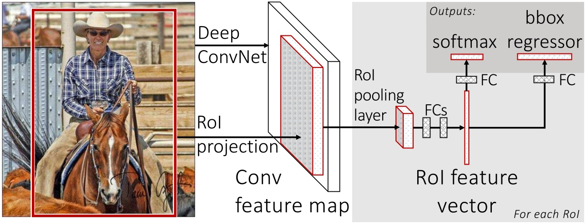
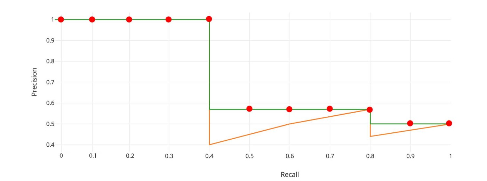

title: NPFL114, Lecture 6
class: title, langtech, cc-by-nc-sa

# Object Detection

## Milan Straka

### April 06, 2020

---
section: FastR-CNN
class: middle, center
# Beyond Image Classification

# Beyond Image Classification

---
# Beyond Image Classification

- Object detection (including location)
 

- Image segmentation
 

- Human pose estimation

---
# Fast R-CNN Architecture

- Start with a network pre-trained on ImageNet (VGG-16 is used in the original
  paper).

~~~
- Several rectangular **Regions of Interest** (RoI) are passed on the input. For
  every of them, the network decides whether:

  - they contain an object;
  - location of the object relative to the RoI.

~~~

- RoI representation is _fixed size_, independent on its size. It is computed
  using **RoI pooling**, which replaces the last max-pool layer ($14×14 → 7×7$
  in VGG). For each channel, the representation of each RoI _bin_ (one of the
  $7×7$) is computed as max-pool of the corresponding bins (of the $14×14$ grid
  in VGG) of the convolutional image features.

~~~
- For every RoI, two sibling heads are added, one predicting $K+1$ categories
  and the other one predicting 4 bounding box parameters for each of the $K$
  categories.

---
# Fast R-CNN

---
# Fast R-CNN

The bounding box is parametrized as follows. Let $x_r, y_r, w_r, h_r$ be
center coordinates and width and height of the RoI, and let $x, y, w, h$ be
parameters of the bounding box. We represent the bounding box relative
to the RoI as follows:
$$\begin{aligned}
t_x &= (x - x_r)/w_r, & t_y &= (y - y_r)/h_r \\
t_w &= \log (w/w_r), & t_h &= \log (h/h_r)
\end{aligned}$$

~~~
Usually a $\textrm{smooth}_{L_1}$ loss, or _Huber loss_, is employed for bounding box parameters

$$\textrm{smooth}_{L_1}(x) = \begin{cases}
  0.5x^2    & \textrm{if }|x| < 1 \\
  |x| - 0.5 & \textrm{otherwise}
\end{cases}$$

~~~
The complete loss is then
$$L(ĉ, t̂, c, t) = L_\textrm{cls}(ĉ, c) + λ ⋅ [c ≥ 1] ⋅
  ∑\nolimits_{i ∈ \lbrace \mathrm{x, y, w, h}\rbrace} \textrm{smooth}_{L_1}(t̂_i - t_i).$$

---
# Fast R-CNN

## Intersection over union
For two bounding boxes (or two masks) the _intersection over union_ (_IoU_)
is a ration of the intersection of the boxes (or masks) and the union
of the boxes (or masks).

~~~
## Choosing RoIs for training
During training, we use $2$ images with $64$ RoIs each. The RoIs are selected
so that $25\%$ have intersection over union (IoU) overlap with ground-truth
boxes at least 0.5; the others are chosen to have the IoU in range $[0.1, 0.5)$,
the so-called _hard examples_.

~~~
## Choosing RoIs during inference
Single object can be found in multiple RoIs. To choose the most salient one,
we perform _non-maximum suppression_ – we ignore RoIs which have an overlap
with a higher scoring RoI of the same type, where the IoU is larger than a given
threshold (usually, 0.3 is used). Higher scoring RoI is the one with higher
probability from the classification head.

---
# Object Detection Evaluation

## Average Precision
Evaluation is performed using _Average Precision_ ($\mathit{AP}$ or $\mathit{AP}_{50}$).

We assume all bounding boxes (or masks) produced by a system have confidence
values which can be used to rank them. Then, for a single class, we take the
boxes (or masks) in the order of the ranks and generate precision/recall curve,
considering a bounding box correct if it has IoU at least 0.5 with any
ground-truth box.

---
# Object Detection Evaluation – Average Precision

The general ideal of AP is to compute the area under the precision/recall curve.

~~~

We start by interpolating the precision/recall curve, so that it is always
non-increasing.

~~~

Finally, the average precision for a single class is an average of precision at
recall $0.0, 0.1, 0.2, …, 1.0$.

~~~
The final AP is a mean of average precision of all classes.

---
class: tablewide
style: table {line-height: 1}
# Object Detection Evaluation – Average Precision

For the COCO dataset, the AP is computed slightly differently. First, it is an
average over 101 recall points $0.00, 0.01, 0.02, …, 1.00$.

~~~
In the original metric, IoU of 50% is enough to consider the prediction valid.
We can generalize the definition to $\mathit{AP}_{x}$, where an object
prediction is considered valid if IoU is at least $x%$.

~~~
The main COCO metric, denoted just $\mathit{AP}$, is the mean of
$\mathit{AP}_{50},\mathit{AP}_{55}, \mathit{AP}_{60}, …, \mathit{AP}_{95}$.

~~~
| Metric | Description |
|:------:|:------------|
| $\mathit{AP}$ | Mean of $\mathit{AP}_{50},\mathit{AP}_{55}, \mathit{AP}_{60}, \mathit{AP}_{65}, …, \mathit{AP}_{95}$ |
| $\mathit{AP}_{50}$ | AP at IoU 50% |
| $\mathit{AP}_{75}$ | AP at IoU 75% |
~~~
| $\mathit{AP}_{S}$ | AP for small objects: $\textit{area} < 32^2$ |
| $\mathit{AP}_{M}$ | AP for medium objects: $32^2 < \textit{area} < 96^2$ |
| $\mathit{AP}_{L}$ | AP for large objects: $96^2 < \textit{area}$ |

---
section: FasterR-CNN
# Faster R-CNN

For Fast R-CNN, the most time consuming part is generating the RoIs.

Therefore, Faster R-CNN jointly generates _regions of interest_ using
a _region proposal network_ and performs object detection.

~~~

---
# Faster R-CNN

The region proposals are generated using a $3×3$ sliding window, with
3 different scales $(128^2, 256^2, 512^2)$ and 3
aspect ratios $(1:1, 1:2, 2:1)$. For every anchor, there is a
Fast-R-CNN-like object detection head – a classification into two classes
(background, object) and a boundary regressor.

---
# Faster R-CNN

During training, we generate
- positive training examples for every anchor that has highest IoU with
  a ground-truth box;
~~~
- furthermore, a positive example is also any anchor with
  IoU at least 0.7 for any ground-truth box;
~~~
- negative training examples for every anchor that has IoU at most 0.3 with all
  ground-truth boxes.

~~~
During inference, we consider all predicted non-background regions, run
non-maximum suppression on them using a 0.7 IoU threshold, and then take $N$
top-scored regions (i.e., the ones with highest probability from the
classification head) – the paper uses 300 proposals, compared to 2000 in the Fast
R-CNN.

---
# Faster R-CNN

---
# Two-stage Detectors

The Faster R-CNN is a so-called **two-stage** detector, where the regions are
refined twice – once in the region proposal network, and then in the final
bounding box regressor.

~~~
Several **single-stage** detector architectures have been proposed, mainly
because they are faster and smaller, but until circa 2017 the two-stage
detectors achieved better results.

---
section: MaskR-CNN
# Mask R-CNN

Straightforward extension of Faster R-CNN able to produce image segmentation
(i.e., masks for every object).

---
# Mask R-CNN – Architecture

---
# Mask R-CNN – RoIAlign

More precise alignment is required for the RoI in order to predict the masks.
Instead of quantization and max-pooling in RoI pooling, **RoIAlign** uses bilinear
interpolation of features at four regularly samples locations in each RoI bin
and averages them.

~~~
TensorFlow provides `tf.image.crop_and_resize` capable of implementing RoIAlign.

---
# Mask R-CNN

Masks are predicted in a third branch of the object detector.

- Usually higher resolution is needed ($14×14$ instead of $7×7$).
- The masks are predicted for each class separately.
- The masks are predicted using convolutions instead of fully connected layers.

---
# Mask R-CNN

---
# Mask R-CNN – Human Pose Estimation

~~~
- Testing applicability of Mask R-CNN architecture.

- Keypoints (e.g., left shoulder, right elbow, …) are detected
  as independent one-hot masks of size $56×56$ with $\softmax$ output function.

~~~

---
section: FPN
# Feature Pyramid Networks

---
# Feature Pyramid Networks

---
# Feature Pyramid Networks

---
# Feature Pyramid Networks

We employ FPN as a backbone in Faster R-CNN.

~~~
Assuming ResNet-like network with $224×224$ input, we denote $C_2, C_3, …, C_5$
the image features of the last convolutional layer of size $56×56, 28×28, …,
7×7$ (i.e., $C_i$ indicates a downscaling of $2^i$).
~~~
The FPN representations incorporating the smaller resolution features are
denoted as $P_2, …, P_5$, each consisting of 256 channels.

~~~
In both the RPN and the Fast R-CNN, authors utilize the $P_2, …, P_5$
representations, considering single-size anchors for every $P_i$ (of size
$32^2, 64^2, 128^2, 256^2$, respectively). However, three aspect ratios
$(1:1, 1:2, 2:1)$ are still used.

~~~

---
section: FocalLoss
# Focal Loss

For single-stage object detection architectures, _class imbalance_ has been
identified as the main issue preventing to obtain performance comparable to
two-stage detectors. In a single-stage detector, there can be tens of thousands
of anchors, with only dozens of useful training examples.

~~~
Cross-entropy loss is computed as
$$𝓛_\textrm{cross-entropy} = -\log p_\textrm{model}(y | x).$$

~~~
Focal-loss (loss focused on hard examples) is proposed as
$$𝓛_\textrm{focal-loss} = -(1 - p_\textrm{model}(y | x))^γ ⋅ \log p_\textrm{model}(y | x).$$

---
# Focal Loss

For $γ=0$, focal loss is equal to cross-entropy loss.

~~~
Authors reported that $γ=2$ worked best for them for training a single-stage
detector.

~~~

---
# Focal Loss and Class Imbalance

Focal loss is connected to another solution to class imbalance – we might
introduce weighting factor $α ∈ (0, 1)$ for one class and $1 - α$ for the other
class, arriving at
$$ -α_y ⋅ \log p_\textrm{model}(y | x).$$

~~~
The weight $α$ might be set to the inverse class frequency or treated as
a hyperparameter.

~~~
Even if weighting focus more on low-frequent class, it does not distinguish
between easy and hard examples, contrary to focal loss.

~~~
In practice, the focal loss is usually used together with class weighting:
$$ -α_y ⋅ (1 - p_\textrm{model}(y | x))^γ ⋅ \log p_\textrm{model}(y | x).$$
For example, authors report that $α=0.25$ works best with $γ=2$.

---
section: RetinaNet
# RetinaNet

RetineNet is a single-stage detector, using feature pyramid network
architecture. Built on top of ResNet architecture, the feature pyramid
contains levels $P_3$ through $P_7$, with each $P_l$ having 256 channels
and resolution $2^l$ lower than the input. On each pyramid level $P_l$,
we consider 9 anchors for every position, with 3 different aspect ratios ($1$, $1:2$, $2:1$)
and with 3 different sizes ($\{2, 2^{1/3}, 2^{2/3}\} ⋅ 4 ⋅ 2^l$).

~~~
Note that ResNet provides only $C_3$ to $C_5$ features. $C_6$ is computed
using a $3×3$ convolution with stride 2 on $C_5$, and $C_7$ is obtained
by applying ReLU followed by another $3×3$ stride-2 convolution. The $C_6$ and
$C_7$ are included to improve large object detection.

---
# RetinaNet – Architecture

The classification and boundary regression heads do not share parameters and are
fully convolutional, generating $\mathit{anchors} ⋅ \mathit{classes}$ sigmoids
and $\mathit{anchors}$ bounding boxes per position.

---
# RetinaNet

During training, anchors are assigned to ground-truth object boxes if IoU is at
least 0.5; to background if IoU with any ground-truth region is at most 0.4
(the rest of anchors is ignored during training).
~~~
The classification head is trained using focal loss with $γ=2$ and $α=0.25$ (but
according to the paper, all values of $γ$ in $[0.5, 5]$ range works well); the
boundary regression head is trained using $\textrm{smooth}_{L_1}$ loss as in
Fast(er) R-CNN.

~~~
During inference, at most 1000 objects with at least 0.05 probability from every
pyramid level are considered, and combined from all levels using non-maximum
suppression with a threshold of 0.5.

~~~

---
# RetinaNet – Ablations

---
section: EfficientDet
# EfficientDet – Architecture

EfficientDet builds up on EfficientNet and delivers state-of-the-art performance
with minimum time and space requirements. It is a single-scale detector similar
to RetinaNet, which:

~~~
- uses EfficientNet as backbone;
~~~
- employs compound scaling;
~~~
- uses a newly proposed BiFPN, “efficient bidirectional cross-scale connections
  and weighted feature fusion”.

~~~

---
# EfficientDet – BiFPN

In multi-scale fusion in FPN, information flows only from the pyramid levels
with smaller resolution to the levels with higher resolution.

~~~
BiFPN consists of several rounds of bidirectional flows. Each bidirectional flow
employs residual connections and does not include nodes that have only one input
edge with no feature fusion. All operations are $3×3$ separable convolutions with
batch normalization and ReLU, upsampling is done by repeating rows and columns
and downsampling by max-pooling.

---
# EfficientDet – Weighted BiFPN

When combining features with different resolutions, it is common to resize them
to the same resolution and sum them – therefore, both set of features is
considered to be of the same importance. The authors however argue that features
from different resolution contribute to the final result _unequally_ and propose
a combination with trainable weighs.

~~~
- **Softmax-based fusion**: There is a trainable weight $w_i$ for every input $⇶I_i$
  and the final combination is
  $$∑_i \frac{e^{w_i}}{∑\nolimits_j e^{w_j}} ⇶I_i.$$

~~~
- **Fast normalized fusion**: Authors propose a simpler alternative of
  weighting:
  $$∑_i \frac{\ReLU(w_i)}{ε + ∑\nolimits_j \ReLU(w_j)} ⇶I_i.$$
  It uses $ε=0.0001$ for stability and is up to 30% faster on a GPU.

---
# EfficientDet – Compound Scaling

Similar to EfficientNet, authors propose to scale various dimensions of the
network, using a single compound coefficient $ϕ$.

~~~
After performing a grid search:
- the width of BiFPN is scaled as $W_\mathit{BiFPN} = 64 ⋅ 1.35^ϕ,$
- the depth of BiFPN is scaled as $D_\mathit{BiFPN} = 3 + ϕ,$
- the box/class predictor has the same width as BiFPN and depth $D_\mathit{class} = 3 + \lfloor ϕ/3 \rfloor,$
- input image resolution increases according to $R_\mathit{image} = 512 + 128 ⋅ ϕ.$

---
# EfficientDet – Results

---
# EfficientDet – Results

---
# EfficientDet – Latencies

---
# EfficientDet – Ablations

Given that EfficientDet employs both a powerful backbone and new BiFPN, authors
quantify the improvement of the individual components.

~~~
Furthermore, they provide comparison with previously used cross-scale fusion
architectures.

---
section: GroupNorm
# Normalization

## Batch Normalization

Neuron value is normalized across the minibatch, and in case of CNN also across
all positions.

~~~
## Layer Normalization

Neuron value is normalized across the layer.

~~~

---
# Group Normalization

Group Normalization is analogous to Layer normalization, but the channels are
normalized in groups (by default, $G=32$).

~~~

---
# Group Normalization

---
# Group Normalization

