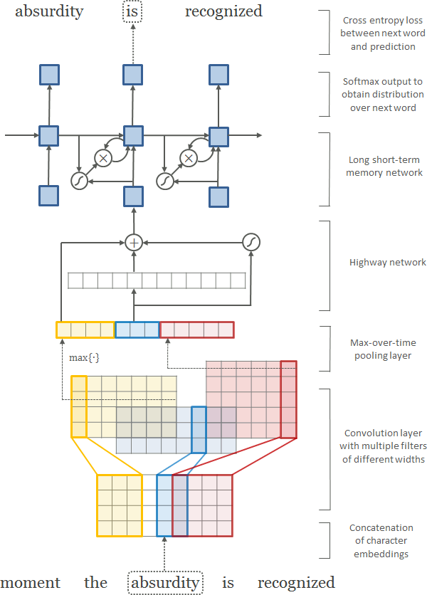

title: NPFL114, Lecture 7
class: title, langtech, cc-by-nc-sa

# Recurrent Neural Networks

## Milan Straka

### March 28, 2022

---
section: RNN
class: middle, center
# Recurrent Neural Networks

# Recurrent Neural Networks

---
# Recurrent Neural Networks

## Single RNN cell


~~~

## Unrolled RNN cells


---
# Basic RNN Cell


Given an input $→x^{(t)}$ and previous state $→h^{(t-1)}$, the new state is computed as
$$→h^{(t)} = f(→h^{(t-1)}, →x^{(t)}; →θ).$$

~~~
One of the simplest possibilities (called `SimpleRNN` in TensorFlow) is
$$→h^{(t)} = \tanh(⇉U→h^{(t-1)} + ⇉V→x^{(t)} + →b).$$

---
# Basic RNN Cell

Basic RNN cells suffer a lot from vanishing/exploding gradients (the so-called
**challenge of long-term dependencies**).

~~~
If we simplify the recurrence of states to just a linear approximation
$$→h^{(t)} ≈ ⇉U→h^{(t-1)},$$

~~~
we get $→h^{(t)} ≈ ⇉U^t→h^{(0)}$.

~~~
If $⇉U$ has an eigenvalue decomposition of $⇉U = ⇉Q ⇉Λ ⇉Q^{-1}$, we therefore get
$$→h^{(t)} ≈ ⇉Q ⇉Λ^t ⇉Q^{-1} →h^{(0)}.$$
The main problem is that the _same_ function is iteratively applied many times.

~~~
Several more complex RNN cell variants have been proposed, which alleviate
this issue to some degree, namely **LSTM** and **GRU**.

---
section: LSTM
# Long Short-Term Memory

Hochreiter & Schmidhuber (1997) suggested that to enforce
_constant error flow_, we would like
$$f' = →1.$$

~~~
They propose to achieve that by a _constant error carrousel_.


~~~ ~~
They propose to achieve that by a _constant error carrousel_.


---
# Long Short-Term Memory

They also propose an **input** and **output** gates which control the flow
of information into and out of the carrousel (**memory cell** $→c_t$).


$$\begin{aligned}
  →i_t & ← σ(⇉W^i →x_t + ⇉V^i →h_{t-1} + →b^i) \\
  →o_t & ← σ(⇉W^o →x_t + ⇉V^o →h_{t-1} + →b^o) \\
  →c_t & ← →c_{t-1} + →i_t \cdot \tanh(⇉W^y →x_t + ⇉V^y →h_{t-1} + →b^y) \\
  →h_t & ← →o_t \cdot \tanh(→c_t)
\end{aligned}$$

---
# Long Short-Term Memory

Later in Gers, Schmidhuber & Cummins (1999) a possibility to **forget**
information from memory cell $→c_t$ was added.


$$\begin{aligned}
  →i_t & ← σ(⇉W^i →x_t + ⇉V^i →h_{t-1} + →b^i) \\
  →f_t & ← σ(⇉W^f →x_t + ⇉V^f →h_{t-1} + →b^f) \\
  →o_t & ← σ(⇉W^o →x_t + ⇉V^o →h_{t-1} + →b^o) \\
  →c_t & ← →f_t \cdot →c_{t-1} + →i_t \cdot \tanh(⇉W^y →x_t + ⇉V^y →h_{t-1} + →b^y) \\
  →h_t & ← →o_t \cdot \tanh(→c_t)
\end{aligned}$$

~~~
Note that since 2015, following the paper
- R. Jozefowicz et al.: _An Empirical Exploration of Recurrent Network Architectures_

the forget gate bias is usually initialized to 1.

---
# Long Short-Term Memory


---
# Long Short-Term Memory


---
# Long Short-Term Memory


---
# Long Short-Term Memory


---
# Long Short-Term Memory


---
# Long Short-Term Memory


---
# Long Short-Term Memory


---
section: GRU
# Gated Recurrent Unit

**Gated recurrent unit (GRU)** was proposed by Cho et al. (2014) as
a simplification of LSTM. The main differences are


- no memory cell,
- forgetting and updating tied together.

~~~
$$\begin{aligned}
  →r_t & ← σ(⇉W^r →x_t + ⇉V^r →h_{t-1} + →b^r) \\
  →u_t & ← σ(⇉W^u →x_t + ⇉V^u →h_{t-1} + →b^u) \\
  →ĥ_t & ← \tanh(⇉W^h →x_t + ⇉V^h (→r_t \cdot →h_{t-1}) + →b^h) \\
  →h_t & ← →u_t \cdot →h_{t-1} + (1 - →u_t) \cdot →ĥ_t
\end{aligned}$$

---
# Gated Recurrent Unit


---
# GRU and LSTM Differences

The main differences between GRU and LSTM:
~~~
- GRU uses fewer parameters and less computation.

  - six matrices $⇉W$, $⇉V$ instead of eight
~~~
- GRU are easier to work with, because the state is just one tensor, while it is
  a pair of tensors for LSTM.
~~~
- In most tasks, LSTM and GRU give very similar results.
~~~
- However, there are some tasks, on which LSTM achieves (much) better results
  than GRU.
~~~
  - For a demonstration of difference in the expressive power of LSTM and GRU
    (caused by the coupling of the forget and update gate), see the paper
    - G. Weiss et al.: _On the Practical Computational Power of Finite Precision
      RNNs for Language Recognition_ https://arxiv.org/abs/1805.04908
~~~
  - For a practical difference between LSTM and GRU, see for example
    - T. Dozat et al.: _Deep Biaffine Attention for Neural Dependency Parsing_
      https://arxiv.org/abs/1611.01734

---
# SimpleRNN, GRU, and LSTM Initialization

Recall that when we approximate $→h^{(t)} ≈ ⇉U→h^{(t-1)}$,
assuming the eigenvalue decomposition of $⇉U = ⇉Q ⇉Λ ⇉Q^{-1}$ we get
$$→h^{(t)} ≈ ⇉Q ⇉Λ^t ⇉Q^{-1} →h^{(0)}.$$

~~~
This motivated a specific initialization scheme for the $⇉U$ matrix –
this so-called **recurrent kernel** is initialized with a randomly generated
orthogonal matrix.

~~~
This **orthogonal** initialization is used for all RNN cells in TensorFlow
(via the `recurrent_initializer='orthogonal'` parameter of `SimpleRNN`, `GRU`,
and `LSTM`).

---
section: HighwayNetworks
class: middle, center
# Highway Networks

# Highway Networks

---
# Highway Networks

For input $→x$, fully connected layer computes
$$→y ← H(→x, ⇉W_H).$$

~~~
Highway networks add residual connection with gating:
$$→y ← H(→x, ⇉W_H) \cdot T(→x, ⇉W_T) + →x \cdot (1 - T(→x, ⇉W_T)).$$

~~~
Usually, the gating is defined as
$$T(→x, ⇉W_T) ← σ(⇉W_T →x + →b_T).$$

~~~
Note that the resulting update is very similar to a GRU cell with $→h_t$ removed; for a
fully connected layer $H(→x, ⇉W_H) = \tanh(⇉W_H →x + →b_H)$ it is exactly it,
apart from copying $→x$ instead of $→h_{t-1}$.

---
# Highway Networks on MNIST


---
# Highway Networks


---
# Highway Networks


---
section: RNNRegularization
# Regularizing RNNs

## Dropout

- Using dropout on hidden states interferes with long-term dependencies.

~~~

- However, using dropout on the inputs and outputs works well and is used
frequently.
~~~
    - In case residual connections are present, the output dropout needs to be
      applied before adding the residual connection.

~~~
- Several techniques were designed to allow using dropout on hidden states.
    - Variational Dropout
    - Recurrent Dropout
    - Zoneout

---
# Regularizing RNNs

## Variational Dropout


~~~
To implement variational dropout on inputs in TensorFlow, use `noise_shape` of
`tf.keras.layers.Dropout` to force the same mask across time-steps.
The variational dropout on the hidden states can be implemented using
`recurrent_dropout` argument of `tf.keras.layers.{LSTM,GRU,SimpleRNN}{,Cell}`.

---
# Regularizing RNNs

## Recurrent Dropout

Dropout only candidate states (i.e., values added to the memory cell in LSTM and
previous state in GRU), independently in every time-step.

~~~
## Zoneout

Randomly preserve hidden activations instead of dropping them.

~~~
## Batch Normalization


Very fragile and sensitive to proper initialization – there were papers with
negative results (_Dario Amodei et al, 2015: Deep Speech 2_ or _Cesar Laurent et al,
2016: Batch Normalized Recurrent Neural Networks_) until people managed to make
it work (_Tim Cooijmans et al, 2016: Recurrent Batch Normalization_;
specifically, initializing $γ=0.1$ did the trick).

---
# Regularizing RNNs

## Batch Normalization

Neuron value is normalized across the minibatch, and in case of CNN also across
all positions.

~~~
## Layer Normalization

Neuron value is normalized across the layer.

~~~


---
# Regularizing RNNs

## Layer Normalization

Much more stable than batch normalization for RNN regularization.


---
# Layer Normalization

In an important recent architecture (namely Transformer), many fully
connected layers are used, with a residual connection and a layer normalization.


~~~
This could be considered an alternative to highway networks, i.e., a suitable
residual connection for fully connected layers.
~~~
Note the architecture can be considered as a variant of a mobile inverted
bottleneck $1×1$ convolution block.

---
section: RNNArchitectures
# Basic RNN Architectures and Tasks

## Sequence Element Representation

Create output for individual elements, for example for classification of the
individual elements.


~~~
## Sequence Representation

Generate a single output for the whole sequence (either the last output or the
last state).

---
# Basic RNN Architectures and Tasks

## Sequence Prediction

During training, predict next sequence element.


~~~
During inference, use predicted elements as further inputs.


---
# Multilayer RNNs

We might stack several layers of recurrent neural networks. Usually using two or
three layers gives better results than just one.


---
# Multilayer RNNs

In case of multiple layers, residual connections usually improve results.
Because dimensionality has to be the same, they are usually applied from the
second layer.


---
# Bidirectional RNN

To consider both the left and right contexts, a **bidirectional** RNN can be used,
which consists of parallel application of a **forward** RNN and a **backward** RNN.


~~~
The outputs of both directions can be either **added** or **concatenated**. Even
if adding them does not seem very intuitive, it does not increase
dimensionality and therefore allows residual connections to be used in case
of multilayer bidirectional RNN.

---
section: WE
# Word Embeddings

We might represent **words** using one-hot encoding, considering all words to be
independent of each other.

~~~
However, words are not independent – some are more similar than others.

~~~
Ideally, we would like some kind of similarity in the space of the word
representations.

~~~
## Distributed Representation
The idea behind distributed representation is that objects can
be represented using a set of common underlying factors.

~~~
We therefore represent words as fixed-size **embeddings** into $ℝ^d$ space,
with the vector elements playing role of the common underlying factors.

~~~
These embeddings are initialized randomly and trained together with the rest of
the network.

---
# Word Embeddings

The word embedding layer is in fact just a fully connected layer on top of
one-hot encoding. However, it is not implemented in that way.

~~~
Instead, the so-called **embedding** layer is used, which is much more efficient.
When a matrix is multiplied by an one-hot encoded vector (all but one zeros
and exactly one 1), the row corresponding to that 1 is selected, so the
embedding layer can be implemented only as a simple lookup.

~~~
In TensorFlow, the embedding layer is available as
```python
tf.keras.layers.Embedding(input_dim, output_dim)
```

---
# Word Embeddings

Even if the embedding layer is just a fully connected layer on top of one-hot
encoding, it is important that this layer is _shared_ across
the whole network.

~~~

~~~


---
section: CLE
# Word Embeddings for Unknown Words


## Recurrent Character-level WEs

In order to handle words not seen during training, we could find a way
to generate a representation from the word **characters**.

~~~
A possible way to compose the representation from individual characters
is to use RNNs – we embed _characters_ to get character representation,
and then use an RNN to produce the representation of a whole _sequence of
characters_.

~~~
Usually, both forward and backward directions are used, and the resulting
representations are concatenated/added.

---
# Word Embeddings for Unknown Words

## Convolutional Character-level WEs



Alternatively, 1D convolutions might be used.

~~~
Assume we use a 1D convolution with kernel size 3. It produces a representation
for every input word trigram, but we need a representation of the whole word.
To that end, we use _global max-pooling_ – using it has an interpretable
meaning, where the kernel is a _pattern_ and the activation after the maximum
is a level of a highest match of the pattern anywhere in the word.

~~~
Kernels of varying sizes are usually used (because it makes sense to have
patterns for unigrams, bigrams, trigrams, …) – for example, 25 filters for every
kernel size $(1, 2, 3, 4, 5)$ might be used.

~~~
Lastly, authors employed a highway layer after the convolutions, improving
the results (compared to not using any layer or using a fully connected one).

---
# Examples of Recurrent Character-level WEs


---
# Examples of Convolutional Character-level WEs


---
# Character-level WE Implementation

## Training

- Generate unique words per batch.

~~~
- Process the unique words in the batch.

~~~
- Copy the resulting embeddings suitably in the batch.

~~~
## Inference

- We can cache character-level word embeddings during inference.

---
# NLP Processing with CLEs


