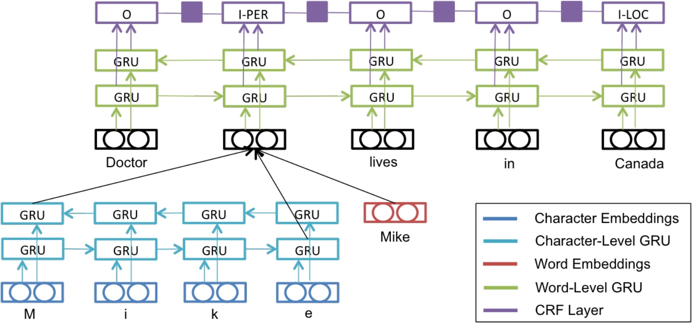

title: NPFL114, Lecture 7
class: title, langtech, cc-by-nc-sa
style: .algorithm { background-color: #eee; padding: .5em }

# Recurrent Neural Networks II

## Milan Straka

### April 15, 2019

---
section: Refresh
# Recurrent Neural Networks

## Single RNN cell

## Unrolled RNN cells

---
# Basic RNN Cell

Given an input $→x^{(t)}$ and previous state $→s^{(t-1)}$, the new state is computed as
$$→s^{(t)} = f(→s^{(t-1)}, →x^{(t)}; →θ).$$

One of the simplest possibilities is
$$→s^{(t)} = \tanh(⇉U→s^{(t-1)} + ⇉V→x^{(t)} + →b).$$

---
# Basic RNN Cell

Basic RNN cells suffer a lot from vanishing/exploding gradients (_the challenge
of long-term dependencies_).

If we simplify the recurrence of states to
$$→s^{(t)} = ⇉U→s^{(t-1)},$$
we get
$$→s^{(t)} = ⇉U^t→s^{(0)}.$$

If $U$ has eigenvalue decomposition of $⇉U = ⇉Q ⇉Λ ⇉Q^{-1}$, we get
$$→s^{(t)} = ⇉Q ⇉Λ^t ⇉Q^{-1} →s^{(0)}.$$
The main problem is that the _same_ function is iteratively applied many times.

Several more complex RNN cell variants have been proposed, which alleviate
this issue to some degree, namely **LSTM** and **GRU**.

---
# Long Short-Term Memory

Later in Gers, Schmidhuber & Cummins (1999) a possibility to _forget_
information from memory cell $→c_t$ was added.

$$\begin{aligned}
  →i_t & ← σ(⇉W^i →x_t + ⇉V^i →h_{t-1} + →b^i) \\
  →f_t & ← σ(⇉W^f →x_t + ⇉V^f →h_{t-1} + →b^f) \\
  →o_t & ← σ(⇉W^o →x_t + ⇉V^o →h_{t-1} + →b^o) \\
  →c_t & ← →f_t \cdot →c_{t-1} + →i_t \cdot \tanh(⇉W^y →x_t + ⇉V^y →h_{t-1} + →b^y) \\
  →h_t & ← →o_t \cdot \tanh(→c_t)
\end{aligned}$$

---
# Long Short-Term Memory

---
# Long Short-Term Memory

---
# Long Short-Term Memory

---
# Long Short-Term Memory

---
# Long Short-Term Memory

---
# Long Short-Term Memory

---
# Long Short-Term Memory

---
section: GRU
# Gated Recurrent Unit

_Gated recurrent unit (GRU)_ was proposed by Cho et al. (2014) as
a simplification of LSTM. The main differences are
- no memory cell
- forgetting and updating tied together

---
# Gated Recurrent Unit

$$\begin{aligned}
  →r_t & ← σ(⇉W^r →x_t + ⇉V^r →h_{t-1} + →b^r) \\
  →u_t & ← σ(⇉W^u →x_t + ⇉V^u →h_{t-1} + →b^u) \\
  →ĥ_t & ← \tanh(⇉W^h →x_t + ⇉V^h (→r_t \cdot →h_{t-1}) + →b^h) \\
  →h_t & ← →u_t \cdot →h_{t-1} + (1 - →u_t) \cdot →ĥ_t
\end{aligned}$$

---
# Gated Recurrent Unit

---
section: Highway Networds
class: middle, center
# Highway Networks

# Highway Networks

---
# Highway Networks

For input $→x$, fully connected layer computes
$$→y ← H(→x, ⇉W_H).$$

~~~

Highway networks add residual connection with gating:
$$→y ← H(→x, ⇉W_H) \cdot T(→x, ⇉W_T) + →x \cdot (1 - T(→x, ⇉W_T)).$$

~~~

Usually, the gating is defined as
$$T(→x, ⇉W_T) ← σ(⇉W_T →x + →b_T).$$

---
# Highway Networks

---
# Highway Networks

---
# Highway Networks

---
section: RNN Regularization
# Multilayer RNNs

---
# Multilayer RNNs

---
# Regularizing RNNs

## Dropout

- Using dropout on hidden states interferes with long-term dependencies.

~~~

- However, using dropout on the inputs and outputs works well and is used
frequently.
~~~
    - In case residual connections are present, the output dropout needs to be
      applied before adding the residual connection.

~~~
- Several techniques were designed to allow using dropout on hidden states.
    - Variational Dropout
    - Recurrent Dropout
    - Zoneout

---
# Regularizing RNNs

## Variational Dropout

~~~
Implemented in `tf.keras.layers.{RNN,LSTM,GRU}` using `dropout` and
`recurrent_dropout` arguments (for dropping inputs and previous states,
respectively).

---
# Regularizing RNNs

## Recurrent Dropout

Dropout only candidate states (i.e., values added to the memory cell in LSTM and previous state in GRU).

~~~
## Zoneout

Randomly preserve hidden activations instead of dropping them.

~~~
## Batch Normalization

Very fragile and sensitive to proper initialization (there were papers with
negative results until people managed to make it work).

---
# Regularizing RNNs

## Layer Normalization

Much more stable than batch normalization.

---
section: Word Embeddings
# Word Embeddings

One-hot encoding considers all words to be independent of each other.

However, words are not independent – some are more similar than others.

Ideally, we would like some kind of similarity in the space of the word
representations.

~~~
## Distributed Representation
The idea behind distributed representation is that objects can
be represented using a set of common underlying factors.

~~~
We therefore represent words as fixed-size _embeddings_ into $ℝ^d$ space,
with the vector elements playing role of the common underlying factors.

---
# Word Embeddings

The word embedding layer is in fact just a fully connected layer on top of
one-hot encoding. However, it is important that this layer is _shared_ across
the whole network.

~~~

~~~

---
# Word Embeddings for Unknown Words

## Recurrent Character-level WEs

---
# Word Embeddings for Unknown Words

# Convolutional Character-level WEs

---
# Character-level WE Implementation

## Training

- Generate unique words per batch.

~~~
- Process the unique words in the batch.

~~~
- Copy the resulting embeddings suitably in the batch.

~~~
## Inference

- We can cache character-level word embeddings during inference.

---
# Basic RNN Applications

## Sequence Element Classification

Use outputs for individual elements.

~~~
## Sequence Representation

Use state after processing the whole sequence (alternatively, take output of the
last element).

---
# Bidirectional RNN

---
# Sequence Tagging

---
# Multitask Learning

---
# Multitask Learning

---
# Multitask Learning

---
# Multitask Learning

---
section: CRF
class: middle, center
# Structured Prediction

# Structured Prediction

---
# Structured Prediction

Consider generating a sequence of $y_1, \ldots, y_N ∈ Y^N$ given input
$→x_1, \ldots, →x_N$.

~~~
Predicting each sequence element independently models the distribution $P(y_i | ⇉X)$.

~~~
However, there may be dependencies among the $y_i$ themselves, which
is difficult to capture by independent element classification.

---
# Conditional Random Fields

Let $G = (V, E)$ be a graph such that $Y$ is indexed by vertices of $G$.
Then $(⇉X, →y)$ is a conditional Markov field, if the random variables $→y$
conditioned on $⇉X$ obey the Markov property with respect to the graph, i.e.,
$$P(y_i | ⇉X, y_j, i ≠j) = P(y_i | ⇉X, y_j ~ ∀j: (i, j) ∈ E).$$

~~~
Usually we assume that dependencies of $→y$, conditioned on $⇉X$, form a chain.

---
# Linear-Chain Conditional Random Fields (CRF)

Linear-chain Conditional Random Fields, usually abbreviated only to CRF, acts as
an output layer. It can be considered an extension of a softmax – instead of
a sequence of independent softmaxes, CRF is a sentence-level softmax, with
additional weights for neighboring sequence elements.

~~~
$$s(⇉X, →y; →θ, ⇉A) = ∑_{i=1}^N \big(⇉A_{y_{i-1}, y_i} + f_→θ(y_i | ⇉X)\big)$$

~~~
$$p(→y | ⇉X) = \softmax_{→z ∈ Y^N}\big(s(⇉X, →z)\big)_{→z}$$

~~~
$$\log p(→y | ⇉X) = s(⇉X, →y) - \operatorname{logadd}_{→z ∈ Y^N}(s(⇉X, →z))$$

---
# Linear-Chain Conditional Random Fields (CRF)

## Computation

We can compute $p(→y | ⇉X)$ efficiently using dynamic programming. If we denote
$α_t(k)$ as probability of all sentences with $t$ elements with the last $y$
being $k$.

~~~
The core idea is the following:

$$α_t(k) = f_→θ(y_t=k | ⇉X) + \operatorname{logadd}_{j∈Y} (α_{t-1}(j) + ⇉A_{j, k}).$$

~~~
For efficient implementation, we use the fact that
$$\ln(a+b) = \ln a + \ln (1 + e^{\ln b - \ln a}).$$

---
# Conditional Random Fields (CRF)

**Inputs**: Network computing $f_→θ(y_t = k | ⇉X)$, an unnormalized probability
of output sequence element probability being $k$ in time $t$. 
**Inputs**: Transition matrix $⇉A ∈ ℝ^{Y×Y}$. 
**Inputs**: Input sequence $⇉X$ of length $N$, gold labeling $→y ∈ Y^N$. 
**Outputs**: Value of $\log p(→y | ⇉X)$. 
**Complexity**: $𝓞(N ⋅ Y^2)$.

- For $k = 1, \ldots, Y$: $α_0(k) ← 0$
- For $t = 1, \ldots, N$:
  - For $k = 1, \ldots, Y:$
    - $α_t(k) ← 0$
    - For $j = 1, \ldots, Y$:
      - $α_t(k) ← \operatorname{logadd}(α_t(k), α_{t-1}(j) + ⇉A_{j, k})$
    - $α_t(k) ← α_t(k) + f_→θ(y_t=k | ⇉X)$

---
# Conditional Random Fields (CRF)

## Decoding

We can perform optimal decoding, by using the same algorithm, only replacing
$\operatorname{logadd}$ with $\max$ and tracking where the maximum was attained.

~~~
## Applications

CRF output layers are useful for _span labeling_ tasks, like
- named entity recognition
- dialog slot filling

---
section: CTC
# Connectionist Temporal Classification

Let us again consider generating a sequence of $y_1, \ldots, y_M$ given input
$→x_1, \ldots, →x_N$, but this time $M ≤ N$ and there is no explicit alignment
of $→x$ and $y$ in the gold data.

~~~

---
# Connectionist Temporal Classification

We enlarge the set of output labels by a – (_blank_) and perform a classification for every
input element to produce an _extended labeling_. We then post-process it by the
following rules (denoted $𝓑$):
1. We remove neighboring symbols.
2. We remove the –.

~~~
Because the explicit alignment of inputs and labels is not known, we consider
_all possible_ alignments.

~~~
Denoting the probability of label $l$ at time $t$ as $p_l^t$, we define
$$α^t(s) ≝ ∑_{\textrm{labeling }→π: 𝓑(→π_{1:t}) = →y_{1:s}} ∏_{t'=1}^t p_{→π_{t'}}^{t'}.$$

---
# CRF and CTC Comparison

In CRF, we normalize the whole sentences, therefore we need to compute
unnormalized probabilities for all the (exponentially many) sentences. Decoding
can be performed optimally.

~~~
In CTC, we normalize per each label. However, because we do not have explicit
alignment, we compute probability of a labeling by summing probabilities
of (generally exponentially many) extended labelings.

---
# Connectionist Temporal Classification

## Computation

When aligning an extended labeling to a regular one, we need to consider
whether the extended labeling ends by a _blank_ or not. We therefore define
$$\begin{aligned}
  α_-^t(s) &≝ ∑_{\textrm{labeling }→π: 𝓑(→π_{1:t}) = →y_{1:s}, π_t=-} ∏_{t'=1}^t p_{→π_{t'}}^{t'} \\
  α_*^t(s) &≝ ∑_{\textrm{labeling }→π: 𝓑(→π_{1:t}) = →y_{1:s}, π_t≠-} ∏_{t'=1}^t p_{→π_{t'}}^{t'}
\end{aligned}$$
and compute $α^t(s)$ as $α_-^t(s) + α_*^t(s)$.

---
# Connectionist Temporal Classification

## Computation

We initialize $α$s as follows:
- $α_-^1(0) ← p_-^1$
- $α_*^1(1) ← p_{y_1}^1$

~~~
We then proceed recurrently according to:
- $α_-^t(s) ← p_-^t (α_-^{t-1}(s) + α_*^{t-1}(s))$
~~~
- $α_*^t(s) ← \begin{cases}
  p_{y_s}^t(α_*^{t-1}(s) + α_*^{t-1}(s-1) + a_-^{t-1}(s-1))\textrm{, if }y_s≠y_{s-1}\\
  p_{y_s}^t(α_*^{t-1}(s) + a_-^{t-1}(s-1))\textrm{, if }y_s=y_{s-1}\\
\end{cases}$

---
# CTC Decoding

Unlike CRF, we cannot perform the decoding optimally. The key
observation is that while an optimal extended labeling can be extended
into an optimal labeling of a larger length, the same does not apply to
regular (non-extended) labeling. The problem is that regular labeling coresponds
to many extended labelings, which are modified each in a different way
during an extension of the regular labeling.

---
# CTC Decoding

## Beam Search

To perform beam search, we keep $k$ best regular labelings for each prefix of
the extended labelings. For each regular labeling we keep both $α_-$ and
$a_*$ and by _best_ we mean such regular labelings with maximum $α_- + α_*$.

To compute best regular labelings for longer prefix of extended labelings,
for each regular labeling in the beam we consider the following cases:
- adding a _blank_ symbol, i.e., updating both $α_-$ and $α_*$;
- adding any non-blank symbol, i.e., updating $α_*$.

Finally, we merge the resulting candidates according to their regular labeling and
keep only the $k$ best.

---
section: Word2vec
# Unsupervised Word Embeddings

The embeddings can be trained for each task separately.

~~~

However, a method of precomputing word embeddings have been proposed, based on
_distributional hypothesis_:

**Words that are used in the same contexts tend to have similar meanings**.

The distributional hypothesis is usually attributed to Firth (1957).

---
# Word2Vec

Mikolov et al. (2013) proposed two very simple architectures for precomputing
word embeddings, together with a C multi-threaded implementation `word2vec`.

---
# Word2Vec

---
# Word2Vec – SkipGram Model

Considering input word $w_i$ and output $w_o$, the Skip-gram model defines
$$p(w_o | w_i) ≝ \frac{e^{⇉W_{w_o}^\top ⇉V_{w_i}}}{∑_w e^{⇉W_w^\top ⇉V_{w_i}}}.$$

---
# Word2Vec – Hierarchical Softmax

Instead of a large softmax, we construct a binary tree over the words, with
a sigmoid classifier for each node.

If word $w$ corresponds to a path $n_1, n_2, \ldots, n_L$, we define
$$p_\textrm{HS}(w | w_i) ≝ ∏_{j=1}^{L-1} σ(\textrm{[+1 if }n_{j+1}\textrm{  is right child else -1]} \cdot ⇉W_{n_j}^\top ⇉V_{w_i}).$$

---
# Word2Vec – Negative Sampling

Instead of a large softmax, we could train individual sigmoids for all words.

We could also only sample the _negative examples_ instead of training all of
them.

This gives rise to the following _negative sampling_ objective:
$$l_\textrm{NEG}(w_o, w_i) ≝ \log σ(⇉W_{w_o}^\top ⇉V_{w_i}) + ∑_{j=1}^k 𝔼_{w_j ∼ P(w)} \log \big(1 - σ(⇉W_{w_j}^\top ⇉V_{w_i})\big).$$

~~~

For $P(w)$, both uniform and unigram distribution $U(w)$ work, but
$$U(w)^{3/4}$$
outperforms them significantly (this fact has been reported in several papers by
different authors).
