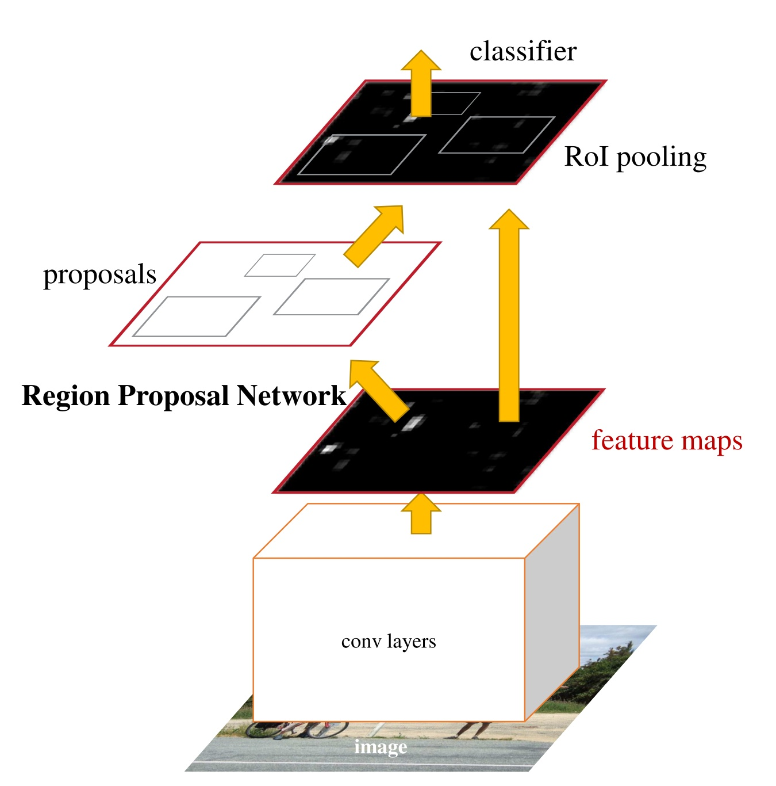
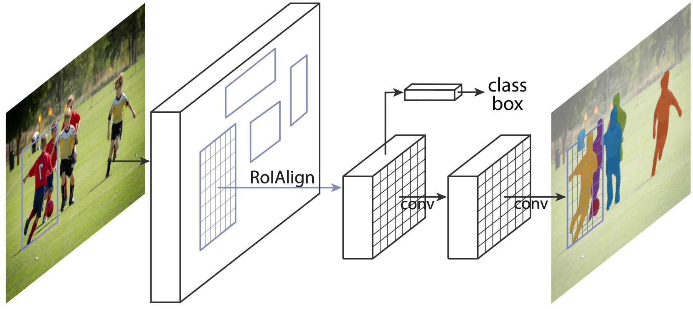

class: title
## NPFL114, Lecture 06

# Object Detection & Segmentation, Recurrent Neural Networks

.author[
Milan Straka
]

---
# Object Detection

- Object detection (including location)

--
- Image segmentation

--
- Human pose estimation

---
# Fast R-CNN

- Start with a network pre-trained on ImageNet (VGG-16 is used in the original
  paper).

--

## RoI Pooling
- Crucial for fast performance.
- The last max-pool layer ($14×14 → 7×7$ in VGG) is replaced by a RoI pooling
  layer, producing output of the same size. For each output sub-window we
  max-pool the corresponding values in the output layer.
- Two sibling layers are added, one predicting $K+1$ categories and the other
  one predicting 4 bounding box parameters for each of $K$ categories.

---
class: middle
# Fast R-CNN

---
# Fast R-CNN

The bounding box is parametrized as follows. Let $x\_r, y\_r, w\_r, h\_r$ be
center coordinates and width and height of the RoI, and let $x, y, w, h$ be
parameters of the bounding box. We represent them as follows:
$$\begin{aligned}
t\_x &= (x - x\_r)/w\_r, & t\_y &= (y - y\_r)/h\_r \\\
t\_w &= \log (w/w\_r), & t\_h &= \log (h/h\_r)
\end{aligned}$$

--

Usually a $\textrm{smooth}\_{L\_1}$ loss is employed for bounding box parameters
$$\textrm{smooth}\_{L\_1}(x) = \begin{cases}
  0.5x^2    & \textrm{if }|x| < 1 \\\
  |x| - 0.5 & \textrm{otherwise}
\end{cases}$$

--

The complete loss is then
$$L(\hat c, \hat t,c, t) = L\_\textrm{cls}(\hat c, c) + λ[c ≥ 1]
  ∑\_{i ∈ \lbrace \mathrm{x, y, w, h}\rbrace} \textrm{smooth}\_{L\_1}(\hat t\_i - t\_i).$$

---
# Fast R-CNN

##Intersection over union
For two bounding boxes (or two masks) the _intersection over union_ (_IoU_)
is a ration of the intersection of the boxes (or masks) and the union
of the boxes (or masks).

--

##Choosing RoIs for training
During training, we use $2$ images with $64$ RoIs each. The RoIs are selected
so that $25\%$ have intersection over union (IoU) overlap with ground-truth
boxes at least 0.5; the others are chosen to have the IoU in range $\[0.1, 0.5)$.

--

##Choosing RoIs during inference
Single object can be found in multiple RoIs. To choose the most salient one,
we perform _non-maximum suppression_ -- we ignore RoIs which have an overlap
with a higher scoring larger than a given threshold (usually, 0.3 is used).

---
# Object Detection Evaluation

##Average Precision
Evaluation is performed using _Average Precision_ (_AP_).

We assume all bounding boxes (or masks) produced by a system have confidence
values which can be used to rank them. Then, for a single class, we take the
boxes (or masks) in the order of the ranks and generate precision/recall curve,
considering a bounding box correct if it has IoU at least 0.5 with any
ground-truth box.
We define _AP_ as an average of precisions for recall levels $0, 0.1, 0.2,
\ldots, 1$.

--

---
# Faster R-CNN

For Fast R-CNN, the most time consuming part is generating the RoIs.

Therefore, Faster R-CNN jointly generates _regions of interest_ using
a _region proposal network_ and performs object detection.

--

---
# Faster R-CNN

The region proposals are generated using a $3×3$ sliding window, with
3 different scales ($128^2$, $256^2$ and $512^2$) and 3
aspect ratios ($1:1$, $1:2$, $2:1$).

---
class: middle
# Faster R-CNN

---
# Mask R-CNN

"Straightforward" extension of Faster R-CNN able to produce image segmentation
(i.e., masks for every object).

---
class: middle
# Mask R-CNN

---
# Mask R-CNN

##RoIAlign

More precise alignment if required for the RoI in order to predict the masks.
Therefore, instead of max-pooling used in the RoI pooling, RoIAlign with
bilinear interpolation is used instead.

---
# Mask R-CNN

Masks are predicted in a third branch of the object detector.

- Usually higher resolution is needed ($14×14$ instead of $7×7$).
- The masks are predicted for each class separately.
- The masks are predicted using convolutions instead of fully connected layers.

---
class: middle, full
# Mask R-CNN

---
# Mask R-CNN – Human Pose Estimation

--

- Testing applicability of Mask R-CNN architecture.

- Keypoints (e.g., left shoulder, right elbow, …) are detected
  as independent one-hot masks of size $56×56$ with $\softmax$ output function.

--

