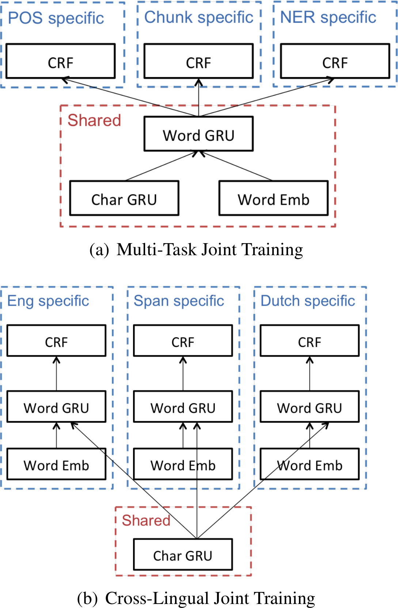

title: NPFL114, Lecture 8
class: title, langtech, cc-by-nc-sa
style: .algorithm { background-color: #eee; padding: .5em }

# Word Embeddings, CRF, CTC

## Milan Straka

### April 20, 2020

---
section: Refresh
# Recurrent Neural Networks

## Single RNN cell


## Unrolled RNN cells


---
# Long Short-Term Memory

Later in Gers, Schmidhuber & Cummins (1999) a possibility to _forget_
information from memory cell $→c_t$ was added.


$$\begin{aligned}
  →i_t & ← σ(⇉W^i →x_t + ⇉V^i →h_{t-1} + →b^i) \\
  →f_t & ← σ(⇉W^f →x_t + ⇉V^f →h_{t-1} + →b^f) \\
  →o_t & ← σ(⇉W^o →x_t + ⇉V^o →h_{t-1} + →b^o) \\
  →c_t & ← →f_t \cdot →c_{t-1} + →i_t \cdot \tanh(⇉W^y →x_t + ⇉V^y →h_{t-1} + →b^y) \\
  →h_t & ← →o_t \cdot \tanh(→c_t)
\end{aligned}$$

---
# Gated Recurrent Unit

_Gated recurrent unit (GRU)_ was proposed by Cho et al. (2014) as
a simplification of LSTM. The main differences are


- no memory cell
- forgetting and updating tied together

$$\begin{aligned}
  →r_t & ← σ(⇉W^r →x_t + ⇉V^r →h_{t-1} + →b^r) \\
  →u_t & ← σ(⇉W^u →x_t + ⇉V^u →h_{t-1} + →b^u) \\
  →ĥ_t & ← \tanh(⇉W^h →x_t + ⇉V^h (→r_t \cdot →h_{t-1}) + →b^h) \\
  →h_t & ← →u_t \cdot →h_{t-1} + (1 - →u_t) \cdot →ĥ_t
\end{aligned}$$

---
# Basic RNN Applications

## Sequence Element Representation

Create output for individual elements, for example for classification of the
individual elements.


## Sequence Representation

Generate a single output for the whole sequence (either the last output of the
last state).

---
# Basic RNN Applications

## Sequence Prediction

During training, predict next sequence element.


During inference, use predicted elements as further inputs.


---
# Multilayer RNNs

We might stack several layers of recurrent neural networks. Usually using two or
three layers gives better results than just one.

In case of multiple layers, residual connections usually improve results.
Because dimensionality has to be the same, they are usually applied from the
second layer.


---
# Bidirectional RNN

To consider both the left and right contexts, a _bidirectional_ RNN can be used,
which consists of parallel application of a _forward_ RNN and a _backward_ RNN.


The outputs of both directions can be either _added_ or _concatenated_. Even
if adding them does not seem very intuitive, it does not increase
dimensionality and therefore allows residual connections to be used in case
of multilayer bidirectional RNN.

---
# Word Embeddings

We might represent _words_ using one-hot encoding, considering all words to be
independent of each other.

However, words are not independent – some are more similar than others.

Ideally, we would like some kind of similarity in the space of the word
representations.

## Distributed Representation
The idea behind distributed representation is that objects can
be represented using a set of common underlying factors.

We therefore represent words as fixed-size _embeddings_ into $ℝ^d$ space,
with the vector elements playing role of the common underlying factors.

These embeddings are initialized randomly and trained together with the rest of
the network.

---
# Word Embeddings

The word embedding layer is in fact just a fully connected layer on top of
one-hot encoding. However, it is not implemented in that way.

Instead, a so-called _embedding_ layer is used, which is much more efficient.
When a matrix is multiplied by an one-hot encoded vector (all but one zeros
and exactly one 1), the row corresponding to that 1 is selected, so the
embedding layer can be implemented only as a simple lookup.

In TensorFlow, the embedding layer is available as
```python
tf.keras.layers.Embedding(input_dim, output_dim)
```
---
# Word Embeddings

Even if the embedding layer is just a fully connected layer on top of one-hot
encoding, it is important that this layer is _shared_ across
the whole network.


---
section: CLE
# Word Embeddings for Unknown Words

## Recurrent Character-level WEs


In order to handle words not seen during training, we could find a way
to generate a representation from the word **characters**.

~~~
A possible way to compose the representation from individual characters
is to use RNNs – we embed _characters_ to get character representation,
and then use a RNN to produce the representation of a whole _sequence of
characters_.

~~~
Usually, both forward and backward directions are used, and the resulting
representations are concatenated/added.

---
# Word Embeddings for Unknown Words

## Convolutional Character-level WEs


Alternatively, 1D convolutions might be used.

~~~
Assume we use a 1D convolution with kernel size 3. It produces a representation
for every input word trigram, but we need a representation of the whole word.
To that end, we use _global max-pooling_ – using it has an interpretable
meaning, where the kernel is a _pattern_ and the activation after the maximum
is a level of a highest match of the pattern anywhere in the word.

~~~
Kernels of varying sizes are usually used (because it makes sense to have
patterns for unigrams, bigrams, trigrams, …) – for example, 25 filters for every
kernel size $(1, 2, 3, 4, 5)$ might be used.

~~~
Lastly, authors employed a highway layer after the convolutions, improving
the results (compared to not using any layer or using a fully connected one).

---
# Character-level WE Implementation

## Training

- Generate unique words per batch.

~~~
- Process the unique words in the batch.

~~~
- Copy the resulting embeddings suitably in the batch.

~~~
## Inference

- We can cache character-level word embeddings during inference.

---
# NLP Processing with CLEs


---
section: MultiTask
# NLP Multitask Learning



---
# NLP Multitask Learning


---
# NLP Multitask Learning


---
section: CRF
class: middle, center
# Structured Prediction

# Structured Prediction

---
# Structured Prediction

Consider generating a sequence of $y_1, \ldots, y_N ∈ Y^N$ given input
$→x_1, \ldots, →x_N$.

~~~
Predicting each sequence element independently models the distribution $P(y_i | ⇉X)$.


~~~
However, there may be dependencies among the $y_i$ themselves, which
is difficult to capture by independent element classification.

---
# Maximum Entropy Markov Models

We might model the dependencies by assuming that the output sequence is
a Markov chain, and model it as
$$P(y_i | ⇉X, y_{i-1}).$$

~~~
Each label would be predicted by a softmax from the hidden state and _the
previous label_.


~~~
The decoding can be then performed by a dynamic programming algorithm.

---
# Maximum Entropy Markov Models

However, MEMMs suffer from a so-called _label bias_ problem. Because the
probability is factorized, each $P(y_i | ⇉X, y_{i-1})$ is a distribution
and **must sum to one**.

~~~
Imagine there was a label error during prediction. In the next step, the model
might “realize” that the previous label has very low probability of being
followed by any label – however, it cannot express this by setting the
probability of all following labels low, it has to “conserve the mass”.

---
# Conditional Random Fields

Let $G = (V, E)$ be a graph such that $→y$ is indexed by vertices of $G$.
Then $(⇉X, →y)$ is a **conditional random field**, if the random variables $→y$
conditioned on $⇉X$ obey the Markov property with respect to the graph, i.e.,
$$P(y_i | ⇉X, y_j, i ≠j) = P(y_i | ⇉X, y_j ~ ∀j: (i, j) ∈ E).$$

~~~
By a _fundamental theorem of random fields_, the density of a conditional random
field can be factorized over the cliques of the graph $G$:
$$P(→y | ⇉X) = ∏_{\textrm{clique~}C\textrm{~of~}G} P(→y_C|⇉X).$$

---
# Linear-Chain Conditional Random Fields (CRF)

Usually often assume that dependencies of $→y$, conditioned on $⇉X$, form a chain.


~~~
Then, the cliques are _nodes_ and _edges_, and we usually factorize the
probability as:
$$P(→y | ⇉X) ∝ \exp\Big(∑_{i=1}^N P(y_i | →x_i) + ∑_{i=2}^N P(y_i, y_{i-1})\Big).$$

---
# Linear-Chain Conditional Random Fields (CRF)

Linear-chain Conditional Random Field, usually abbreviated only to CRF, acts as
an output layer. It can be considered an extension of a softmax – instead of
a sequence of independent softmaxes, CRF is a sentence-level softmax, with
additional weights for neighboring sequence elements.

~~~
$$s(⇉X, →y; →θ, ⇉A) = ∑_{i=1}^N \big(⇉A_{y_{i-1}, y_i} + f_→θ(y_i | ⇉X)\big)$$

~~~
$$p(→y | ⇉X) = \softmax_{→z ∈ Y^N}\big(s(⇉X, →z)\big)_{→y}$$

~~~
$$\log p(→y | ⇉X) = s(⇉X, →y) - \operatorname{logadd}_{→z ∈ Y^N}(s(⇉X, →z))$$


---
# Linear-Chain Conditional Random Fields (CRF)

## Computation

We can compute $p(→y | ⇉X)$ efficiently using dynamic programming. We denote
$α_t(k)$ the logarithmic probability of all $t$-element sequences with the
last label $y$ being $k$.

~~~
The core idea is the following:


$$α_t(k) = f_→θ(y_t=k | ⇉X) + \operatorname{logadd}_{j∈Y} (α_{t-1}(j) + ⇉A_{j, k}).$$

~~~
For efficient implementation, we use the fact that
$$\ln(a+b) = \ln a + \ln (1 + e^{\ln b - \ln a}).$$

---
# Conditional Random Fields (CRF)

<div class="algorithm">

**Inputs**: Network computing $f_→θ(y_t = k | ⇉X)$, an unnormalized probability
of output sequence element probability being $k$ at time $t$.<br>
**Inputs**: Transition matrix $⇉A ∈ ℝ^{Y×Y}$.<br>
**Inputs**: Input sequence $⇉X$ of length $N$, gold labeling $→y^g ∈ Y^N$.<br>
**Outputs**: Value of $\log p(→y^g | ⇉X)$.<br>
**Time Complexity**: $𝓞(N ⋅ Y^2)$.

- For $t = 1, \ldots, N$:
  - For $k = 1, \ldots, Y:$
    - $α_t(k) ← f_→θ(y_t=k | ⇉X)$
    - If $t > 1$:
      - For $j = 1, \ldots, Y$:
        - $α_t(k) ← \operatorname{logadd}(α_t(k), α_{t-1}(j) + ⇉A_{j, k})$
- Return $∑_{t=1}^N f_→θ(y_t=y^g_t | ⇉X) + ∑_{t=2}^N ⇉A_{y^g_{t-1}, y^g_t} - \operatorname{logadd}_{k=1}^Y(α_N(k))$
</div>

---
# Conditional Random Fields (CRF)

## Decoding

We can perform optimal decoding, by using the same algorithm, only replacing
$\operatorname{logadd}$ with $\max$ and tracking where the maximum was attained.

~~~
## Applications


CRF output layers are useful for _span labeling_ tasks, like
- named entity recognition
- dialog slot filling

---
section: CTC
# Connectionist Temporal Classification

Let us again consider generating a sequence of $y_1, \ldots, y_M$ given input
$→x_1, \ldots, →x_N$, but this time $M ≤ N$ and there is no explicit alignment
of $→x$ and $y$ in the gold data.

~~~


---
# Connectionist Temporal Classification

We enlarge the set of output labels by a – (_blank_) and perform a classification for every
input element to produce an _extended labeling_. We then post-process it by the
following rules (denoted $𝓑$):
1. We remove neighboring symbols.
2. We remove the –.

~~~
Because the explicit alignment of inputs and labels is not known, we consider
_all possible_ alignments.

~~~
Denoting the probability of label $l$ at time $t$ as $p_l^t$, we define
$$α^t(s) ≝ ∑_{\textrm{labeling }→π: 𝓑(→π_{1:t}) = →y_{1:s}} ∏_{t'=1}^t p_{→π_{t'}}^{t'}.$$

---
# CRF and CTC Comparison

In CRF, we normalize the whole sentences, therefore we need to compute
unnormalized probabilities for all the (exponentially many) sentences. Decoding
can be performed optimally.

~~~
In CTC, we normalize per each label. However, because we do not have explicit
alignment, we compute probability of a labeling by summing probabilities
of (generally exponentially many) extended labelings.

---
# Connectionist Temporal Classification

## Computation

When aligning an extended labeling to a regular one, we need to consider
whether the extended labeling ends by a _blank_ or not. We therefore define
$$\begin{aligned}
  α_-^t(s) &≝ ∑_{\textrm{labeling }→π: 𝓑(→π_{1:t}) = →y_{1:s}, π_t=-} ∏_{t'=1}^t p_{→π_{t'}}^{t'} \\
  α_*^t(s) &≝ ∑_{\textrm{labeling }→π: 𝓑(→π_{1:t}) = →y_{1:s}, π_t≠-} ∏_{t'=1}^t p_{→π_{t'}}^{t'}
\end{aligned}$$
and compute $α^t(s)$ as $α_-^t(s) + α_*^t(s)$.

---
# Connectionist Temporal Classification

## Computation – Initialization


We initialize $α$s as follows:
- $α_-^1(0) ← p_-^1$
- $α_*^1(1) ← p_{y_1}^1$

~~~
## Computation – Induction Step

We then proceed recurrently according to:
- $α_-^t(s) ← p_-^t \big(α_-^{t-1}(s) + α_*^{t-1}(s)\big)$
~~~
- $α_*^t(s) ← \begin{cases}
  p_{y_s}^t\big(α_*^{t-1}(s) + α_*^{t-1}(s-1) + a_-^{t-1}(s-1)\big)\textrm{, if }y_s≠y_{s-1}\\
  p_{y_s}^t\big(α_*^{t-1}(s) + a_-^{t-1}(s-1)\big)\textrm{, if }y_s=y_{s-1}\\
\end{cases}$

---
# CTC Decoding

Unlike CRF, we cannot perform the decoding optimally.

~~~
The key
observation is that while an optimal extended labeling can be extended
into an optimal labeling of a larger length, the same does not apply to
regular (non-extended) labeling. The problem is that regular labeling corresponds
to many extended labelings, which are modified each in a different way
during an extension of the regular labeling.

~~~


---
# CTC Decoding

## Beam Search

~~~
To perform beam search, we keep $k$ best **regular** (non-extended) labelings
for each prefix of the extended labelings. For each regular labeling we keep
both $α_-$ and $a_*$ and by _best_ we mean such regular labelings with maximum
$α_- + α_*$.

~~~
To compute best regular labelings for longer prefix of extended labelings,
for each regular labeling in the beam we consider the following cases:
~~~
- adding a _blank_ symbol, i.e., updating both $α_-$ and $α_*$;
~~~
- adding a non-blank symbol, i.e., updating $α_*$.

~~~
Finally, we merge the resulting candidates according to their regular labeling and
keep only the $k$ best.
