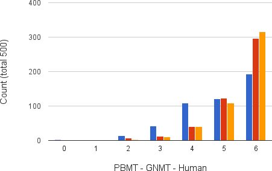

title: NPFL114, Lecture 9
class: title, langtech, cc-by-nc-sa

# Word2Vec, Seq2seq, NMT

## Milan Straka

### April 27, 2020

---
section: Word2vec
# Unsupervised Word Embeddings

The embeddings can be trained for each task separately.

~~~

However, a method of precomputing word embeddings have been proposed, based on
_distributional hypothesis_:

**Words that are used in the same contexts tend to have similar meanings**.

The distributional hypothesis is usually attributed to Firth (1957):
> _You shall know a word by a company it keeps._

---
# Word2Vec

Mikolov et al. (2013) proposed two very simple architectures for precomputing
word embeddings, together with a C multi-threaded implementation `word2vec`.

---
# Word2Vec

---
# Word2Vec – SkipGram Model

Considering input word $w_i$ and output $w_o$, the Skip-gram model defines
$$p(w_o | w_i) ≝ \frac{e^{⇉W_{w_o}^\top ⇉V_{w_i}}}{∑_w e^{⇉W_w^\top ⇉V_{w_i}}}.$$

---
# Word2Vec – Hierarchical Softmax

Instead of a large softmax, we construct a binary tree over the words, with
a sigmoid classifier for each node.

If word $w$ corresponds to a path $n_1, n_2, \ldots, n_L$, we define
$$p_\textrm{HS}(w | w_i) ≝ ∏_{j=1}^{L-1} σ(\textrm{[+1 if }n_{j+1}\textrm{  is right child else -1]} \cdot ⇉W_{n_j}^\top ⇉V_{w_i}).$$

---
# Word2Vec – Negative Sampling

Instead of a large softmax, we could train individual sigmoids for all words.

We could also only sample the _negative examples_ instead of training all of
them.

This gives rise to the following _negative sampling_ objective:
$$l_\textrm{NEG}(w_o, w_i) ≝ \log σ(⇉W_{w_o}^\top ⇉V_{w_i}) + ∑_{j=1}^k 𝔼_{w_j ∼ P(w)} \log \big(1 - σ(⇉W_{w_j}^\top ⇉V_{w_i})\big).$$

~~~

For $P(w)$, both uniform and unigram distribution $U(w)$ work, but
$$U(w)^{3/4}$$
outperforms them significantly (this fact has been reported in several papers by
different authors).

---
section: Subword Embeddings
# Recurrent Character-level WEs

---
# Convolutional Character-level WEs

---
# Character N-grams

Another simple idea appeared simultaneously in three nearly simultaneous
publications as [Charagram](https://arxiv.org/abs/1607.02789), [Subword Information](https://arxiv.org/abs/1607.04606) or [SubGram](http://link.springer.com/chapter/10.1007/978-3-319-45510-5_21).

A word embedding is a sum of the word embedding plus embeddings of its character
_n_-grams. Such embedding can be pretrained using same algorithms as `word2vec`.

~~~
The implementation can be
- dictionary based: only some number of frequent character _n_-grams is kept;
~~~
- hash-based: character _n_-grams are hashed into $K$ buckets
  (usually $K ∼ 10^6$ is used).

---
# Charagram WEs

---
# Charagram WEs

---
section: Seq2seq
class: middle, center
# Sequence-to-Sequence Architecture

# Sequence-to-Sequence Architecture

---
# Sequence-to-Sequence Architecture

---
# Sequence-to-Sequence Architecture

---
# Sequence-to-Sequence Architecture

## Training

The so-called _teacher forcing_ is used during training – the gold outputs are
used as inputs during training.

~~~
## Inference

During inference, the network processes its own predictions.

Usually, the generated logits are processed by an $\argmax$, the chosen word
embedded and used as next input.

---
# Tying Word Embeddings

---
section: Attention
# Attention

As another input during decoding, we add _context vector_ $c_i$:
$$→s_i = f(→s_{i-1}, →y_{i-1}, →c_i).$$

~~~
We compute the context vector as a weighted combination of source sentence
encoded outputs:
$$→c_i = ∑_j α_{ij} →h_j$$

~~~
The weights $α_{ij}$ are softmax of $e_{ij}$ over $j$,
$$→α_i = \softmax(→e_i),$$
with $e_{ij}$ being
$$e_{ij} = →v^\top \tanh(⇉V→h_j + ⇉W→s_{i-1} + →b) .$$

---
# Attention

---
section: SubWords
# Subword Units

Translate _subword units_ instead of words. The subword units can be generated
in several ways, the most commonly used are:

~~~
- **BPE**:
  Using the _byte pair encoding_ algorithm. Start with individual characters plus
  a special end-of-word symbol $⋅$. Then, merge the most occurring symbol pair
  $A, B$ by a new symbol $AB$, with the symbol pair never crossing word boundary
  (so that the end-of-word symbol cannot be inside a subword).

~~~
  Considering a dictionary with words _low, lowest, newer, wider_, a possible
  sequence of merges:

  $$\begin{aligned}
    r \,\,\, ⋅ & → r⋅ \\
    l \,\,\, o & → lo \\
    lo \,\,\, w & → low \\
    e \,\,\, r⋅ & → er⋅ \\
  \end{aligned}$$

---
# Subword Units

- **Wordpieces**:
  Given a text divided into subwords, we can compute unigram probability of
  every subword, and then get the likelihood of the text under a unigram language
  model by multiplying the probabilities of the subwords in the text.

~~~
  When we have only a text and a subword dictionary, we divide the text in
  a greedy fashion, iteratively choosing the longest existing subword.

~~~
  When constructing the subwords, we again start with individual characters, and
  then repeatedly join such a pair of subwords, which increases the unigram
  language model likelihood the most.

~~~
Both approaches give very similar results; a biggest difference is that during
the inference:
- for BPE, the sequence of merges must be performed in the same order as during
  the construction of the BPE;
~~~
- for Wordpieces, it is enough to find longest matches from the subword
  dictionary.

~~~
Usually quite little subword units are used (32k-64k), often generated on the
union of the two vocabularies (the so-called _joint BPE_ or _shared
wordpieces_).

---
section: GNMT
# Google NMT

---
# Google NMT

---
# Google NMT

---
# Beyond one Language Pair

---
# Beyond one Language Pair

---
# Multilingual and Unsupervised Translation

Many attempts at multilingual translation.

- Individual encoders and decoders, shared attention.

- Shared encoders and decoders.

~~~
Surprisingly, even unsupervised translation is attempted lately.
By unsupervised we understand settings where we have access to large
monolingual corpora, but no parallel data.

~~~
In 2019, the best unsupervised systems were on par with the best 2014 supervised
systems.

