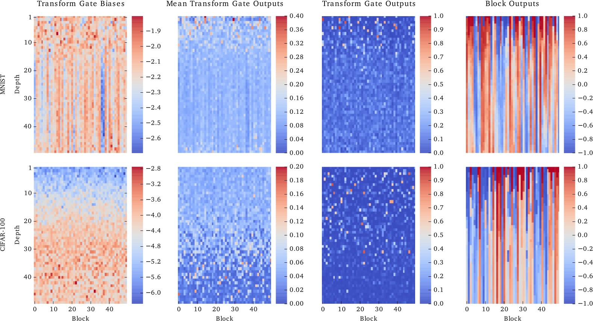

class: title
## NPFL114, Lecture 09

# Recurrent Neural Networks III, Machine Translation

.author[
Milan Straka
]

---
class: middle, center
# Basic RNN Cell

---
class: middle, center
# LSTM Cell

---
class: middle, center
# LSTM Cell

---
class: middle, center
# LSTM Cell

---
class: middle, center
# LSTM Cell

---
class: middle, center
# LSTM Cell

---
class: middle, center
# LSTM Cell

---
class: middle, center
# GRU Cell

---
class: middle, center
# Highway Networks

# Highway Networks

---
# Highway Networks

For input $→x$, fully connected layer computes
$$→y ← H(→x, ⇉W\_H).$$

--

Highway networks add residual connection with gating:
$$→y ← H(→x, ⇉W\_H) \cdot T(→x, ⇉W\_T) + →x \cdot (1 - T(→x, ⇉W\_T)).$$

--

Usually, the gating is defined as
$$T(→x, ⇉W\_T) ← σ(⇉W\_T →x + →b\_T).$$

---
class: middle
# Highway Networks

---
class: middle
# Highway Networks

---
class: middle
# Highway Networks

---
class: middle
# Multilayer RNNs

---
class: middle
# Multilayer RNNs

---
class: center
# Multitask Learning

---
class: middle
# Multitask Learning

---
class: middle
# Multitask Learning

---
class: center
# Multitask Learning

---
# Regularizing RNNs

## Dropout

- Using dropout on hidden states interferes with long-term dependencies.

--

- However, using dropout on the inputs and outputs works well and is used
frequently.

--
    - In case residual connections are present, the output dropout needs to be
      applied before adding the residual connection.

--
- Several techniques were designed to allow using dropout on hidden states.
    - Variational Dropout
    - Recurrent Dropout
    - Zoneout

---
# Regularizing RNNs

## Variational Dropout

--
## Recurrent Dropout

Dropout only candidate states (i.e., values added to the memory cell in LSTM and previous state in GRU).

--
## Zoneout

Randomly preserve hidden activations instead of dropping them.

---
# Regularizing RNNs

## Batch Normalization

Very fragile and sensitive to proper initialization (there were papers with
negative results until people managed to make it work).

--
## Layer Normalization

Much more stable than batch normalization.

---
# TF Layers and Variable Creation

When `tf.layers.Dense` or `tf.nn.rnn_cell.{GRU,...}Cell` is constructed, no
variables are yet created (one of the reasons is that the size of the input is
not known at that time).

--

The variables are instantiated either automatically during first layer
application, or during `build` call (which usually needs to be passed an input
shape).

--

If no variable scope is defined during variable instantiation, a unique one is
generated; otherwise, it is respected. This causes problems during
`tf.nn.[bidirectional_]dynamic_rnn`, which opens a fixed scope if `None` is
passed. Therefore, the safest approach is to always provide a unique scope
for `tf.nn.[bidirectional_]dynamic_rnn`.

---
# Refreshing Word Embeddings

Recall that instead of one-hot encoding, distributed representation of words is
preferred.

--

The word embedding layer is in fact just a fully connected layer on top of
one-hot encoding. However, it is important that this layer is _shared_ across
the whole network.

--

--

---
class: middle, center
# Sequence-to-Sequence Architecture

# Sequence-to-Sequence Architecture

---
class: middle
# Sequence-to-Sequence Architecture

---
class: center
# Sequence-to-Sequence Architecture

---
# Sequence-to-Sequence Architecture

## Training

The so-called _teacher forcing_ is used during training – the gold outputs are
used as inputs during training.

--

## Inference

During inference, the network processes its own predictions.

Usually, the generated logits are processed by an $\argmax$, the chosen word
embedded and used as next input.

---
class: center
# Tying Word Embeddings

---
# Attention

As another input during decoding, we add _context vector_ $c\_i$:
$$→s\_i = f(→s\_{i-1}, →y\_{i-1}, →c\_i).$$

--

We compute the context vector as a weighted combination of source sentence
encoded outputs:
$$→c\_i = ∑\_j α\_{ij} →h\_j$$

--

The weights $α\_{ij}$ are softmax of $e\_{ij}$ over $j$, $→α\_i = \softmax(→e\_i)$,
with $e\_{ij}$ being
$$e\_{ij} = →v^\top \tanh(⇉V→h\_j + ⇉W→s\_{i-1} + →b) .$$

---
class: center
# Attention

---
# Subword Units

Translate _subword units_ instead of words. The subword units can be generated
in several ways, the most commonly used are

--
- BPE – Using the _byte pair encoding_ algorithm. Start with characters plus
  a special end-of-word symbol $\cdot$. Then, merge the most occurring symbol
  pair $A, B$ by a new symbol $AB$, with the symbol pair never crossing word
  boundary.

--

  Considering a dictionary with words _low, lowest, newer, wider_:
  $$\begin{aligned}
    r \,\,\, \cdot & → r\cdot \\\
    l \,\,\, o & → lo \\\
    lo \,\,\, w & → low \\\
    e \,\,\, r\cdot & → er\cdot \\\
  \end{aligned}$$

---
# Subword Units

- Wordpieces – Similar heuristic of joining two neighboring symbols (maximizing
  likelihood under unigram language model).

Usually quite little subword units are used (32k-64k), often generated on the
union of the two vocabularies (the so-called _joint BPE_ or _shared
wordpieces_).

---
class: middle
# Google NMT

---
class: center
# Google NMT

---
class: middle
# Google NMT

---
class: middle
# Beyond one Language Pair

---
class: middle
# Beyond one Language Pair

---
# Multilingual Translation

Many attempts at multilingual translation.

- Individual encoders and decoders, shared attention.

- Shared encoders and decoders.

---
class: center
# Attention is All You Need

---
# Attention is All You Need

The attention module is defined as:

$$\textrm{Attention}(⇉Q, ⇉K, ⇉V) = \softmax\left(\frac{⇉Q ⇉K^\top}{\sqrt{d\_k}}\right)⇉V.$$

Multihead attention is used in practice.

---
# Attention is All You Need

## Positional Embeddings

We need to encode positional information (which was implicit in RNNs).

--

- Learned embeddings for every position.

--

- Sinusoids of different frequencies:
  $$\begin{aligned}
    \textrm{PE}\_{(\textit{pos}, 2i)} & = \sin\left(\textit{pos} / 10000^{2i/d}\right) \\\
    \textrm{PE}\_{(\textit{pos}, 2i + 1)} & = \cos\left(\textit{pos} / 10000^{2i/d}\right)
  \end{aligned}$$

  This choice of functions should allow the model to attend to relative
  positions, since for any fixed $k$, $\textrm{PE}\_{\textit{pos} + k}$ is
  a linear function of $\textrm{PE}\_\textit{pos}$.

---
class: middle
# Why Attention

---
class: middle
# Transformers Results

