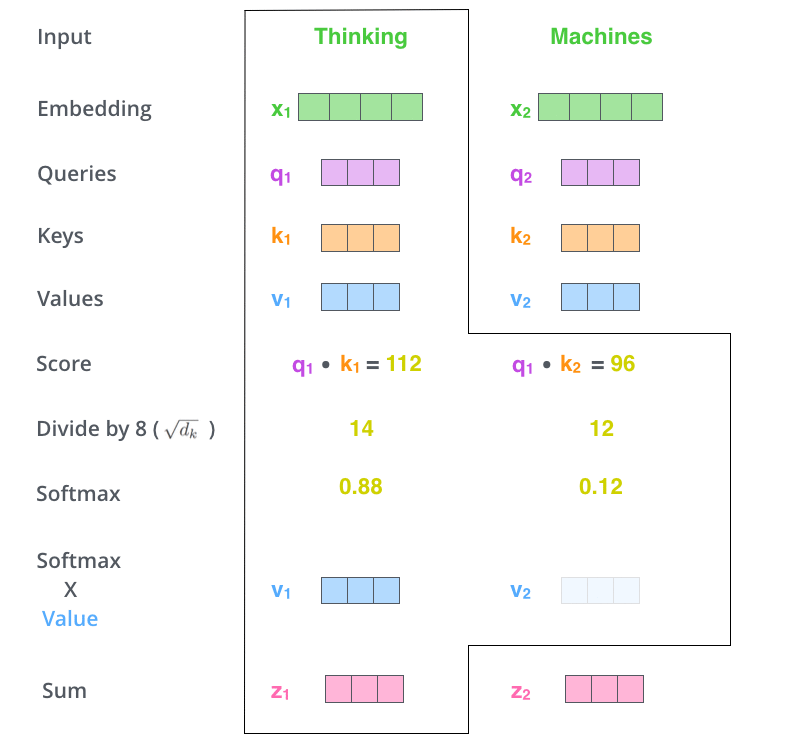

title: NPFL114, Lecture 9
class: title, langtech, cc-by-nc-sa

# Seq2seq, NMT, Transformer

## Milan Straka

### Apr 11, 2021

---
section: Seq2seq
class: middle, center
# Sequence-to-Sequence Architecture

# Sequence-to-Sequence Architecture

---
# Sequence-to-Sequence Architecture

Sequence-to-Sequence is a name for an architecture allowing to produce an
arbitrary output sequence $y_1, …, y_M$ from an input sequence
$→x_1, …, →x_N$.

Unlike CRF/CTC, no assumptions are necessary and we condition each output
sequence element on all input sequence elements and all already generated output
sequence elements:
$$P(y_i | →x_1, …, →x_N, y_1, …, y_{i-1}).$$

---
# Sequence-to-Sequence Architecture

---
# Sequence-to-Sequence Architecture

---
# Sequence-to-Sequence Architecture

## Training

The so-called **teacher forcing** is used during training – the gold outputs are
used as inputs during training.

~~~
## Inference

During inference, the network processes its own predictions – such an approach
is called **autoregressive decoding**.

Usually, the generated logits are processed by an $\argmax$, the chosen word
embedded and used as next input.

---
# Tying Word Embeddings

In the decoder, we both:
- embed the previous prediction, using a matrix of size $ℝ^{V × D}$, where
  $V$ is the vocabulary size and $D$ is the embedding size;
- classify the hidden state into current prediction, using a matrix of
  size $ℝ^{D × V}$.

~~~
Both these matrices have the same meaning – they represent the target-side words
in the embedding space (the first explicitly represents the words by these embeddings,
the second chooses the embedding in a sense “closest” to the produced hidden state).

~~~
Therefore, it makes sense to **tie** these matrices, i.e., to represent one of
them as a transposition of the other.

---
section: Attention
# Attention

---
# Attention

As another input during decoding, we add _context vector_ $c_i$:
$$→s_i = f(→s_{i-1}, →y_{i-1}, →c_i).$$

~~~
We compute the context vector as a weighted combination of source sentence
encoded outputs:
$$→c_i = ∑_j α_{ij} →h_j$$

~~~
The weights $α_{ij}$ are softmax of $e_{ij}$ over $j$,
$$→α_i = \softmax(→e_i),$$
with $e_{ij}$ being
$$e_{ij} = →v^\top \tanh(⇉V→h_j + ⇉W→s_{i-1} + →b) .$$

---
# Attention Implementation

---
# Trained Attention Visualization

---
section: SubWords
# Subword Units

Translate **subword units** instead of words. The subword units can be generated
in several ways, the most commonly used are:

~~~
- **BPE**:
  Using the _byte pair encoding_ algorithm. Start with individual characters plus
  a special end-of-word symbol $⋅$. Then, merge the most occurring symbol pair
  $A, B$ by a new symbol $AB$, with the symbol pair never crossing word boundary
  (so that the end-of-word symbol cannot be inside a subword).

~~~
  Considering a dictionary with words _low, lowest, newer, wider_, a possible
  sequence of merges:

  $$\begin{aligned}
    r \,\,\, ⋅ & → r⋅ \\
    l \,\,\, o & → lo \\
    lo \,\,\, w & → low \\
    e \,\,\, r⋅ & → er⋅ \\
  \end{aligned}$$

---
# Subword Units

- **Wordpieces**:
  Given a text divided into subwords, we can compute unigram probability of
  every subword, and then get the likelihood of the text under a unigram language
  model by multiplying the probabilities of the subwords in the text.

~~~
  When we have only a text and a subword dictionary, we divide the text in
  a greedy fashion, iteratively choosing the longest existing subword.

~~~
  When constructing the subwords, we again start with individual characters, and
  then repeatedly join such a pair of subwords, which increases the unigram
  language model likelihood the most.

~~~
Both approaches give very similar results; the biggest difference is that during
the inference:
- for BPE, the sequence of merges must be performed in the same order as during
  the construction of the BPE;
~~~
- for Wordpieces, it is enough to find longest matches from the subword
  dictionary.

~~~
Usually quite little subword units are used (32k-64k), often generated on the
union of the two vocabularies (the so-called _joint BPE_ or _shared
wordpieces_).

---
section: GNMT
# Google NMT

---
# Google NMT

---
# Google NMT

---
# Beyond one Language Pair

---
# Beyond one Language Pair

---
# Multilingual and Unsupervised Translation

Many attempts at multilingual translation.

- Individual encoders and decoders, shared attention.

- Shared encoders and decoders.

~~~
Surprisingly, even unsupervised translation is attempted lately.
By unsupervised we understand settings where we have access to large
monolingual corpora, but no parallel data.

~~~
In 2019, the best unsupervised systems were on par with the best 2014 supervised
systems.

---
section: Transformer
# Attention is All You Need

For some sequence processing tasks, _sequential_ processing (as performed by
recurrent neural networks) of its elements might be too restrictive.

~~~
Instead, we may want to be able to combine sequence elements independently on
their distance.

~~~
Such processing is allowed in the **Transformer** architecture, originally
proposed for neural machine translation in 2017 in _Attention is All You Need_
paper.

---
# Transformer

---
# Transformer

---
# Transformer

---
# Transformer

---
section: SelfAttention
# Transformer – Self-Attention

Assume that we have a sequence of $n$ words represented using a matrix $⇉X ∈ ℝ^{n×d}$.

The attention module for a queries $⇉Q ∈ ℝ^{n×d_k}$, keys $⇉K ∈ ℝ^{n×d_k}$ and values $⇉V ∈ ℝ^{n×d_v}$ is defined as:

$$\textrm{Attention}(⇉Q, ⇉K, ⇉V) = \softmax\left(\frac{⇉Q ⇉K^\top}{\sqrt{d_k}}\right)⇉V.$$

The queries, keys and values are computed from the input word representations $⇉X$
using a linear transformation as
$$\begin{aligned}
  ⇉Q &= ⇉W^Q ⋅ ⇉X \\
  ⇉K &= ⇉W^K ⋅ ⇉X \\
  ⇉V &= ⇉W^V ⋅ ⇉X \\
\end{aligned}$$

---
# Transformer – Self-Attention

---
# Transformer – Self-Attention

---
# Transformer – Self-Attention

---
# Transformer – Self-Attention

