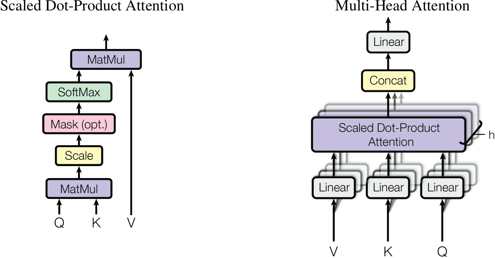
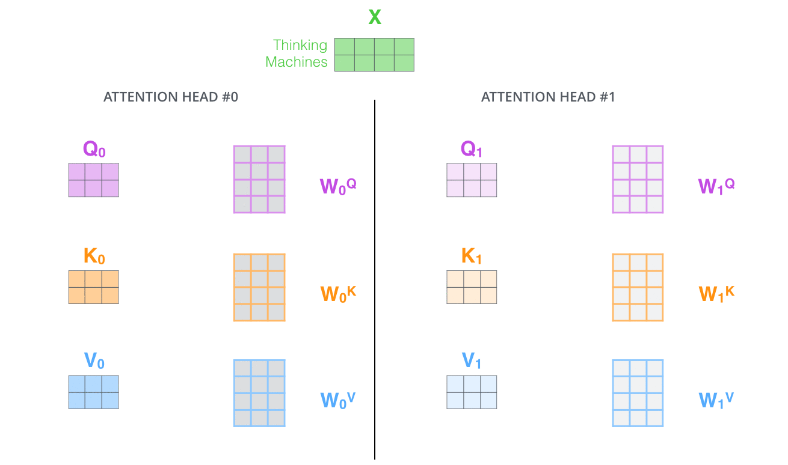
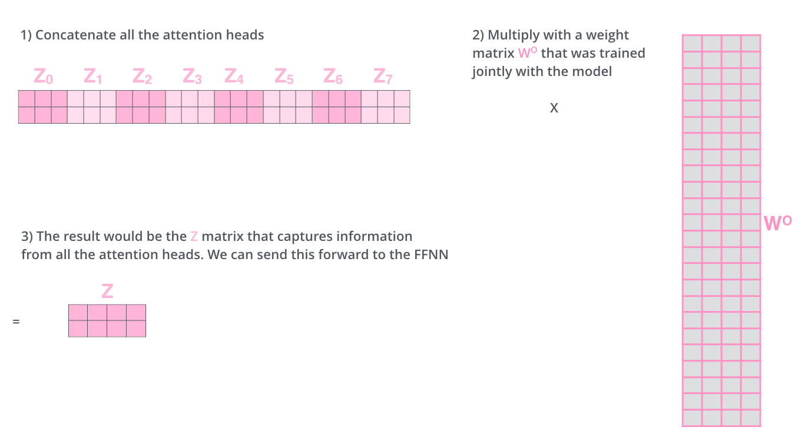
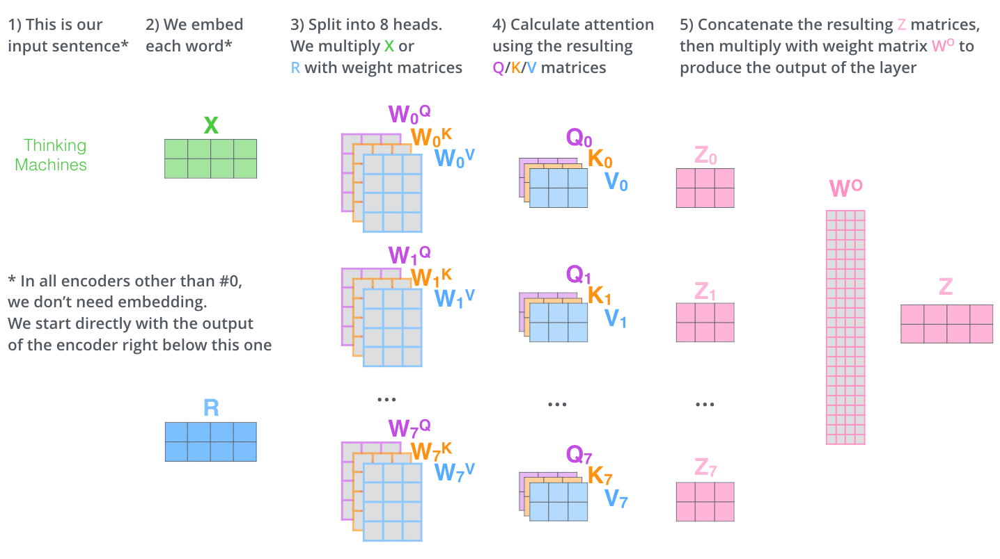
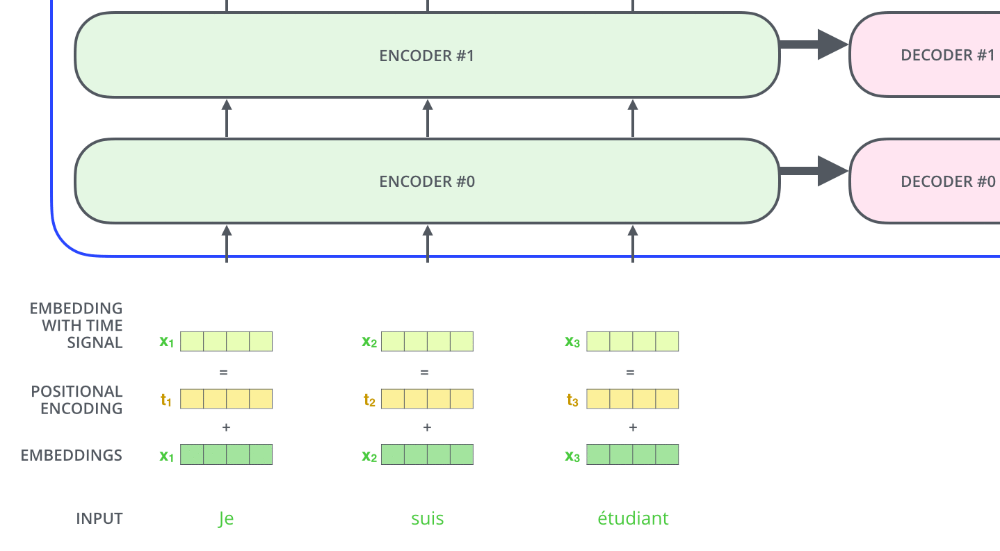
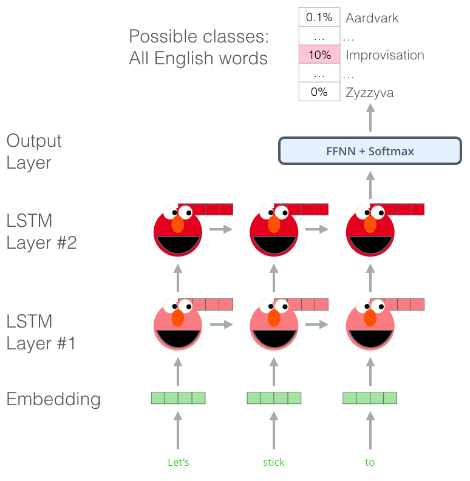
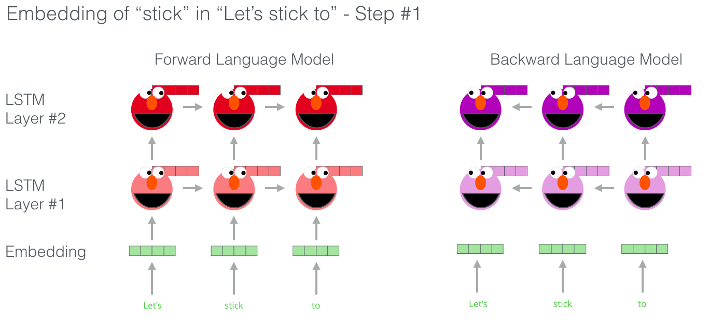
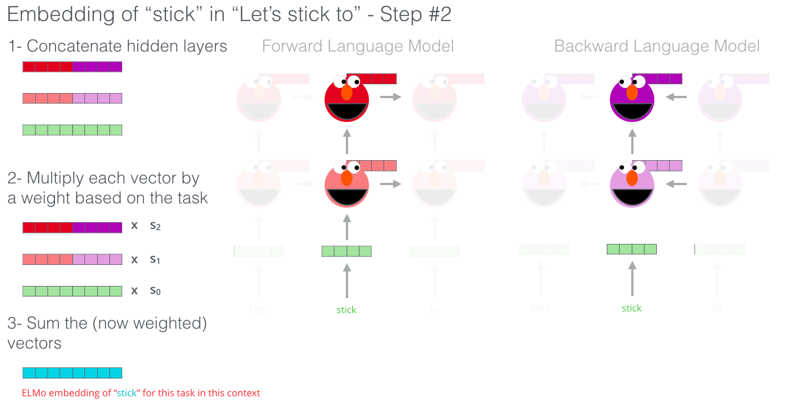
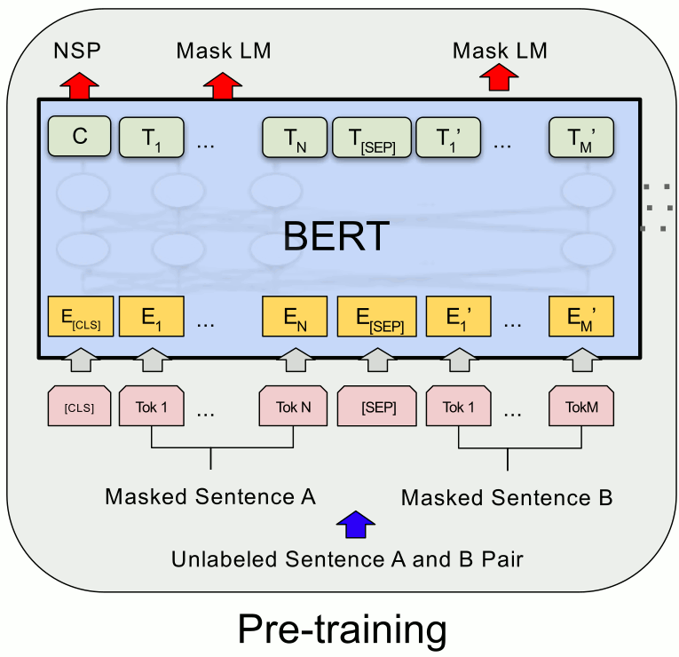
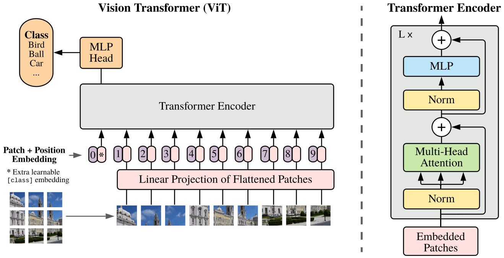

title: NPFL114, Lecture 11
class: title, langtech, cc-by-sa

# Transformer, BERT

## Milan Straka

### April 24, 2023

---
# Attention is All You Need

For some sequence processing tasks, _sequential_ processing (as performed by
recurrent neural networks) of its elements might be too restrictive.

~~~
Instead, we may want to be able to combine sequence elements independently on
their distance.

~~~
Such processing is allowed in the **Transformer** architecture, originally
proposed for neural machine translation in 2017 in _Attention is All You Need_
paper.

---
# Transformer

---
# Transformer

---
# Transformer

---
# Transformer

---
section: SelfAtt
# Transformer – Self-Attention

Assume that we have a sequence of $n$ words represented using a matrix $⇉X ∈ ℝ^{n×d}$.

The attention module for a queries $⇉Q ∈ ℝ^{n×d_k}$, keys $⇉K ∈ ℝ^{n×d_k}$ and values $⇉V ∈ ℝ^{n×d_v}$ is defined as:

$$\textrm{Attention}(⇉Q, ⇉K, ⇉V) = \softmax\left(\frac{⇉Q ⇉K^\top}{\sqrt{d_k}}\right)⇉V.$$

The queries, keys and values are computed from the input word representations $⇉X$
using a linear transformation as
$$\begin{aligned}
  ⇉Q &= ⇉X ⇉W^Q \\
  ⇉K &= ⇉X ⇉W^K \\
  ⇉V &= ⇉X ⇉W^V \\
\end{aligned}$$
for trainable weight matrices $⇉W^Q, ⇉W^K ∈ ℝ^{d×d_k}$ and $⇉W^V ∈ ℝ^{d×d_v}$.

---
# Transformer – Self-Attention

---
# Transformer – Self-Attention

---
# Transformer – Self-Attention

---
# Transformer – Self-Attention

---
# Transformer – Multihead Attention

Multihead attention is used in practice. Instead of using one huge attention, we
split queries, keys and values to several groups (similar to how ResNeXt works),
compute the attention in each of the groups separately, concatenate the
results and multiply them by a matrix $⇉W^O$.

---
# Transformer – Multihead Attention

---
# Transformer – Multihead Attention

---
# Transformer – Multihead Attention

---
# Why Attention

---
# Transformer – Feed Forward Networks

## Feed Forward Networks

The self-attention is complemented with FFN layers, which is a fully connected
ReLU layer with four times as many hidden units as inputs, followed by another
fully connected layer without activation.

---
# Transformer – Post-LN Configuration including Residuals

---
# Transformer – Pre-LN Configuration

---
# Transformer – Decoder

---
# Transformer – Decoder

## Masked Self-Attention

During decoding, the self-attention must attent only to earlier positions in the
output sequence.

~~~
This is achieved by **masking** future positions, i.e., zeroing their weights out,
which is usually implemented by setting them to $-∞$ before the $\softmax$ calculation.

~~~

## Encoder-Decoder Attention

In the encoder-decoder attentions, the _queries_ comes from the decoder, while the
_keys_ and the _values_ originate from the encoder.

---
section: PosEmbed
# Transformer – Positional Embedding

---
# Transformer – Positional Embeddings

## Positional Embeddings

We need to encode positional information (which was implicit in RNNs).

~~~
- Learned embeddings for every position.

~~~
- Sinusoids of different frequencies:
  $$\small\begin{aligned}
    \textrm{PE}_{(\textit{pos}, 2i)} & = \sin\left(\textit{pos} / 10000^{2i/d}\right) \\
    \textrm{PE}_{(\textit{pos}, 2i + 1)} & = \cos\left(\textit{pos} / 10000^{2i/d}\right)
  \end{aligned}$$

~~~
  This choice of functions should allow the model to attend to relative
  positions, since for any fixed $k$, $\textrm{PE}_{\textit{pos} + k}$ is
  a linear function of $\textrm{PE}_\textit{pos}$, because
  $$\small\begin{aligned}
    \textrm{PE}_{(\textit{pos}+k, 2i)}
      &= \sin\left((\textit{pos}+k) / 10000^{2i/d}\right) \\
      &= \sin\left(\textit{pos} / 10000^{2i/d}\right) ⋅ \cos\left(k / 10000^{2i/d}\right) + \cos\left(\textit{pos} / 10000^{2i/d}\right) ⋅ \sin\left(k / 10000^{2i/d}\right) \\
      &= \textit{offset}_{(k,2i)} ⋅ \textrm{PE}_{(\textit{pos}, 2i)} + \textit{offset}_{(k, 2i+1)} ⋅ \textrm{PE}_{(\textit{pos}, 2i + 1)}.
  \end{aligned}$$

---
# Transformer – Positional Embeddings

---
# Transformer – Positional Embeddings

---
# Transformer – Positional Embeddings

---
section: Training
# Transformer – Training

## Regularization

The network is regularized by:
- dropout of input embeddings,
~~~
- dropout of each sub-layer, just before it is added to the residual
  connection (and then normalized),
~~~
- label smoothing.

~~~
Default dropout rate and also label smoothing weight is 0.1.

~~~
## Parallel Execution
Because of the _masked attention_, training can be performed in parallel.

~~~
However, inference is still sequential.

---
# Transformer – Training

## Optimizer

Adam optimizer (with $β_2=0.98$, smaller than the default value of $0.999$)
is used during training, with the learning rate decreasing proportionally to
inverse square root of the step number.

~~~
## Warmup
Furthermore, during the first
$\textit{warmup\_steps}$ updates, the learning rate is increased linearly from
zero to its target value.

$$\textit{learning\_rate} = \frac{1}{\sqrt{d_\textrm{model}}} \min\left(\frac{1}{\sqrt{\textit{step\_num}}}, \frac{\textit{step\_num}}{\textit{warmup\_steps}} ⋅ \frac{1}{\sqrt{\textit{warmup\_steps}}}\right).$$

~~~
In the original paper, 4000 warmup steps were proposed.

---
# Transformers Results

---
# Transformers Results

---
# Transformers Results

## Main Takeaway

Generally, Transformer provides more powerful sequence-to-sequence architecture
and also sequence element representation architecture than RNNs, but requires
**substantially more** data.

---
section: ELMo
# ELMo

At the end of 2017, a new type of _deep contextualized_ word representations was
proposed by Peters et al., called ELMo, **E**mbeddings from **L**anguage
**Mo**dels.

~~~
The ELMo embeddings were based on a two-layer pre-trained LSTM language model,
where a language model predicts following word based on a sentence prefix.
Specifically, two such models were used, one for the forward direction and the
other one for the backward direction.

---
# ELMo

To compute an embedding of a word in a sentence, the concatenation of the two
language model's hidden states is used.

~~~
Pre-trained ELMo embeddings substantially improved several NLP tasks.

---
section: BERT
# BERT

A year later after ELMo, at the end of 2018, a new model called
BERT (standing for **B**idirectional **E**ncoder **R**epresentations from **T**ransformers)
was proposed. It is nowadays one of the most dominating approaches for pre-training word
embeddings and for paragraph and document representations.

~~~

---
# BERT

In the BERT model computes contextualized representations using a bidirectional
Transformer architecture.

---
# BERT

The baseline BERT base model consists of 12 Transformer layers:

~~~
The bidirectionality is important, but it makes training difficult.

---
# BERT Input

The input fo the BERT model is a sequence of subwords, namely their identifiers.
This input represents two so-called _sentences_, but they are in fact
pieces of text with hundreds of subwords (512 maximum in total). The first token
is a special `CLS` token and every sentence is ended by a `SEP` token.

~~~
Every subword representation is a sum of:
- trainable subword embeddings,
~~~
- trainable positional embeddings (not the sinusoidal embeddings, but I do not
  know why),
~~~
- trainable segment embeddings, which indicate if a token belongs to a sentence
  `A` (inclusively up to its `SEP` token) or to sentence `B`.

---
# BERT Pretraining

The BERT model is pretrained using two objectives:
- **masked language model** – 15% of the input words are **masked**, and the model
  tries to predict them (using a head consisting of a fully connected layer with softmax
  activation);

~~~
  - 80% of them are replaced by a special `MASK` token;
~~~
  - 10% of them are replaced by a random word;
~~~
  - 10% of them are left intact.

~~~
- **next sentence prediction** – the model tries to predict whether the second
  _sentence_ followed the first one in the raw corpus (using a head that
  on top of the `CLS` output adds a fully connected layer with tanh activation
  (_pooler_),
  followed by a softmax-activated fully connected layer with two outputs).

~~~
  - 50% of the time the second sentence is the actual next sentence;
~~~
  - 50% of the time the second sentence is a random sentence from the corpus.

---
# BERT Pretraining

For pre-training, English BookCorpus (800M words) and Wikipedia (2,500M words)
are used, with a 30k WordPieces vocabulary.

~~~
Batch size is 256 sequences, each 512 subwords, giving 128k tokens per batch.
Adam with learning rate 1e-4 is used, with linear learning rate warmup for the
first 10k steps, followed by a linear learning rate decay to 0. Standard
momentum parameters are used, and $L^2$ weight decay of 0.01 is utilized.

~~~
Dropout of 0.1 on all layers is used, and GELU activation is used instead of
ReLU.

~~~
Furthermore, because longer sequences are quadratically more expensive, first
90% of the pre-training is performed on sequences of length 128, and only the
last 10% use sequences of length 512.

~~~
Two variants are considered:
- BERT _base_ with 12 layers, 12 attention heads and hidden size 768 (110M parameters),
~~~
- BERT _large_ with 24 layers, 16 attention heads and hidden size 1024 (340M parameters).

---
# BERT – GELU

ReLU multiplies the input by zero or one, depending on its value.

~~~
Dropout stochastically multiplies the input by zero or one.

~~~

Both these functionalities are merged in Gaussian error linear units (GELUs),
where the input value is multiplied by $m ∼ \operatorname{Bernoulli}(Φ(x))$,
where $Φ(x) = P(x' ≤ x)$ for $x' ∼ 𝓝(0, 1)$ is the cumulative density function
of the standard normal distribution.

~~~
The GELUs compute the expectation of this value, i.e.,
$$\operatorname{GELU}(x) = x ⋅ Φ(x) + 0 ⋅ \big(1 - Φ(x)\big) = x Φ(x).$$

~~~
GELUs can be approximated using (no need to remember this):
$$0.5x \left(1 + \tanh\left[\sqrt{2/π}(x + 0.044715 x^3)\right]\right)\textrm{~~or~~}x σ(1.702x).$$

---
# BERT – Finetuning

The pre-trained BERT model can be finetuned on a range of tasks:

- **sentence element representation**

  - PoS tagging
  - named entity recognition
  - …

~~~
- **sentence representation**

  - text classification

~~~
- **sentence relation representation**

  - textual entailment, aka natural language inference (the second sentence is
    _implied by/contradicts/has no relation to_ the first sentence)
  - textual similarity
  - paraphrase detection
  - natural language inference

---
# BERT – Results

For finetuning, dropout 0.1 is used, usually very small number of epochs (2-4) suffice,
and a good learning rate is usually one of 5e-5, 3e-5, 2e-5.

~~~

---
class: middle
# BERT – Results

---
class: middle
# BERT – Ablations

---
section: mBERT
# Multilingual BERT

The Multilingual BERT is pre-trained on 102-104 largest Wikipedias, including the
Czech one.

~~~
There are two versions, the _cased_ one has WordPieces including case,
and the _uncased_ one with subwords all in lower case and _without diacritics_.

~~~
Even if only very small percentage of input sentences were Czech, it works
surprisingly well for Czech NLP.

~~~
Furthermore, without any explicit supervision, mBERT is able to represent the
input languages in a _shared_ space, allowing cross-lingual transfer.

---
# Cross-lingual Transfer with Multilingual BERT

Consider a _reading comprehension_ task, where for a given paragraph and
a question an answer needs to be located in the paragraph.

Then training the model in English and then directly running it on a different
language works comparably to translating the data to English and then back.

---
section: RoBERTa
# RoBERTa – NSP

The _next sentence prediction_ was originally hypothesized to be an important
factor during training of the BERT model, as indicated by ablation experiments.
However, later experiments indicated removing it might improve results.

~~~
The RoBERTa authors therefore performed the following experiments:

- SEGMENT-PAIR: pair of segments with at most 512 tokens in total;
~~~
- SENTENCE-PAIR: pair of _natural sentences_, usually significantly
  shorter than 512 tokens;
~~~
- FULL-SENTENCES: just one segment on input with 512 tokens, can cross document
  boundary;
~~~
- DOC-SENTENCES: just one segment on input with 512 tokens, cannot cross
  document boundary.

---
# RoBERTa – Larger Batches

BERT is trained for 1M steps with a learning rate of 1e-4.

~~~
The RoBERTa authors also considered larger batches (with linearly larger
learning rate).

---
# RoBERTa

The RoBERTa model, **R**bustly **o**ptimized **BERT** **a**pproach, is trained
with dynamic masking, FULL-SENTENCES without NSP, large 8k minibatches
and byte-level BPE with 50k subwords.

---
# RoBERTa Results

---
section: One🤖ToRuleThemAll
style: li p { margin-bottom: 0.3em }
# One Transformer to Rule Them All

The Transformer architecture has been spreading and has become
almost omnipresent in tasks where data is available in abundance,
in which case it usually delivers superior performance.

~~~
## Language Models

- GPT: Transformer decoder-only model, 2018, ~150M parameters

~~~
- GPT-2: Transformer decoder-only model, 2019, ~1.5B parameters
~~~
- GPT-3: Transformer decoder-only model, May 2020, ~175B parameters
~~~
- GPT-4: Transformer decoder-only model, March 2023, ???; $100M
~~~
- Gopher: Transformer decoder-only model, Dec 2021, ~280B parameters
~~~
- XGLM: multilingual Transformer decoder-only model, Dec 2021, ~7.5B parameters
  - 30 languages from 16 language families
~~~
- Megatron-Turing NLP: Transformer decoder-only model, Jan 2022, ~530B parameters
  - trained using 2240 A100
~~~
- PaLM: Transformer decoder-only model, Apr 2022, ~580B parameters
  - trained using 6144 TPUv4; 22% training data non-English

---
# PaLM Jokes Explanations

---
# Pre-trained Encoder-Decoder Models

Various pre-trained encoder-decoder models are available:

- BART, 2019, ~200M parameters
~~~
- T5, Oct 2019, up to ~11B parameters
~~~
  - REALM, Feb 2020, ~330M, uses explicit retrieval from a large knowledge base
  
~~~
- mT5, Oct 2020, ~100 languages, up to ~13B parameters
  - sizes small (300M), base (582M), large (1.23B), xl (3.74B), xxl (12.9B)
~~~
- ByT5, May 2021, byte-based, ~100 languages, same sizes as mT5

---
# Image Recognition with Transformers

In Oct 2020, an influential paper
> _An Image is Worth 16x16 Words: Transformers for Image Recognition at Scale_

proposed processing of images using ViT a variant of the Transformers
architecture (**Vi**sual **T**ransformer)

---
# Image Recognition with Transformers

The ViT architecture surpasses convolutional models like EfficientNet when
pre-trained on very large data (~300M images); however, training only on
ImageNet1k delivered worse results (77.9% top-1  accuracy).

~~~
An improved training with a variety of augmentation (DeiT architecture, Dec
2020) resulted in performance close to EfficientNet when trained only
on ImageNet1k data (83.1% vs 84.7% top-1 accuracy).

~~~
_DeiT III: Revenge of the ViT_ (Apr 2022) has presented simplified training
procedure, achieving results analogous to EfficientNetV2 on ImageNet1k (85.2% vs
85.7% top-1 accuracy) and ImageNet21k (87.2% vs 87.3% top-1 accuracy).

---
# Image Recognition with Transformers

When data is limited (_“only” 1M images_), the best approach to train a ViT
seems to be a BERT-like masking, which was proposed in Nov 2021 paper
> _Masked Autoencoders Are Scalable Vision Learners_.

~~~

~~~
This MAE architecture reaches 86.9% top-1 accuracy on ImageNet1k-only training
on images of size 224, and 87.8\% on images of size 448.

---
# Image Recognition with Transformers

As of April 2023, the current best model on ImageNet is BASIC-L trained with
Lion optimizer. The image encoder in BASIC-L is CoAtNet-7, an architecture
combining MBConv in first stages and relative pre-activated 2D self-attention in
later stages, with GELU activations everywhere. The image encoder has 2.4B
parameters, it is trained on 6.6B noisy image-text pairs using a batch size
of 65536 images in ~7k TPUv4/days, and achieves 91.1% top-1 accuracy.

It also achieves 88.3% zero-shot accuracy on ImageNet, i.e., when no ImageNet
training data is used for training nor finetuning.

---
# Object Detection with Transformers

---
# Object Detection with Transformers

- The encoder uses fixed sine positional encodings added to every self-attention
  layer. The $x$ and $y$ axes are encoded independently and concatenated.

- During training, we pair the predictions and gold objects (padded with
  “`no object`”s to the same length) using a maximum-weight bipartite
  matching algorithm – the Hungarian algorithm.
