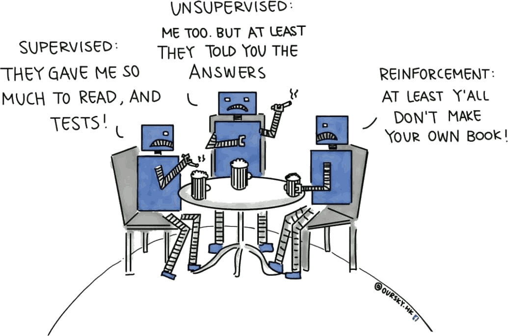
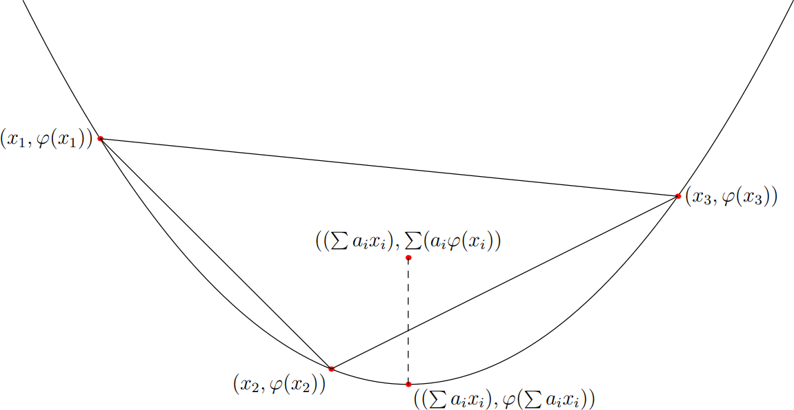

title: NPFL114, Lecture 12
class: title, langtech, cc-by-sa

# Deep Reinforcement Learning, VAE

## Milan Straka

### May 2, 2023

---
section: RL
class: center, middle
# Reinforcement Learning

# Reinforcement Learning

---
# Reinforcement Learning

**Reinforcement learning** is a machine learning paradigm, different from
_supervised_ and _unsupervised learning_.

~~~
The essence of reinforcement learning is to learn from _interactions_ with the
environment to maximize a numeric _reward_ signal.
~~~
The learner is not told which actions to take, and the actions may affect not
just the immediate reward, but also all following rewards.

~~~

---
# History of Reinforcement Learning

_Develop goal-seeking agent trained using reward signal._

~~~
- _Optimal control_ in 1950s – Richard Bellman

~~~
- Trial and error learning – since 1850s
  - Law and effect – Edward Thorndike, 1911
    - Responses that produce a satisfying effect in a particular situation become
      more likely to occur again in that situation, and responses that produce
      a discomforting effect become less likely to occur again in that situation
  - Shannon, Minsky, Clark&Farley, … – 1950s and 1960s
  - Tsetlin, Holland, Klopf – 1970s
  - Sutton, Barto – since 1980s

---
# Reinforcement Learning Successes

- Human-level video game playing (_DQN_) – 2013 (2015 Nature), Mnih. et al, Deepmind.

~~~
  - After 7 years of development, the _Agent57_ beats humans on all 57
    Atari 2600 games, achieving a mean score of 4766% compared to human players.

~~~

- _AlphaGo_ beat 9-dan professional player Lee Sedol in Go in Mar 2016.
~~~
  - After two years of development, _AlphaZero_ achieved best performance
    in Go, chess, shogi, being trained using self-play only.
  

~~~
- Impressive performance in Dota2, Capture the flag FPS, StarCraft II, …

---
# Reinforcement Learning Successes

- Neural Architecture Search – since 2017

  - automatically designing CNN image recognition networks
    surpassing state-of-the-art performance
  - _NasNet_, _EfficientNet_, _EfficientNetV2_, …
~~~
  - AutoML: automatically discovering
    - architectures (CNN, RNN, overall topology)
    - activation functions
    - optimizers
    - …

~~~
- Optimize nondifferentiable loss
~~~
  - improved translation quality in 2016

~~~
- Discovering discrete latent structures
~~~
- Controlling cooling in Google datacenters directly by AI (2018)
  - reaching 30% cost reduction
~~~
- Reinforcement learning from human feedback (_RLHF_) is used during
  ChatGPT training.

---
section: MABandits
# Multi-armed Bandits

---
class: middle
# Multi-armed Bandits

---
# Multi-armed Bandits

We start by selecting action $A_1$, which is the index of the arm to use, and we
get a reward of $R_1$. We then repeat the process by selecting actions $A_2$, $A_3$, …

~~~
Let $q_*(a)$ be the real **value** of an action $a$:
$$q_*(a) = 𝔼[R_t | A_t = a].$$

~~~

Denoting $Q_t(a)$ our estimated value of action $a$ at time $t$ (before taking
trial $t$), we would like $Q_t(a)$ to converge to $q_*(a)$. A natural way to
estimate $Q_t(a)$ is
$$Q_t(a) ≝ \frac{\textrm{sum of rewards when action }a\textrm{ is taken}}{\textrm{number of times action }a\textrm{ was taken}}.$$

~~~
Following the definition of $Q_t(a)$, we could choose a **greedy** action $A_t$ as
$$A_t ≝ \argmax_a Q_t(a).$$

---
# $ε$-greedy Method

## Exploitation versus Exploration

Choosing a greedy action is **exploitation** of current estimates. We however also
need to **explore** the space of actions to improve our estimates.

~~~

An _$ε$-greedy_ method follows the greedy action with probability $1-ε$, and
chooses a uniformly random action with probability $ε$.

---
# $ε$-greedy Method

---
section: MDP
# Markov Decision Process

~~~~
# Markov Decision Process

A **Markov decision process** (MDP) is a quadruple $(𝓢, 𝓐, p, γ)$,
where:
- $𝓢$ is a set of states,
~~~
- $𝓐$ is a set of actions,
~~~
- $p(S_{t+1} = s', R_{t+1} = r | S_t = s, A_t = a)$ is a probability that
  action $a ∈ 𝓐$ will lead from state $s ∈ 𝓢$ to $s' ∈ 𝓢$, producing a **reward** $r ∈ ℝ$,
~~~
- $γ ∈ [0, 1]$ is a **discount factor** (we always use $γ=1$ and finite episodes in this course).

~~~
Let a **return** $G_t$ be $G_t ≝ ∑_{k=0}^∞ γ^k R_{t + 1 + k}$. The goal is to optimize $𝔼[G_0]$.

---
# Episodic and Continuing Tasks

If the agent-environment interaction naturally breaks into independent
subsequences, usually called **episodes**, we talk about **episodic tasks**.
Each episode then ends in a special **terminal state**, followed by a reset
to a starting state (either always the same, or sampled from a distribution
of starting states).

~~~
In episodic tasks, it is often the case that every episode ends in at most
$H$ steps. These **finite-horizon tasks** then can use discount factor $γ=1$,
because the return $G ≝ ∑_{t=0}^H γ^t R_{t + 1}$ is well defined.

~~~
If the agent-environment interaction goes on and on without a limit, we instead
talk about **continuing tasks**. In this case, the discount factor $γ$ needs
to be sharply smaller than 1.

---
# Policy

A **policy** $π$ computes a distribution of actions in a given state, i.e.,
$π(a | s)$ corresponds to a probability of performing an action $a$ in state
$s$.

~~~
We will model a policy using a neural network with parameters $→θ$:
$$π(a | s; →θ).$$

~~~
If the number of actions is finite, we consider the policy to be a categorical
distribution and utilize the $\softmax$ output activation as in supervised
classification.

---
# (State-)Value and Action-Value Functions

To evaluate a quality of a policy, we define **value function** $v_π(s)$, or
**state-value function**, as
$$\begin{aligned}
  v_π(s) & ≝ 𝔼_π\left[G_t \middle| S_t = s\right] = 𝔼_π\left[∑\nolimits_{k=0}^∞ γ^k R_{t+k+1} \middle| S_t=s\right] \\
         & = 𝔼_{A_t ∼ π(s)} 𝔼_{S_{t+1},R_{t+1} ∼ p(s,A_t)} \big[R_{t+1}
           + γ 𝔼_{A_{t+1} ∼ π(S_{t+1})} 𝔼_{S_{t+2},R_{t+2} ∼ p(S_{t+1},A_{t+1})} \big[R_{t+2} + … \big]\big]
\end{aligned}$$

~~~
An **action-value function** for a policy $π$ is defined analogously as
$$q_π(s, a) ≝ 𝔼_π\left[G_t \middle| S_t = s, A_t = a\right] = 𝔼_π\left[∑\nolimits_{k=0}^∞ γ^k R_{t+k+1} \middle| S_t=s, A_t = a\right].$$

~~~
The value function and the state-value function can be easily expressed using one another:
$$\begin{aligned}
  v_π(s) &= 𝔼_{a∼π}\big[q_π(s, a)\big], \\
  q_π(s, a) &= 𝔼_{s', r ∼ p}\big[r + γv_π(s')\big]. \\
\end{aligned}$$

---
# Optimal Value Functions

**Optimal state-value function** is defined as
$$v_*(s) ≝ \max_π v_π(s),$$
~~~
and **optimal action-value function** is defined analogously as
$$q_*(s, a) ≝ \max_π q_π(s, a).$$

~~~
Any policy $π_*$ with $v_{π_*} = v_*$ is called an **optimal policy**. Such policy
can be defined as $π_*(s) ≝ \argmax_a q_*(s, a) = \argmax_a 𝔼[R_{t+1} + γv_*(S_{t+1}) | S_t = s, A_t = a]$.
When multiple actions maximize $q_*(s, a)$, the optimal policy can
stochastically choose any of them.

~~~
## Existence
In finite-horizon tasks or if $γ < 1$, there always exists a unique optimal
state-value function, a unique optimal action-value function, and a (not necessarily
unique) optimal policy.

---
section: REINFORCE
# Policy Gradient Methods

We train the policy
$$π(a | s; →θ)$$
by maximizing the expected return $v_π(s)$.

~~~
To that account, we need to compute its **gradient** $∇_{→θ} v_π(s)$.

---
# Policy Gradient Theorem

Assume that $𝓢$ and $𝓐$ are finite, $γ=1$, and that maximum episode length $H$ is also finite.

Let $π(a | s; →θ)$ be a parametrized policy. We denote the initial state
distribution as $h(s)$ and the on-policy distribution under $π$ as $μ(s)$.
Let also $J(→θ) ≝ 𝔼_{s∼h} v_π(s)$.

~~~
Then
$$∇_{→θ} v_π(s) ∝ ∑_{s'∈𝓢} P(s → … → s'|π) ∑_{a ∈ 𝓐} q_π(s', a) ∇_{→θ} π(a | s'; →θ)$$
and
$$∇_{→θ} J(→θ) ∝ ∑_{s∈𝓢} μ(s) ∑_{a ∈ 𝓐} q_π(s, a) ∇_{→θ} π(a | s; →θ),$$

~~~
where $P(s → … → s'|π)$ is the probability of getting to state $s'$ when starting
from state $s$, after any number of 0, 1, … steps.

---
# Proof of Policy Gradient Theorem

$\displaystyle ∇v_π(s) = ∇ \Big[ ∑\nolimits_a π(a|s; →θ) q_π(s, a) \Big]$

~~~
$\displaystyle \phantom{∇v_π(s)} = ∑\nolimits_a \Big[ q_π(s, a) ∇ π(a|s; →θ) + π(a|s; →θ) ∇ q_π(s, a) \Big]$

~~~
$\displaystyle \phantom{∇v_π(s)} = ∑\nolimits_a \Big[ q_π(s, a) ∇ π(a|s; →θ) + π(a|s; →θ) ∇ \big(∑\nolimits_{s', r} p(s', r|s, a)(r + v_π(s'))\big) \Big]$

~~~
$\displaystyle \phantom{∇v_π(s)} = ∑\nolimits_a \Big[ q_π(s, a) ∇ π(a|s; →θ) + π(a|s; →θ) \big(∑\nolimits_{s'} p(s'|s, a) ∇ v_π(s')\big) \Big]$

~~~
_We now expand $v_π(s')$._

~~~
$\displaystyle \phantom{∇v_π(s)} = ∑\nolimits_a \Big[ q_π(s, a) ∇ π(a|s; →θ) + π(a|s; →θ) \Big(∑\nolimits_{s'} p(s'|s, a)\Big(\\
                \quad\qquad\qquad ∑\nolimits_{a'} \Big[ q_π(s', a') ∇ π(a'|s'; →θ) + π(a'|s'; →θ) \big(∑\nolimits_{s''} p(s''|s', a') ∇ v_π(s'')\big) \Big] \Big) \Big) \Big]$

~~~
_Continuing to expand all $v_π(s'')$, we obtain the following:_

$\displaystyle ∇v_π(s) = ∑_{s'∈𝓢} ∑_{k=0}^H P(s → s'\textrm{~in~}k\textrm{~steps~}|π) ∑_{a ∈ 𝓐} q_π(s', a) ∇_{→θ} π(a | s'; →θ).$

---
# Proof of Policy Gradient Theorem

To finish the proof of the first part, it is enough to realize that
$$∑\nolimits_{k=0}^H P(s → s'\textrm{~in~}k\textrm{~steps~}|π) ∝ P(s → … → s'|π).$$

~~~
For the second part, we know that
$$∇_{→θ} J(→θ) = 𝔼_{s ∼ h} ∇_{→θ} v_π(s) ∝ 𝔼_{s ∼ h} ∑_{s'∈𝓢} P(s → … → s'|π) ∑_{a ∈ 𝓐} q_π(s', a) ∇_{→θ} π(a | s'; →θ),$$
~~~
therefore using the fact that $μ(s') = 𝔼_{s ∼ h} P(s → … → s'|π)$ we get
$$∇_{→θ} J(→θ) ∝ ∑_{s∈𝓢} μ(s) ∑_{a ∈ 𝓐} q_π(s, a) ∇_{→θ} π(a | s; →θ).$$

~~~
Finally, note that the theorem can be proven with infinite $𝓢$ and $𝓐$; and
also for infinite episodes when discount factor $γ<1$.

---
# REINFORCE Algorithm

The REINFORCE algorithm (Williams, 1992) uses directly the policy gradient
theorem, minimizing $-J(→θ) ≝ -𝔼_{s∼h} v_π(s)$. The loss gradient is then
$$∇_{→θ} -J(→θ) ∝ -∑_{s∈𝓢} μ(s) ∑_{a ∈ 𝓐} q_π(s, a) ∇_{→θ} π(a | s; →θ) = -𝔼_{s ∼ μ} ∑_{a ∈ 𝓐} q_π(s, a) ∇_{→θ} π(a | s; →θ).$$

~~~
However, the sum over all actions is problematic. Instead, we rewrite it to an
expectation which we can estimate by sampling:
$$∇_{→θ} -J(→θ) ∝ 𝔼_{s ∼ μ} 𝔼_{a ∼ π} q_π(s, a) ∇_{→θ} -\log π(a | s; →θ),$$
where we used the fact that
$$∇_{→θ} \log π(a | s; →θ) = \frac{1}{π(a | s; →θ)} ∇_{→θ} π(a | s; →θ).$$

---
# REINFORCE Algorithm

REINFORCE therefore minimizes the loss $-J(→θ)$ with gradient
$$𝔼_{s ∼ μ} 𝔼_{a ∼ π} q_π(s, a) ∇_{→θ} -\log π(a | s; →θ),$$
where we estimate the $q_π(s, a)$ by a single sample.

Note that the loss is just a weighted variant of negative log-likelihood (NLL),
where the sampled actions play a role of gold labels and are weighted according
to their return.

---
# REINFORCE Algorithm Example Performance

---
section: Baseline
# REINFORCE with Baseline

The returns can be arbitrary – better-than-average and worse-than-average
returns cannot be recognized from the absolute value of the return.

~~~
Hopefully, we can generalize the policy gradient theorem using a baseline $b(s)$
to
$$∇_{→θ} J(→θ) ∝ ∑_{s∈𝓢} μ(s) ∑_{a ∈ 𝓐} \big(q_π(s, a) - b(s)\big) ∇_{→θ} π(a | s; →θ).$$

~~~
The baseline $b(s)$ can be a function or even a random variable, as long as it
does not depend on $a$, because
$$∑_a b(s) ∇_{→θ} π(a | s; →θ) = b(s) ∑_a ∇_{→θ} π(a | s; →θ) = b(s) ∇_{→θ} ∑_a π(a | s; →θ) = b(s) ∇_{→θ} 1 = 0.$$

---
# REINFORCE with Baseline

A good choice for $b(s)$ is $v_π(s)$, which can be shown to minimize the
variance of the gradient estimator. Such baseline reminds centering of the
returns, given that
$$v_π(s) = 𝔼_{a ∼ π} q_π(s, a).$$

~~~
Then, better-than-average returns are positive and worse-than-average returns
are negative.

~~~
The resulting $q_π(s, a) - v_π(s)$ function is also called the **advantage** function
$$a_π(s, a) ≝ q_π(s, a) - v_π(s).$$

~~~
Of course, the $v_π(s)$ baseline can be only approximated. If neural networks
are used to estimate $π(a|s; →θ)$, then some part of the network is usually
shared between the policy and value function estimation, which is trained using
mean square error of the predicted and observed return.

---
# REINFORCE with Baseline

---
# REINFORCE with Baseline Example Performance

---
section: NAS
# Neural Architecture Search (NASNet) – 2017

- We can design neural network architectures using reinforcement learning.

~~~
- The designed network is encoded as a sequence of elements, and is generated
  using an **RNN controller**, which is trained using the REINFORCE with baseline
  algorithm.

~~~
- For every generated sequence, the corresponding network is trained on CIFAR-10
  and the development accuracy is used as a return.

---
# Neural Architecture Search (NASNet) – 2017

The overall architecture of the designed network is fixed and only the Normal
Cells and Reduction Cells are generated by the controller.

---
# Neural Architecture Search (NASNet) – 2017

- Each cell is composed of $B$ blocks ($B=5$ is used in NASNet).
~~~
- Each block is designed by a RNN controller generating 5 parameters.

- Every block is designed by a RNN controller generating individual operations.

---
# Neural Architecture Search (NASNet) – 2017

The final Normal Cell and Reduction Cell chosen from 20k architectures
(500GPUs, 4days).

---
# EfficientNet Search

EfficientNet changes the search in three ways.

~~~
- Computational requirements are part of the return. Notably, the goal is to
  find an architecture $m$ maximizing
  $$\operatorname{DevelopmentAccuracy}(m) ⋅ \left(\frac{\textrm{TargetFLOPS=400M}}{\operatorname{FLOPS}(m)}\right)^{0.07},$$
~~~
  where the constant $0.07$ balances the accuracy and FLOPS (_the constant comes
  from an empirical observation that doubling the FLOPS brings about 5% relative
  accuracy gain, and $1.05 = 2^β$_ gives $β ≈ 0.0704$).

~~~
- It uses a different search space allowing to control kernel sizes and
  channels in different parts of the architecture (compared to using the same
  cell everywhere as in NASNet).

~~~
- Training directly on ImageNet, but only for 5 epochs.

~~~
In total, 8k model architectures are sampled, and PPO algorithm is used
instead of the REINFORCE with baseline.

---
# EfficientNet Search

The overall architecture consists of 7 blocks, each described by 6 parameters
– 42 parameters in total, compared to 50 parameters of the NASNet search space.

---
# EfficientNet-B0 Baseline Network

---
section: RLWhatNext
# What Next

If you liked the introduction to the deep reinforcement learning, I have
a whole course **NPFL122 – Deep Reinforcement Learning**.

~~~
- It covers a range of reinforcement learning algorithms, from the basic
  ones to more advanced algorithms utilizing deep neural networks.

~~~
- Previously it was in winter semester, but it will be in the summer semester
  starting from the next year.

~~~
- This year it was 2/2 C+Ex, but I want to lengthen it to 3/2 C+Ex, like
  the Deep learning.

~~~
- An elective (povinně volitelný) course in the programs:
  - Artificial Intelligence,
  - Language Technologies and Computational Linguistics.

---
section: GenerativeModels
class: center, middle
# Generative Models

# Generative Models

---
# Generative Models

---
# Generative Models

~~~

---
# Generative Models

Generative models are given a set of realizations of a random variable $⁇→x$ and
their goal is to estimate $P(→x)$.

~~~
Usually the goal is to be able to sample from $P(⁇→x)$, but sometimes an
explicit calculation of $P(→x)$ is also possible.

---
# Deep Generative Models

One possible approach to estimate $P(→x)$ is to assume that the random variable
$⁇→x$ depends on a **latent variable** $⁇→z$:
$$P(→x) = ∑_{→z} P(→z) P(→x | →z) = 𝔼_{→z ∼ P(⁇→z)} P(→x | →z).$$

~~~
We use neural networks to estimate the conditional probability
$P_{→θ}(→x | →z)$.

---
# AutoEncoders

- Autoencoders are useful for unsupervised feature extraction, especially when
  performing input compression (i.e., when the dimensionality of the latent
  space $→z$ is smaller than the dimensionality of the input).

~~~
- When $→x + →ε$ is used as input, autoencoders can perform denoising.

~~~
- However, the latent space $→z$ does not need to be fully covered, so
  a randomly chosen $→z$ does not need to produce a valid $→x$.

---
# AutoEncoders

---
section: VAE
# Variational AutoEncoders

We assume $P(⁇→z)$ is fixed and independent on $⁇→x$.

We approximate $P(→x | →z)$ using $P_{→θ}(→x | →z)$. However, in order
to train an autoencoder, we need to know the posterior $P_{→θ}(→z | →x)$, which is usually
intractable.

~~~
We therefore approximate $P_{→θ}(→z | →x)$ by a trainable $Q_{→φ}(→z | →x)$.

---
style: .katex-display { margin: .65em 0 }
# Jensen's Inequality

To derive a loss for training variational autoencoders, we first formulate
the Jensen's inequality.

~~~

Recall that convex functions by definition fulfil that for $→u, →v$ and real $0
≤ t ≤ 1$,
$$f(t→u + (1-t)→v) ≤ tf(→u) + (1-t)f(→v).$$

~~~
The **Jensen's inequality** generalizes the above property to any _convex_
combination of points: if we have $→u_i ∈ ℝ^D$ and weights $w_i ∈ ℝ^+$ such
that $∑_i w_i = 1$, it holds that

$$f\big(∑_i w_i →u_i\big) ≤ ∑_i w_i f\big(→u_i\big).$$

~~~
The Jensen's inequality can be formulated also for probability distributions
(whose expectation can be considered an infinite convex combination):

$$f\big(𝔼[⁇→u]\big) ≤ 𝔼_{⁇→u} \big[f(⁇→u)\big].$$

---
# VAE – Loss Function Derivation

Our goal will be to maximize the log-likelihood as usual, but we need to express
it using the latent variable $→z$:
$$\log P_{→θ}(→x) = \log 𝔼_{P(→z)} \big[P_{→θ}(→x | →z)\big].$$

~~~
However, approximating the expectation using a single sample has monstrous
variance, because for most $→z$, $P_{→θ}(→x | →z)$ will be nearly zero.

~~~
We therefore turn to our _encoder_, which is able for a given $→x$ to generate
“its” $→z$:

~~~
$\displaystyle \kern10em\mathllap{\log P_{→θ}(→x)} = \log 𝔼_{P(→z)} \big[P_{→θ}(→x | →z)\big]$

$\displaystyle \kern10em{} = \log 𝔼_{Q_{→φ}(→z|→x)} \bigg[P_{→θ}(→x | →z) ⋅ \frac{P(→z)}{Q_{→φ}(→z|→x)}\bigg]$

~~~
$\displaystyle \kern10em{} ≥ 𝔼_{Q_{→φ}(→z|→x)} \bigg[\log P_{→θ}(→x | →z) + \log\frac{P(→z)}{Q_{→φ}(→z|→x)}\bigg]$

~~~
$\displaystyle \kern10em{} = 𝔼_{Q_{→φ}(→z|→x)} \big[\log P_{→θ}(→x | →z)\big] - D_\textrm{KL}\big(Q_{→φ}(→z|→x) \| P(→z)\big).$

---
# VAE – Variational (or Evidence) Lower Bound

The resulting **variational lower bound** or **evidence lower bound** (ELBO),
denoted $𝓛(→θ, →φ;⁇→x)$, can be also defined explicitly as:
$$𝓛(→θ, →φ;⁇→x) = \log P_{→θ}(→x) - D_\textrm{KL}\big(Q_{→φ}(→z | →x) \| P_{→θ}(→z | →x)\big).$$

~~~
Because KL-divergence is nonnegative, $𝓛(→θ, →φ;⁇→x) ≤ \log P_{→θ}(→x).$

~~~
By using simple properties of conditional and joint probability, we get that

~~~
$\displaystyle \kern9em\mathllap{𝓛(→θ, →φ;⁇→x)} = 𝔼_{Q_{→φ}(→z | →x)} \big[\log P_{→θ}(→x) + \log P_{→θ}(→z | →x) - \log Q_{→φ}(→z | →x)\big]$

~~~
$\displaystyle \kern9em{} = 𝔼_{Q_{→φ}(→z | →x)} \big[\log P_{→θ}(→x, →z) - \log Q_{→φ}(→z | →x)\big]$

~~~
$\displaystyle \kern9em{} = 𝔼_{Q_{→φ}(→z | →x)} \big[\log P_{→θ}(→x | →z) + \log P(→z) - \log Q_{→φ}(→z | →x)\big]$

~~~
$\displaystyle \kern9em{} = 𝔼_{Q_{→φ}(→z | →x)} \big[\log P_{→θ}(→x | →z)\big] - D_\textrm{KL}\big(Q_{→φ}(→z | →x) \| P(→z)\big).$

---
# Variational AutoEncoders Training

$$-𝓛(→θ, →φ;⁇→x) = 𝔼_{Q_{→φ}(→z | →x)} \big[-\log P_{→θ}(→x | →z)\big] + D_\textrm{KL}\big(Q_{→φ}(→z | →x) \| P(→z)\big)$$

- We train a VAE by minimizing the $-𝓛(→θ, →φ;⁇→x)$.

~~~
- The $𝔼_{Q_{→φ}(→z | →x)}$ is estimated using a single sample.
~~~
- The distribution $Q_{→φ}(→z | →x)$ is parametrized as a normal distribution
  $𝓝(→z | →μ, →σ^2)$, with the model predicting $→μ$ and $→σ$ given $→x$.
~~~
  - In order for $→σ$ to be positive, we can use $\exp$ activation function
    (so that the network predicts $\log →σ$ before the activation), or for
    example a $\operatorname{softplus}$ activation function.
~~~
  - The normal distribution is used, because we can sample from it efficiently,
    we can backpropagate through it and we can compute $D_\textrm{KL}$
    analytically; furthermore, if we decide to parametrize $Q_{→φ}(→z | →x)$ using
    mean and variance, the maximum entropy principle suggests we should use the
    normal distribution.
~~~
- We use a prior $P(→z) = 𝓝(→0, →I)$.

---
# Variational AutoEncoders Training

$$-𝓛(→θ, →φ;⁇→x) = 𝔼_{Q_{→φ}(→z | →x)} \big[-\log P_{→θ}(→x | →z)\big] + D_\textrm{KL}\big(Q_{→φ}(→z | →x) \| P(→z)\big)$$

Note that the loss has 2 intuitive components:
- **reconstruction loss** – starting with $→x$, passing though $Q_{→φ}$, sampling
  $→z$ and then passing through $P_{→θ}$ should arrive back at $→x$;
~~~
- **latent loss** – over all $→x$, the distribution of $Q_{→φ}(→z | →x)$ should be as close as
  possible to the prior $P(→z) = 𝓝(→0, →I)$, which is independent on $→x$.

---
# Variational AutoEncoders – Reparametrization Trick

In order to backpropagate through $→z∼Q_{→φ}(→z | →x)$, note that if
$$→z ∼ 𝓝(→μ, →σ^2),$$

~~~
we can write $→z$ as
$$→z ∼ →μ + →σ ⊙ 𝓝(→0, →I).$$

~~~
Such formulation then allows differentiating $→z$ with respect to
$→μ$ and $→σ$ and is called a **reparametrization trick** (Kingma and Welling, 2013).

---
# Variational AutoEncoders – Reparametrization Trick

---
# Variational AutoEncoders – Reparametrization Trick

---
# Variational AutoEncoders

---
# Variational AutoEncoders

---
# Variational AutoEncoders

---
# Variational AutoEncoders – Too High Latent Loss

---
# Variational AutoEncoders – Too High Reconstruction Loss

