title: NPFL114, Lecture 12
class: title, langtech, cc-by-nc-sa

# Deep Generative Models

## Milan Straka

### May 2, 2022

---
# Generative Models

Generative models are given a set of realizations of a random variable $⁇→x$ and
their goal is to estimate $P(→x)$.

~~~
Usually the goal is to be able to sample from $P(⁇→x)$, but sometimes an
explicit calculation of $P(→x)$ is also possible.

---
# Deep Generative Models


One possible approach to estimate $P(→x)$ is to assume that the random variable
$⁇→x$ depends on a **latent variable** $⁇→z$:
$$P(→x) = ∑_{→z} P(→z) P(→x | →z) = 𝔼_{→z ∼ P(⁇→z)} P(→x | →z).$$

~~~
We use neural networks to estimate the conditional probability
$P_{→θ}(→x | →z)$.

---
section: Autoencoders
# AutoEncoders


- Autoencoders are useful for unsupervised feature extraction, especially when
  performing input compression (i.e., when the dimensionality of the latent
  space $→z$ is smaller than the dimensionality of the input).

~~~
- When $→x + →ε$ is used as input, autoencoders can perform denoising.

~~~
- However, the latent space $→z$ does not need to be fully covered, so
  a randomly chosen $→z$ does not need to produce a valid $→x$.

---
# AutoEncoders


---
section: VAE
# Variational AutoEncoders

We assume $P(⁇→z)$ is fixed and independent on $⁇→x$.

We approximate $P(→x | →z)$ using $P_{→θ}(→x | →z)$. However, in order
to train an autoencoder, we need to know the posterior $P_{→θ}(→z | →x)$, which is usually
intractable.

~~~
We therefore approximate $P_{→θ}(→z | →x)$ by a trainable $Q_{→φ}(→z | →x)$.

---
# Variational AutoEncoders

Let us define **variational lower bound** or **evidence lower bound** (ELBO),
denoted $𝓛(→θ, →φ;⁇→x)$, as
$$𝓛(→θ, →φ;⁇→x) = \log P_{→θ}(→x) - D_\textrm{KL}\big(Q_{→φ}(→z | →x) \| P_{→θ}(→z | →x)\big).$$

~~~
Because KL-divergence is non-negative, $𝓛(→θ, →φ;⁇→x) ≤ \log P_{→θ}(→x).$

~~~
By using simple properties of conditional and joint probability, we get that

~~~
$\displaystyle \kern9em\mathllap{𝓛(→θ, →φ;⁇→x)} = 𝔼_{Q_{→φ}(→z | →x)} \big[\log P_{→θ}(→x) + \log P_{→θ}(→z | →x) - \log Q_{→φ}(→z | →x)\big]$

~~~
$\displaystyle \kern9em{} = 𝔼_{Q_{→φ}(→z | →x)} \big[\log P_{→θ}(→x, →z) - \log Q_{→φ}(→z | →x)\big]$

~~~
$\displaystyle \kern9em{} = 𝔼_{Q_{→φ}(→z | →x)} \big[\log P_{→θ}(→x | →z) + \log P(→z) - \log Q_{→φ}(→z | →x)\big]$

~~~
$\displaystyle \kern9em{} = 𝔼_{Q_{→φ}(→z | →x)} \big[\log P_{→θ}(→x | →z)\big] - D_\textrm{KL}\big(Q_{→φ}(→z | →x) \| P(→z)\big).$

---
# Variational AutoEncoders

$$-𝓛(→θ, →φ;⁇→x) = 𝔼_{Q_{→φ}(→z | →x)} \big[-\log P_{→θ}(→x | →z)\big] + D_\textrm{KL}\big(Q_{→φ}(→z | →x) \| P(→z)\big)$$

- We train a VAE by minimizing $-𝓛(→θ, →φ;⁇→x)$.
~~~
- The distribution $Q_{→φ}(→z | →x)$ is parametrized as a normal distribution
  $𝓝(→z | →μ, →σ^2)$, with the model predicting $→μ$ and $→σ$ given $→x$.
~~~
  - In order for $→σ$ to be positive, we can use $\exp$ activation function
    (so that the network predicts $\log →σ$ before the activation), or for
    example a $\operatorname{softplus}$ activation function.
~~~
  - The normal distribution is used, because we can sample from it efficiently,
    we can backpropagate through it and we can compute $D_\textrm{KL}$
    analytically; furthermore, if we decide to parametrize $Q_{→φ}(→z | →x)$ using
    mean and variance, the maximum entropy principle suggests we should use the
    normal distribution.
~~~
- The $𝔼_{Q_{→φ}(→z | →x)}$ is estimated using a single sample.
~~~
- We use a prior $P(→z) = 𝓝(→0, →I)$.

---
# Variational AutoEncoders

$$-𝓛(→θ, →φ;⁇→x) = 𝔼_{Q_{→φ}(→z | →x)} \big[-\log P_{→θ}(→x | →z)\big] + D_\textrm{KL}\big(Q_{→φ}(→z | →x) \| P(→z)\big)$$


Note that the loss has 2 intuitive components:
- **reconstruction loss** – starting with $→x$, passing though $Q_{→φ}$, sampling
  $→z$ and then passing through $P_{→θ}$ should arrive back at $→x$;
~~~
- **latent loss** – over all $→x$, the distribution of $Q_{→φ}(→z | →x)$ should be as close as
  possible to the prior $P(→z) = 𝓝(→0, →I)$, which is independent on $→x$.

---
# VAE – Reparametrization Trick

In order to backpropagate through $→z∼Q_{→φ}(→z | →x)$, note that if
$$→z ∼ 𝓝(→μ, →σ^2),$$

~~~
we can write $→z$ as
$$→z ∼ →μ + →σ \cdot 𝓝(→0, →I).$$

~~~
Such formulation then allows differentiating $→z$ with respect to
$→μ$ and $→σ$ and is called a **reparametrization trick** (Kingma and Welling, 2013).

---
# VAE – Reparametrization Trick

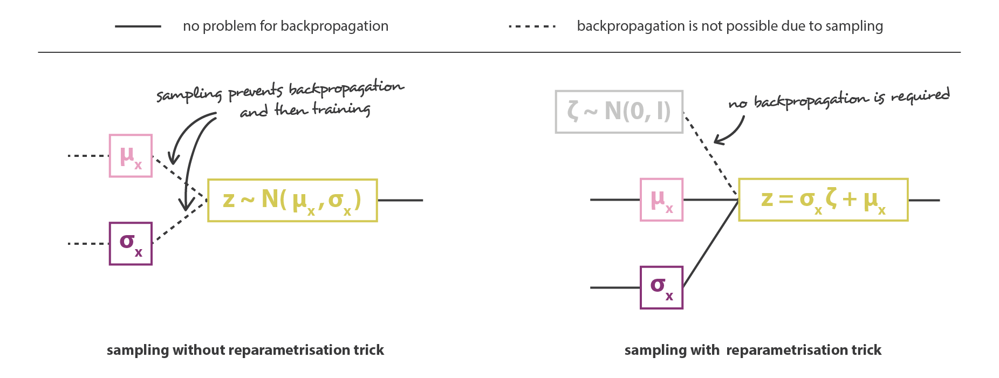

---
# VAE – Reparametrization Trick


---
# Variational AutoEncoders


---
# Variational AutoEncoders


---
# Variational AutoEncoders

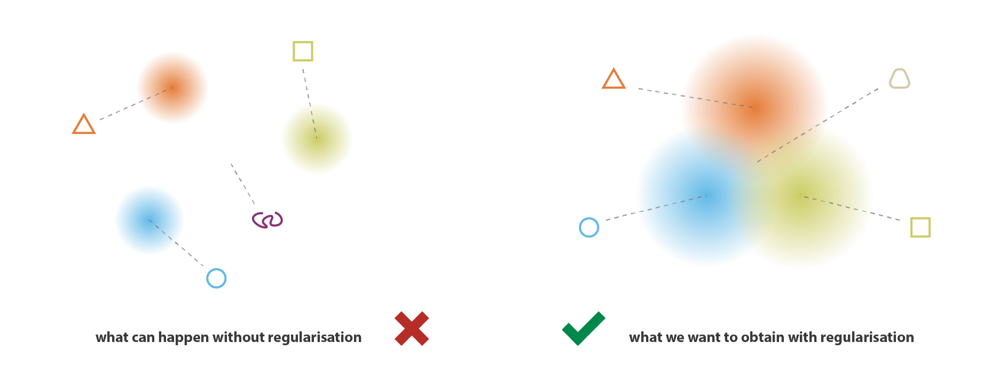

---
# VAE – Too High Latent Loss


---
# VAE – Too High Reconstruction Loss


---
class: dbend
# VAE – Another Derivation

There is also another way to arrive at the variational lower bound.

~~~
First remember that Jensen's inequality states that for a concave function $f$
(like $\log$),
$$f\big(𝔼[x]\big) ≥ 𝔼\big[f(x)\big].$$

~~~
Starting with the log probability, we proceed as follows:

$\displaystyle \kern10em\mathllap{\log P(→x)} = \log 𝔼_{P(→z)} \big[P(→x | →z)\big]$

~~~
$\displaystyle \kern10em{} = \log 𝔼_{Q(→z|→x)} \bigg[P(→x | →z) ⋅ \frac{P(→z)}{Q(→z|→x)}\bigg]$

~~~
$\displaystyle \kern10em{} ≥ 𝔼_{Q(→z|→x)} \bigg[\log P(→x | →z) + \log\frac{P(→z)}{Q(→z|→x)}\bigg]$

~~~
$\displaystyle \kern10em{} ≥ 𝔼_{Q(→z|→x)} \big[\log P(→x | →z)\big] - D_\textrm{KL}\big(Q(→z|→x) \| P(→z)\big)$

---
section: GAN
# Generative Adversarial Networks

We have a **generator**, which given $→z ∼ P(⁇→z)$ generates data $→x$.

We denote the generator as $G(→z; →θ_g)$.

~~~
Then we have a **discriminator**, which given data $→x$ generates a probability
whether $→x$ comes from real data or is generated by a generator.

We denote the discriminator as $D(→x; →θ_d)$.

~~~
The discriminator and generator play the following game:
$$\min_G \max_D 𝔼_{→x ∼ P_\textrm{data}}[\log D(→x)] + 𝔼_{→z ∼ P(⁇→z)}[\log (1 - D(G(→z)))].$$

---
# Generative Adversarial Networks


The generator and discriminator are alternately trained, the discriminator by
$$\argmax_{→θ_d} 𝔼_{→x ∼ P_\textrm{data}}[\log D(→x)] + 𝔼_{→z ∼ P(⁇→z)}[\log (1 - D(G(→z)))]$$
and the generator by
$$\argmin_{→θ_g} 𝔼_{→z ∼ P(⁇→z)}[\log (1 - D(G(→z)))].$$

~~~
In a sense, the discriminator acts as a trainable loss for the generator.

---
# Generative Adversarial Networks

Because $\log (1 - D(G(→z)))$ can saturate in the beginning of the training,
where the discriminator can easily distinguish real and generated samples,
the generator can be trained by
$$\argmin_{→θ_g} 𝔼_{→z ∼ P(⁇→z)}[-\log D(G(→z))]$$
instead, which results in the same fixed-point dynamics, but much stronger
gradients early in learning.

---
# Generative Adversarial Networks


---
# Generative Adversarial Networks


---
# Conditional GAN


---
section: DCGAN
# Deep Convolutional GAN

In Deep Convolutional GAN, the discriminator is a convolutional network (with
batch normalization) and the generator is also a convolutional network,
utilizing transposed convolutions.


---
# Deep Convolutional GAN


---
# Deep Convolutional GAN


---
# Deep Convolutional GAN


---
# Deep Convolutional GAN

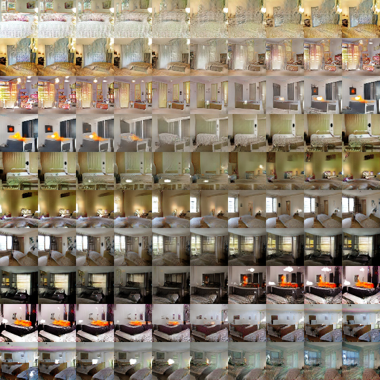

---
# Deep Convolutional GAN

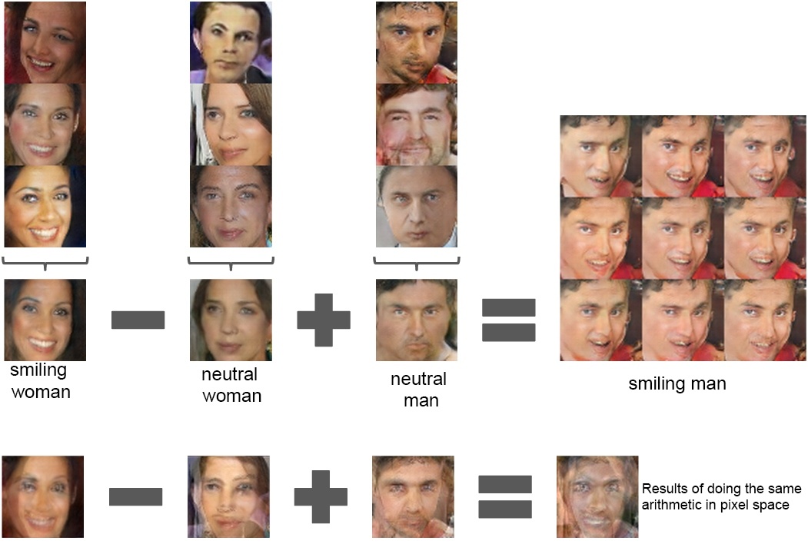

---
# Deep Convolutional GAN


---
# Deep Convolutional GAN


---
# GANs Training

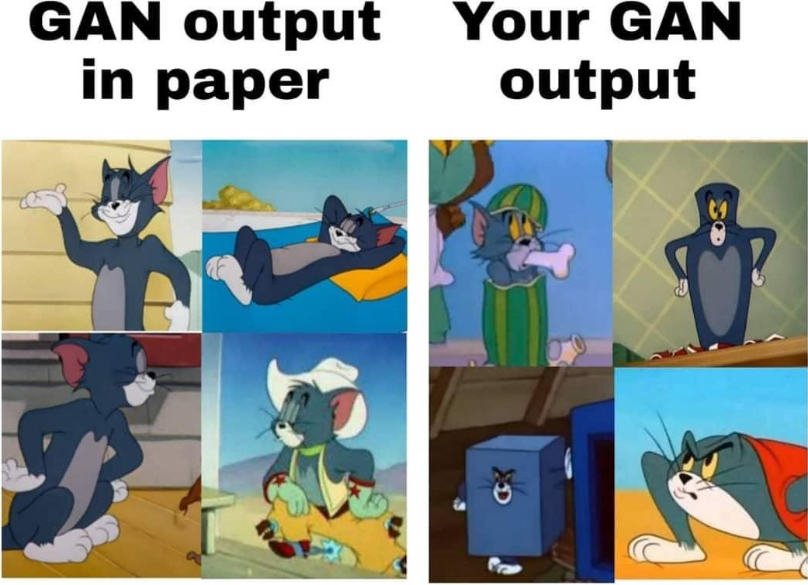

---
# GANs Training


---
section: GANConvergence
# GANs are Problematic to Train

Unfortunately, alternating SGD steps are not guaranteed to reach even
a local optimum of a minimax problem – consider the following one:
$$\min_x \max_y x⋅y.$$

~~~
The update rules of $x$ and $y$ for learning rate $α$ are
$$\begin{bmatrix} x_{n+1} \\ y_{n+1} \end{bmatrix} = \begin{bmatrix} 1 & -α \\ α & 1 \end{bmatrix} \begin{bmatrix} x_n \\ y_n \end{bmatrix}.$$

~~~
The update matrix is a rotation matrix multiplied by a constant $\sqrt{1 + α^2} > 1$
$$\begin{bmatrix} 1 & -α \\ α & 1 \end{bmatrix} = \sqrt{1 + α^2} ⋅ \begin{bmatrix} \cos φ & -\sin φ \\ \sin φ & \cos φ \end{bmatrix},$$
so the SGD will not converge with arbitrarily small step size.

---
# GANs are Problematic to Train


---
# GANs are Problematic to Train

- Mode collapse

  

~~~
  - If the discriminator could see the whole batch, similar samples in it would
    be candidates for fake images.

    - Batch normalization helps a lot with this.

~~~
  - Historical averaging

~~~
- Label smoothing of only positive samples helps with the gradient flow.

---
section: Summary
# Comparison of VAEs and GANs

The Variational Autoencoders:
- are theoretically-pleasing;
~~~
- also provide an encoder, so apart from generation, they can be used as
  unsupervised feature extraction (the VAE encoder is used in various
  modeling architectures);
~~~
- the generated samples tend to be blurry (because of the sampling used in the
  reconstruction).

~~~
The Generative Adversarial Networks:
- offer very high sample quality;
~~~
- are difficult to train and suffer from mode collapse.

~~~
In past few years, GANs saw a big development, improving the sample quality
substantially. However, since 2019/2020, VAEs have shown remarkable progress
(alleviating the blurriness issue via discrete categorical latent variables,
usually arranged in a 2D grid), and are being used for generation too.
Furthermore, additional approaches (normalizing flows, diffusion models) are
being explored, with diffusion models becoming the most promising approach
since Q2 of 2021, surpassing both VAEs and GANs.

---
section: {W,Big}GAN
# Development of GANs

- Martin Arjovsky, Soumith Chintala, Léon Bottou: **Wasserstein GAN** https://arxiv.org/abs/1701.07875
- Ishaan Gulrajani, Faruk Ahmed, Martin Arjovsky, Vincent Dumoulin, Aaron Courville: **Improved Training of Wasserstein GANs** https://arxiv.org/abs/1704.00028
- Tero Karras, Timo Aila, Samuli Laine, Jaakko Lehtinen: **Progressive Growing of GANs for Improved Quality, Stability, and Variation** https://arxiv.org/abs/1710.10196
- Takeru Miyato, Toshiki Kataoka, Masanori Koyama, Yuichi Yoshida: **Spectral Normalization for Generative Adversarial Networks** https://arxiv.org/abs/1802.05957
- Zhiming Zhou, Yuxuan Song, Lantao Yu, Hongwei Wang, Jiadong Liang, Weinan Zhang, Zhihua Zhang, Yong Yu: **Understanding the Effectiveness of Lipschitz-Continuity in Generative Adversarial Nets** https://arxiv.org/abs/1807.00751
- Andrew Brock, Jeff Donahue, Karen Simonyan: **Large Scale GAN Training for High Fidelity Natural Image Synthesis** https://arxiv.org/abs/1809.11096
- Tero Karras, Samuli Laine, Timo Aila: **A Style-Based Generator Architecture for Generative Adversarial Networks** https://arxiv.org/abs/1812.04948

---
class: dbend
# Wasserstein GAN

Standard GANs optimize the Jensen-Shannon divergence
$$\operatorname{JSD}(p \| q) = \frac{1}{2} D_\textrm{KL}\big(p \| (p+q)/2\big) + \frac{1}{2} D_\textrm{KL}\big(q \| (p+q)/2\big),$$
because for a fixed generator $G$, the optimum discriminator $D^*_G(→x) = \frac{P_\textrm{data}(→x)}{P_\textrm{data}(→x) + P_\textrm{generator}(→x)}.$

~~~
Therefore,
$$\begin{aligned}
  & 𝔼_{→x ∼ P_\textrm{data}}[\log D^*_G(→x)] + 𝔼_{→z ∼ P(⁇→z)}[\log (1 - D^*_G(G(→z)))] \\
={} & 𝔼_{→x ∼ P_\textrm{data}}[\log D^*_G(→x)] + 𝔼_{→x ∼ P_\textrm{generator}}[\log (1 - D^*_G(→x)))] \\
={} & 𝔼_{→x ∼ P_\textrm{data}}\left[\log\frac{P_\textrm{data}(→x)}{P_\textrm{data}(→x) + P_\textrm{generator}(→x)}\right] + 𝔼_{→x ∼ P_\textrm{generator}}\left[\log \frac{P_\textrm{generator}(→x)}{P_\textrm{data}(→x) + P_\textrm{generator}(→x)}\right] \\
={} & D_\textrm{KL}\left(P_\textrm{data}\middle\Vert\frac{P_\textrm{data} + P_\textrm{generator}}{2}\right) + D_\textrm{KL}\left(P_\textrm{generator}\middle\Vert\frac{P_\textrm{data} + P_\textrm{generator}}{2}\right) + c.
\end{aligned}$$

---
class: dbend
# Wasserstein GAN

Instead of minimizing JS divergence
$$\operatorname{JSD}(p \| q) = \frac{1}{2} D_\textrm{KL}\big(p \| (p+q)/2\big) + \frac{1}{2} D_\textrm{KL}\big(q \| (p+q)/2\big),$$

~~~
Wasserstein GAN minimizes Earth-Mover distance
$$W(p, q) = \inf_{γ ∈ Π(p, q)} 𝔼_{(x, y) ∼ γ} \big[ \|x - y\| \big].$$

~~~
The joint distribution $γ ∈ Π(p, q)$ indicates how much “mass” must be transported
from $x$ to $y$, and EM is the “cost” of the optimal transport plan.

---
class: dbend
# Wasserstein GAN

The EM distance behaves much better than JS.

~~~
For example, imagine that $P_0$ is a distribution on $ℝ^2$, which is uniform on
$(0, y)$ for $0 ≤ y ≤ 1$ and that $P_θ$ is a distribution on $ℝ^2$ uniform on
$(θ, y)$ for $0 ≤ y ≤ 1$.

~~~
Then


$$\operatorname{JSD}(P_0 \| P_θ) = \begin{cases} 0 & \textrm{if~} θ = 0 \\ \log_2 & \textrm{if~} θ ≠ 0\end{cases},$$
while
$$W(P_0, P_θ) = |θ|.$$

---
class: dbend
# Wasserstein GAN

Using a dual version of the Earth-Mover definition, we arrive at
$$W(p, q) = \sup_{f, \|f\|_L ≤ 1} 𝔼_{x∼p} \big[f(x)\big] - 𝔼_{y∼q} \big[f(x)\big],$$

so the discriminator returns a single output without activation and it needs to be 1-Lipschitz.

~~~
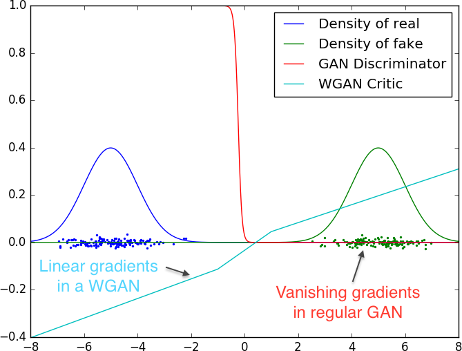

---
# Wasserstein GAN


---
# Wasserstein GAN


---
# Wasserstein GAN


---
# BigGAN


---
# BigGAN

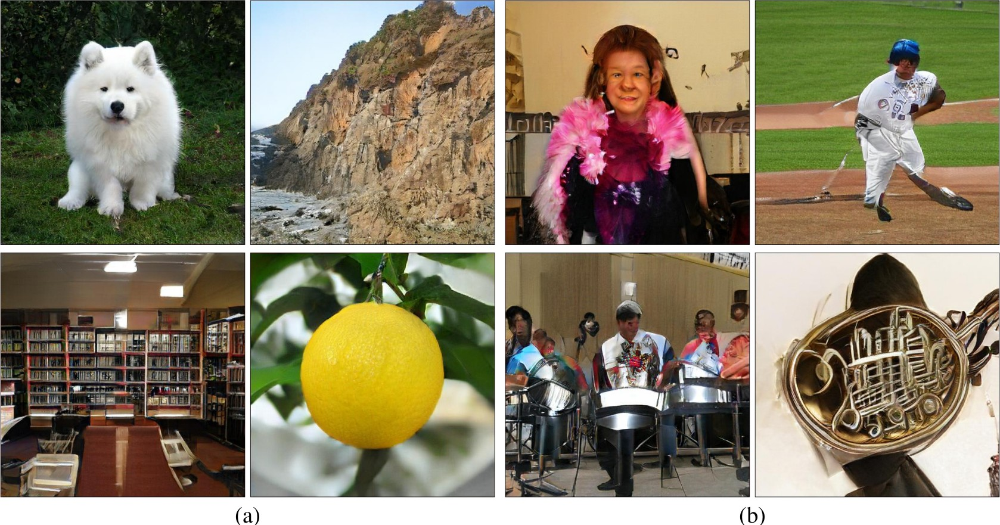

---
class: dbend
# BigGAN Ingredients – Hinge Loss

The Wasserstein GAN formulation can be considered a linear classifier, which
tries to maximize the mean distance of real and generated images using their
features.

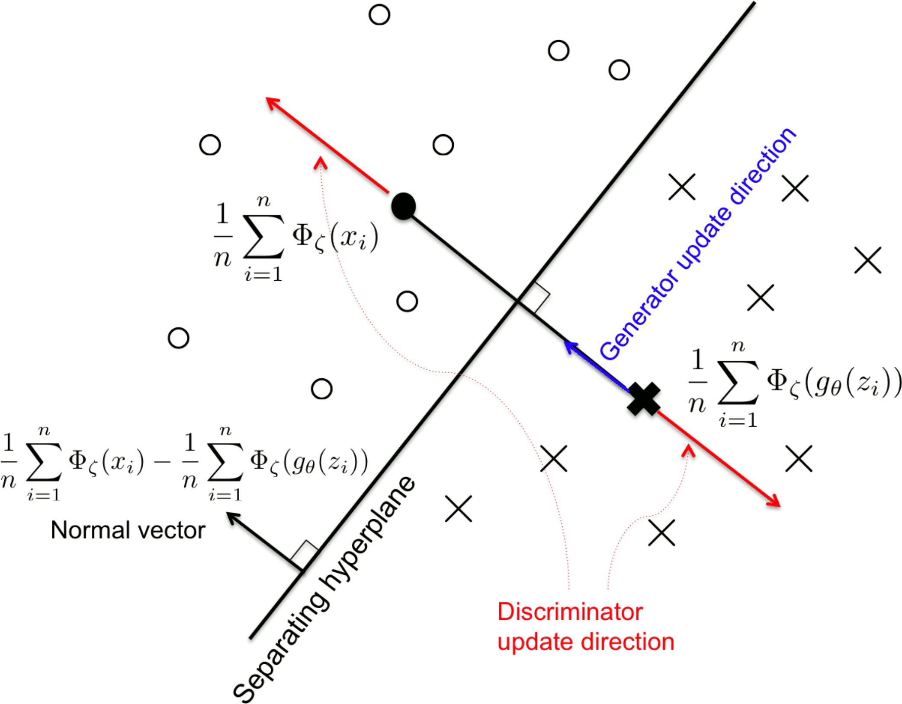

---
class: dbend
# BigGAN Ingredients – Hinge Loss

We could aim for maximum margin classifier by using Hinge loss, updating the
discriminator by

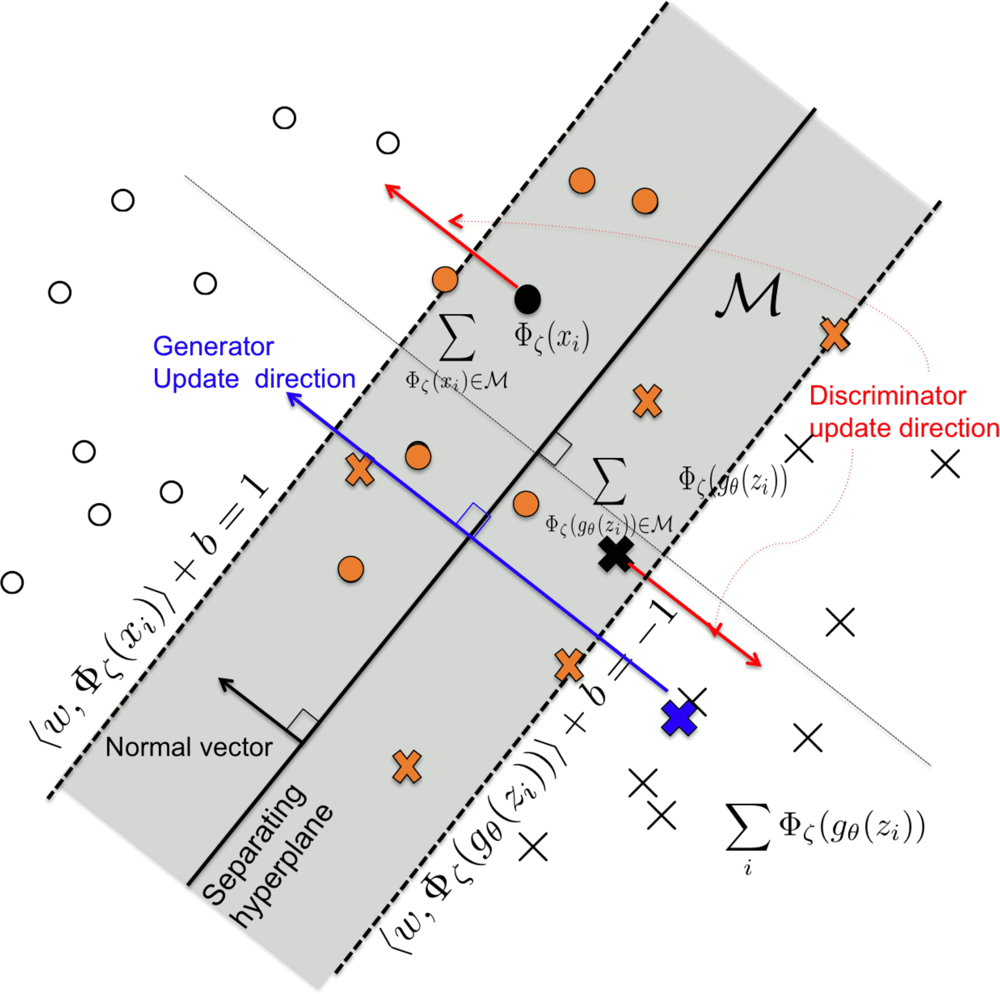

$$\begin{aligned}
  \argmax_{→θ_d}~& 𝔼_{→x ∼ P_\textrm{data}}[\min(0, -1 + D(→x)] \\
                 & + 𝔼_{→z ∼ P(⁇→z)}[\min(0, -1 - D(G(→z))]
\end{aligned}$$
and the generator by
$$\argmin_{→θ_g} 𝔼_{→z ∼ P(⁇→z)}[- D(G(→z)))].$$

---
class: dbend
# BigGAN Ingredients – Spectral Normalization

Satisfying the Lipschitz constraint by truncation is not very effective.
Better approaches were proposed, by using for example gradient penalties
(WGAN-GP) or **spectral normalization**.

~~~
In spectral normalization, the idea is to keep the **spectral norm** (the largest
singular value) of all convolutional and dense layers equal or close to 1,
which in turn guarantees the Lipschitz constraint of the model.

~~~


Spectral normalization can be implemented efficiently by performing one step of
power iteration each time the kernel in question is used in training.

---
class: dbend
# BigGAN Ingredients – Self Attention

Because convolutions process local information only, non-local _self attention_
module has been proposed.


---
class: dbend
# BigGAN Ingredients – Self Attention

```python
def attention(self, x, ch):
  f = conv(x, ch // 8, kernel=1, stride=1) # [bs, h, w, c']
  g = conv(x, ch // 8, kernel=1, stride=1) # [bs, h, w, c']
  h = conv(x, ch, kernel=1, stride=1) # [bs, h, w, c]

  # N = h * w
  s = tf.matmul(
        hw_flatten(g), hw_flatten(f), transpose_b=True) # [bs, N, N]
  beta = tf.nn.softmax(s)  # attention map

  o = tf.matmul(beta, hw_flatten(h)) # [bs, N, C]
  gamma = tf.get_variable("gamma", initializer=[0.0])

  o = tf.reshape(o, shape=x.shape) # [bs, h, w, C]
  x = gamma * o + x
  return x
```

---
class: dbend
# BigGAN Ingredients – Architecture


---
class: dbend
# BigGAN Ingredients – Architecture


---
class: dbend
# BigGAN Ingredients – Truncation Trick

The so-called **tuncation trick** is used to trade between fidelity and variety
– during training, $→z$ is sampled from $𝓝(→0, →I)$, while it is sampled from
_truncated normal_ during generation.

In the following examle, samples were generated using threshold $2, 1, 0.5,
0.04$.


---
section: *VAE
# Development of VAEs

- Aaron van den Oord, Oriol Vinyals, Koray Kavukcuoglu: **Neural Discrete
  Representation Learning** https://arxiv.org/abs/1711.00937

- Ali Razavi, Aaron van den Oord, Oriol Vinyals: **Generating Diverse
  High-Fidelity Images with VQ-VAE-2** https://arxiv.org/abs/1906.00446

- Patrick Esser, Robin Rombach, Björn Ommer: **Taming Transformers for
  High-Resolution Image Synthesis** https://arxiv.org/abs/2012.09841

- Aditya Ramesh, Mikhail Pavlov, Gabriel Goh, Scott Gray, Chelsea Voss, Alec
  Radford, Mark Chen, Ilya Sutskever: **Zero-Shot Text-to-Image Generation**
  https://arxiv.org/abs/2102.12092

---
section: *VAE
# VQ-VAE

In VQ-VAE, the latent variables are arranged in a **two-dimensional grid** and
each latent variable is a **discrete** sample from a categorical distribution.
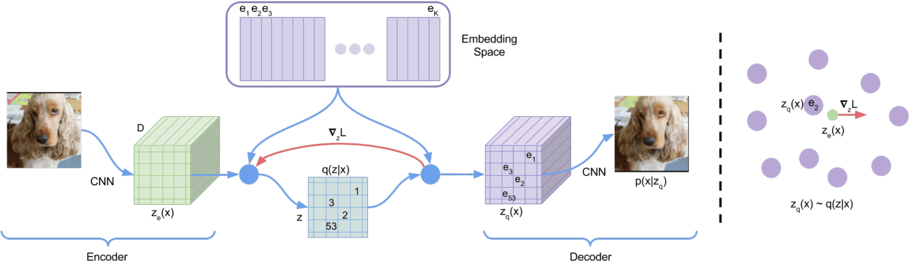
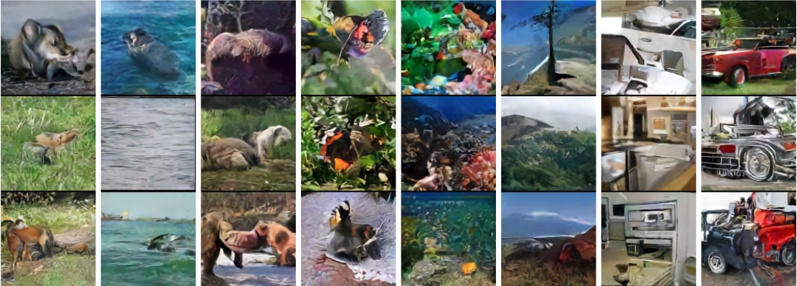

---
# Modeling Latent Structure

With a two-dimensional structure of interdependent latent variables, a question
arises of how to generate the latent variables themselves.

~~~
- An auto-regressive sampling is used in VQ-VAE (PixelCNN architecture).

~~~
- In VQ-VAE-2, the latents are modeled recursively as another VQ-VAE, until
  finally a PixelCNN is used for the last latents.

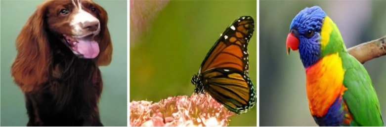

---
# VQ-VAE-2 vs BigGAN Diversity

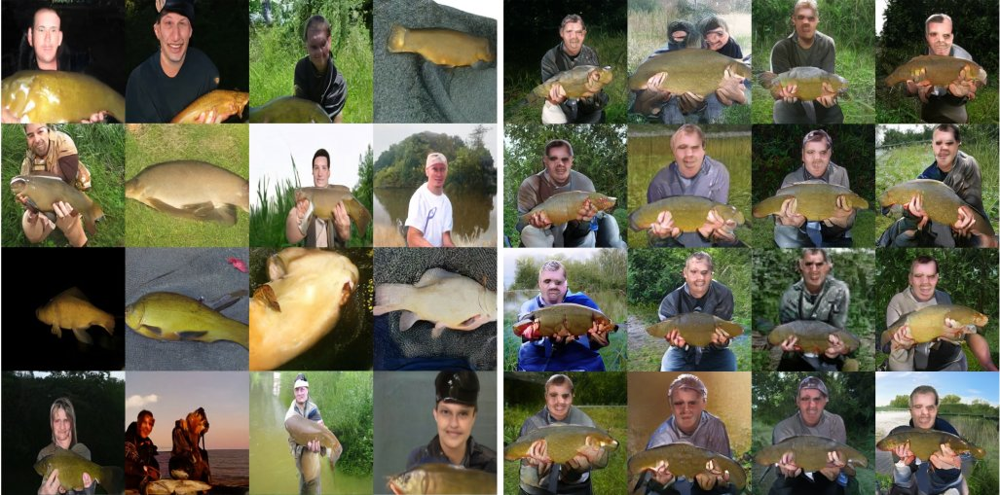

---
# VQ-VAE-2 vs BigGAN Diversity

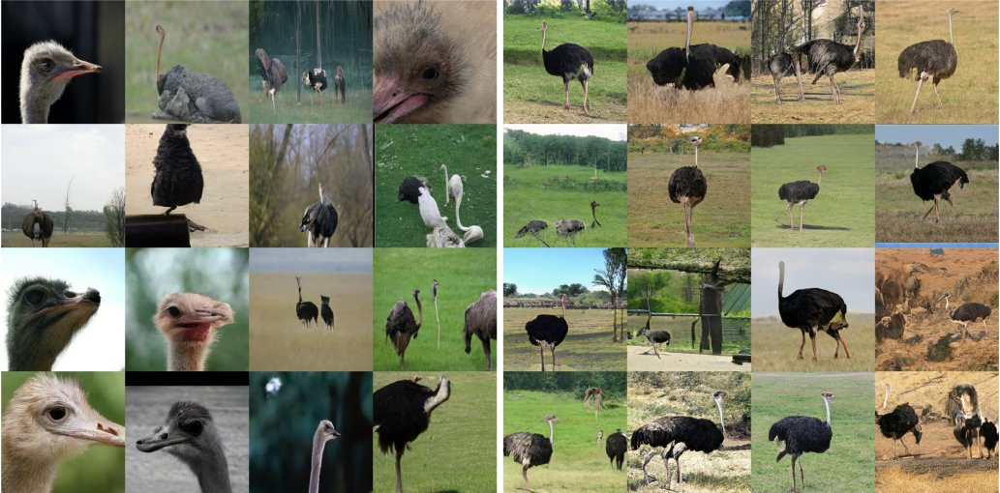

---
# Modeling Latent Structure

With a two-dimensional structure of interdependent latent variables, a question
arises of how to generate the latent variables themselves.

- In VQGAN, Transformer is used to model the discrete latent variables.

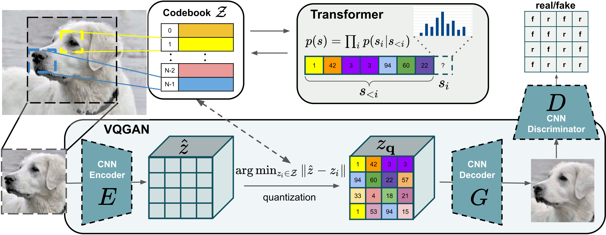

---
class: center
# VQGAN Landscape Image Synthesis

<video controls style="width: 90%">
  <source src="https://github.com/CompVis/taming-transformers/raw/9539a92f08ebea816ec6ddecb2dedd6c8664ef08/images/taming.mp4" type="video/mp4">
</video>

---
# Modeling Latent Structure

With a two-dimensional structure of interdependent latent variables, a question
arises of how to generate the latent variables themselves.

- In DALL-E, Transformer is used to model a sequence of words followed by
  a sequence of the discrete image latent variables.

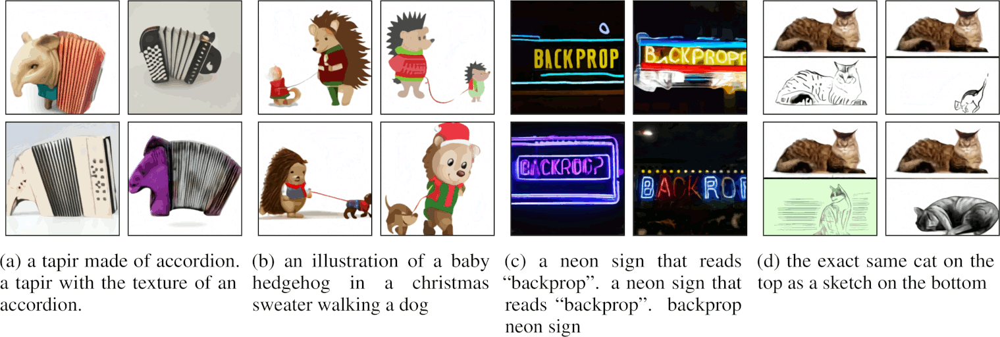

---
section: DDPM
# Diffusion Models

- Jonathan Ho, Ajay Jain, Pieter Abbeel: **Denoising Diffusion Probabilistic
  Models** https://arxiv.org/abs/2006.11239

- Prafulla Dhariwal, Alex Nichol: **Diffusion Models Beat GANs on Image
  Synthesis** https://arxiv.org/abs/2105.05233

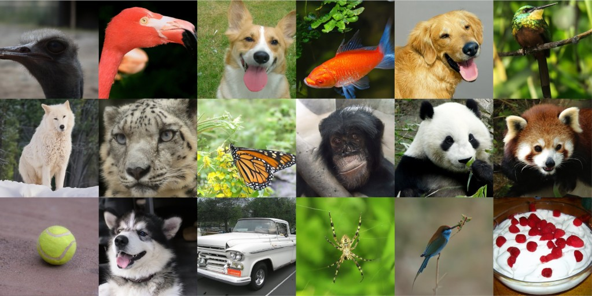

---
# SR3 Super-Resolution via Diffusion

- Chitwan Saharia, Jonathan Ho, William Chan, Tim Salimans, David J. Fleet, M. Norouzi:
  **Image Super-Resolution via Iterative Refinement** https://arxiv.org/abs/2104.07636

<div style="text-align: center"><video controls style="width: 84%">
   <source src="https://iterative-refinement.github.io/images/super_res_movie.m4v" type="video/mp4">
</video></div>

---
# Diffusion-Based Text-Conditional Image Generation

- Alex Nichol et al.: **GLIDE: Towards Photorealistic Image Generation and
  Editing with Text-Guided Diffusion Models** https://arxiv.org/abs/2112.10741

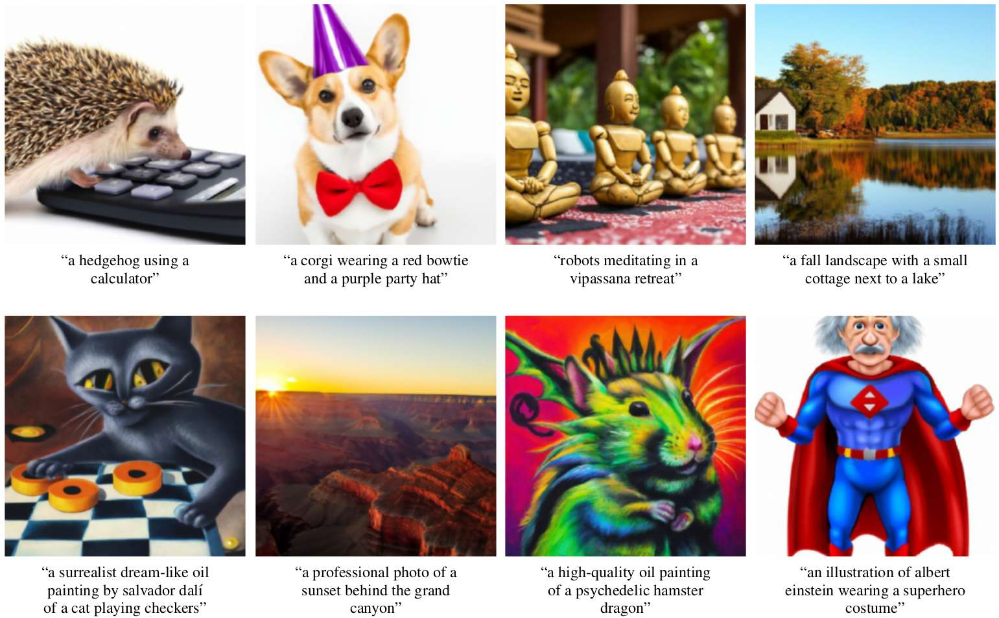

---
# Diffusion-Based Text-Conditional Image Generation

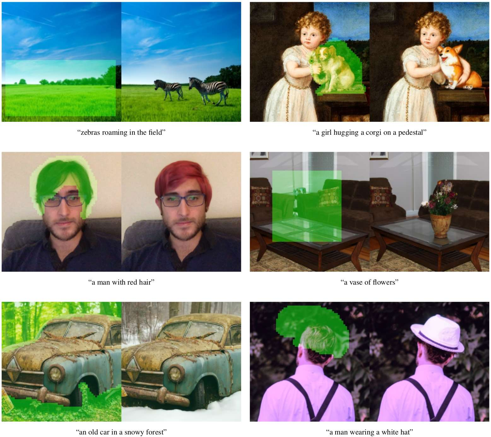

---
# Normalizing Flows

- Laurent Dinh, David Krueger, Yoshua Bengio: **NICE: Non-linear Independent Components Estimation** https://arxiv.org/abs/1410.8516

- Laurent Dinh, Jascha Sohl-Dickstein, Samy Bengio: **Density estimation using Real NVP** https://arxiv.org/abs/1605.08803

- Diederik P. Kingma, Prafulla Dhariwal: **Glow: Generative Flow with Invertible 1x1 Convolutions** https://arxiv.org/abs/1807.03039


