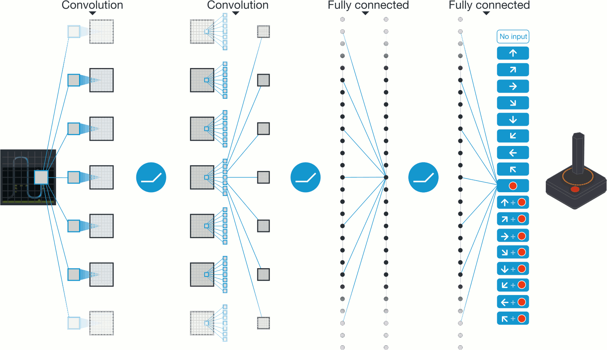

class: title
## NPFL114, Lecture 12

# Sequence Prediction II,  Reinforcement Learning II

.author[
Milan Straka
]

---
class: middle, center
# Structured Prediction

# Structured Prediction

---
# Conditional Random Fields (CRF)

## Motivation
- Label-bias problem

--

  - not a concrete definition
  - the inability of the model to assign individual weights to different
    sequence elements

--

- Global decoding

--

  - _Česko Slovensko porazilo_.

---
# Conditional Random Fields (CRF)

## Proposed Solution

- Performm sentence-level softmax, and add weights for neighboring sequence
  outputs.

--

$$s(⇉X, →y; →θ, ⇉A) = ∑\_{i=1}^N \big(⇉A\_{y\_{i-1}, y\_i} + f\_→θ(y\_i | ⇉X)\big)$$

--

$$p(→y | ⇉X) = \softmax\_{→z ∈ Y^N}\big(s(⇉X, →z)\big)\_{→z}$$

--

$$\log p(→y | ⇉X) = s(⇉X, →y) - \operatorname{logadd}\_{→z ∈ Y^N}(s(⇉X, →z))$$

---
# Conditional Random Fields (CRF)

## Computation

We can compute $p(→y | ⇉X)$ efficiently using dynamic programming. If we denote
$α\_t(k)$ as probability of all sentences with $t$ elements with the last $y$
being $k$.

--

The core idea is the following:

$$α\_t(k) = f\_→θ(y\_t=k | ⇉X) + \operatorname{logadd}\_{j∈Y} (α\_{t-1}(j) + ⇉A\_{j, k}).$$

---
# Conditional Random Fields (CRF)

## Computation

.algorithm[
**Inputs**: Network computing $f\_→θ(y\_t = k | ⇉X)$, an unnormalized probability
of output sequence element probability being $k$ in time $t$. 
**Inputs**: Transition matrix $⇉A ∈ ℝ^{Y×Y}$. 
**Inputs**: Input sequence $⇉X$ of length $N$, gold labeling $→y ∈ Y^N$. 
**Outputs**: Value of $\log p(→y | ⇉X)$. 
**Complexity**: $\mathcal O(N \cdot Y^2)$.

- For $k = 1, \ldots, Y$:
  - $α\_0(k) ← 0$
- For $t = 1, \ldots, N$:
  - For $k = 1, \ldots, Y:$
      - $α\_t(k) ← 0$
      - For $j = 1, \ldots, Y$:
          - $α\_t(k) ← \operatorname{logadd}(α\_t(k), α\_{t-1}(j) + ⇉A\_{j, k})$
        - $α\_t(k) ← α\_t(k) + f\_→θ(y\_t=k | ⇉X)$
]

---
# Conditional Random Fields (CRF)

## Decoding

We can perform optimal decoding, by using the same algorithm, only replacing
$\operatorname{logadd}$ with $\max$ and tracking where the maximum was attained.

---
# Connectionist Temporal Classification

Let us again consider generating a sequence of $y\_1, \ldots, y\_M$ given input
$→x\_1, \ldots, →x\_N$, but this time $M ≤ N$ and there is no explicit alignment
of $→x$ and $y$ in the gold data.

---
# Connectionist Temporal Classification

We enlarge the set of output labels by a – (_blank_) and perform a classification for every
input element to produce an _extended labeling_. We then post-process it by the
following rules (denoted $\mathcal B$):
1. We remove neighboring symbols.
2. We remove the –.

--

Because the explicit alignment of inputs and labels is not known, we consider
_all possible_ alignments.

--

Denoting the probability of label $l$ at time $t$ as $p\_l^t$, we define
$$α^t(s) ≝ ∑\_{\textrm{labeling }→π: \mathcal B(→π\_{1:t}) = →y\_{1:s}} ∏\_{t'=1}^t p\_{→π\_{t'}}^{t'}.$$

---
# CRF and CTC Comparison

In CRF, we normalize the whole sentences, therefore we need to compute
unnormalized probabilities for all the (exponentially many) sentences. Decoding
can be performed optimally.

--

In CTC, we normalize per each label. However, because we do not have explicit
alignment, we compute probability of a labeling by summing probabilities
of (generally exponentially many) extended labelings.

---
# Connectionist Temporal Classification

## Computation

When aligning an extended labeling to a regular one, we need to consider
whether the extended labeling ends by a _blank_ or not. We therefore define
$$\begin{aligned}
  α\_-^t(s) &≝ ∑\_{\textrm{labeling }→π: \mathcal B(→π\_{1:t}) = →y\_{1:s}, π\_t=-} ∏\_{t'=1}^t p\_{→π\_{t'}}^{t'} \\\
  α\_\*^t(s) &≝ ∑\_{\textrm{labeling }→π: \mathcal B(→π\_{1:t}) = →y\_{1:s}, π\_t≠-} ∏\_{t'=1}^t p\_{→π\_{t'}}^{t'}
\end{aligned}$$
and compute $α^t(s)$ as $α\_-^t(s) + α\_\*^t(s)$.

---
# Connectionist Temporal Classification

## Computation

We initialize $α$s as follows:
- $α\_-^1(0) ← p\_-^1$
- $α\_\*^1(1) ← p\_{y\_1}^1$

--

We then proceed recurrently according to:
- $α\_-^t(s) ← p\_-^t (α\_-^{t-1}(s) + α\_\*^{t-1}(s))$
- $α\_\*^t(s) ← \begin{cases}
  p\_{y\_s}^t(α\_\*^{t-1}(s) + α\_\*^{t-1}(s-1) + a\_-^{t-1}(s-1))\textrm{, if }y\_s≠y\_{s-1}\\\
  p\_{y\_s}^t(α\_\*^{t-1}(s) + a\_-^{t-1}(s-1))\textrm{, if }y\_s=y\_{s-1}\\\
\end{cases}$

---
# CTC Decoding

Unlike CRF, we cannot perform the decoding optimally. The key
observation is that while an optimal extended labeling can be extended
into an optimal labeling of a larger length, the same does not apply to
regular (non-extended) labeling. The problem is that regular labeling coresponds
to many extended labelings, which are modified each in a different way
during an extension of the regular labeling.

---
# CTC Decoding

## Beam Search

To perform beam search, we keep $k$ best regular labelings for each prefix of
the extended labelings. For each regular labeling we keep both $α\_-$ and
$a\_\*$ and by _best_ we mean such regular labelings with maximum $α\_- + α\_\*$.

To compute best regular labelings for longer prefix of extended labelings,
for each regular labeling in the beam we consider the following cases:
- adding a _blank_ symbol, i.e., updating both $α\_-$ and $α\_\*$;
- adding any non-blank symbol, i.e., updating $α\_\*$.

Then, we merge the resulting candidates according to their regular labeling and
keep only the $k$ best.

---
class: middle, center
# Reinforcement Learning

# Reinforcement Learning

---
# Reinforcement Learning

--

A _Markov decision process_ is a quadruple $(\mathcal S, \mathcal A, P, γ)$,
where:
- $\mathcal S$ is a set of states,
- $\mathcal A$ is a set of actions,
- $P(S\_{t+1} = s', R\_{t+1} = r | S\_t = s, A\_t = a)$ is a probability that
  action $a ∈ \mathcal A$ will lead from state $s ∈ \mathcal S$ to $s'
  ∈ \mathcal S$, producing a _reward_ $r ∈ ℝ$,
- $γ ∈ [0, 1]$ is a _discount factor_.

--

Let a _return_ $G\_t$ be $G\_t ≝ ∑\_{k=0}^\infty γ^k R\_{t + 1 + k}$.

---
# Policies

A _policy_ $π$ computes a distribution of actions in a given state, i.e., 
$π(a | s)$ corresponds to a probability of performing an action $a$ in state
$s$.

--

## Value Function
To evaluate a quality of policy, we define _value function_ $v\_π(s)$, or more
explicitly _state-value function_, as
$$v\_π(s) ≝ 𝔼\_π[G\_t | S\_t = s].$$

--
An _action-value function_ for policy $π$ is defined analogously as
$$q\_π(s, a) ≝ 𝔼\_π[G\_t | S\_t = s, A\_t = a].$$

--
It follows that
$$q\_π(s, a) = 𝔼\_π[R\_{t+1} + γv\_π(S_{t+1}) | S\_t = s, A\_t = a].$$

---
# Optimal Policy

As value functions define an partial ordering of policies ($π' ≥ π$ if
and only if for all states $s$, $v\_{π'}(s) ≥ v\_π(s)$), it can be proven
that there always exists an _optimal policy_ $π\_\*$, which is better or equal
to all other policies.

Intuitively, $π\_\*(s) = \argmax\nolimits\_a q\_\*(s, a)$.

--
## Policy Improvement Theorem

Let $π$ and $π'$ be any pair of policies (both deterministic or stochastic), such that
$q\_π(s, π'(s)) ≥ v\_π(s)$. Then $π' ≥ π$, i.e., for all states $s$, $v\_{π'}(s) ≥ v\_π(s)$.

---
class: middle
# Monte Carlo Control

---
# Temporal Difference Methods

--

---
# Temporal Difference Methods

A straightforward modification of Monte Carlo algorithm with constant-step
update and temporal difference is given by
$$Q(S\_t, A\_T) ← Q(S\_t, A\_t) + α[R\_{t+1} + γ Q(S\_{t+1}, A\_{t+1}) -Q(S\_t, A\_t)]$$
and is called _Sarsa_ ($S\_t, A\_t, R\_{t+1}, S\_{t+1}, A\_{t+1}$).

--

---
# Q-learning

_Q-learning_ is another TD control algorithm by (Watkins, 1989), defined by
$$Q(S\_t, A\_T) ← Q(S\_t, A\_t) + α[R\_{t+1} + γ \max\_a Q(S\_{t+1}, a) -Q(S\_t, A\_t)].$$

--

---
class: center
# Sarsa vs Q-learning

---
class: middle
# Double Q-learning

---
class: middle
# Double Q-learning

---
# Bridging Q-learning and Monte Carlo

Monte Carlo uses whole episode returns, while Q-learning uses single-step
rewards. We can connect these approaches by considering n-step returns:
$$\sum\_{k=1}^n γ^{k-1} R\_{t+k}.$$
We can then approximate full returns as
$$G\_t ≈ \sum\_{k=1}^n (γ^{k-1} R\_{t+k}) + v\_π(S\_{t+n}).$$

---
class: middle
# Deep Q Networks

---
# Deep Q Networks

No proofs of convergence; the training can be extremely brittle. Several
improvements to increase stability of the training:

--

- experience replay,

--

- separate target network $\hat Q$,

--

- clipping $R\_{t+1} + γ \max\_a Q(S\_{t+1}, a) - Q(S\_t, A\_t)$ to $[-1, 1]$.

---
# Policy Gradient Methods

The main idea of _policy gradient method_ is to train the policy itself, instead
of basing it on action-value function $q$.

However, for that we need to be able to compute a derivation of state-value
function, i.e., $∇v\_π(s)$.

Hopefully, a _policy gradient theorem_ comes to the rescue.

--

## Policy Gradient Theorem
Let $π$ be a given policy. We denote the on-policy distribution under $π$ as $μ(s)$.
Then
$$∇v\_π(s) ∝ \sum\_{s∈\mathcal S} μ(s) \sum\_{a∈\mathcal A} q\_π(s, a) ∇ π(a|s; →θ).$$

---
# Policy Gradient Theorem

Finally, we obtain the required form by dividing the result by an average length
of an episode.

---
# REINFORCE Algorithm

The REINFORCE algorithm (Williams, 1992) uses directly the policy gradient
theorem, approximating the expectation by a single sample.

---
# REINFORCE with baseline Algorithm

The gradient estimation used in REINFORCE has high variance.

However, we can decrease the variance by considering a _baseline_ $b(s)$, which
as an arbitrary function not depending on action $a$, using the following
generalization of policy gradient theorem:
$$∇v\_π(s) ∝ \sum\_{s∈\mathcal S} μ(s) \sum\_{a∈\mathcal A} (q\_π(s, a) \boldsymbol{- b(s)}) ∇ π(a|s; →θ).$$

The introduction of the baseline is possible, because
$$\sum\_{a∈\mathcal A} b(s) ∇ π(a|s; →θ) = b(s) ∇ \sum\_{a∈\mathcal A} π(a|s; →θ) = b(s) ∇1 = 0.$$
$$

---
# REINFORCE with baseline Algorithm

---
# Actor Critic

A combination of Q-learning and REINFORCE is also possible and called Actor
Critic algorithm.

