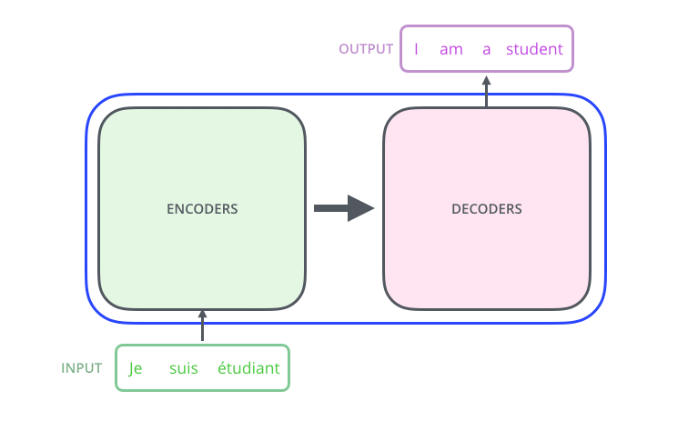
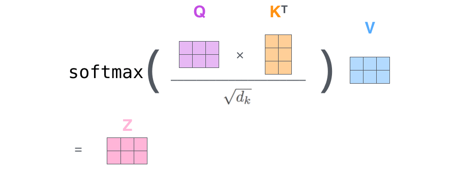
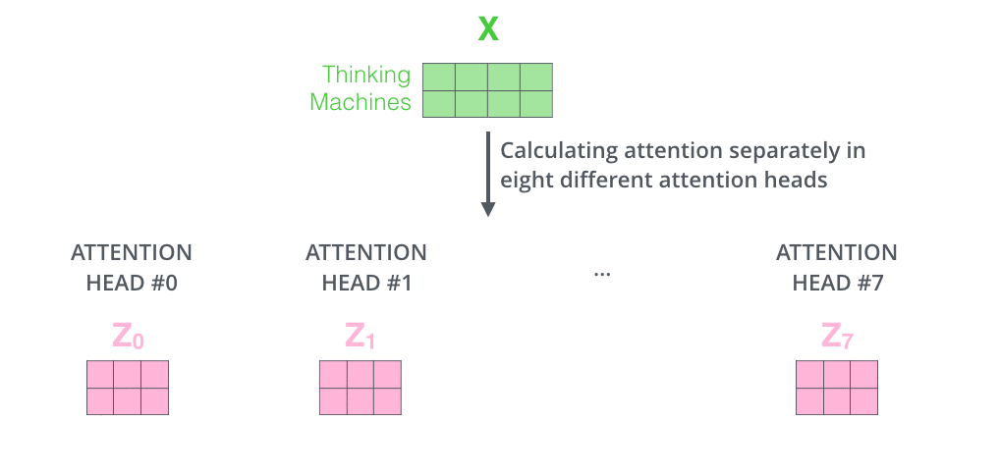
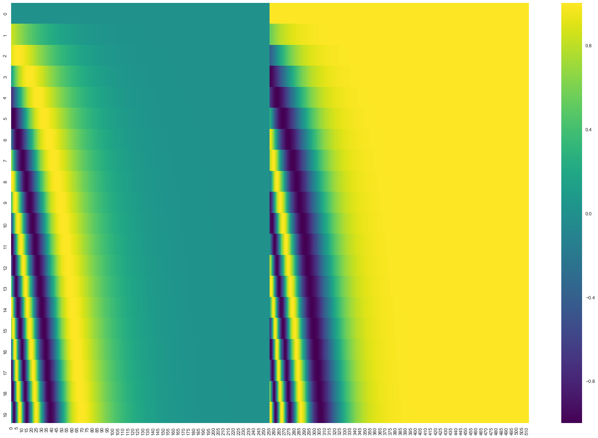

title: NPFL114, Lecture 13
class: title, langtech, cc-by-nc-sa

# Transformer, BERT

## Milan Straka

### May 25, 2020

---
section: Transformer
# Attention is All You Need

For some sequence processing tasks, _sequential_ processing (as performed by
recurrent neural networks) of its elements might be too restrictive.

~~~
Instead, we may want to be able to combine sequence elements independently on
their distance.

~~~
Such processing is allowed in the *Transformer* architecture, originally
proposed for neural machine translation in 2017 in *Attention is All You Need*
paper.

---
# Transformer

---
# Transformer

---
# Transformer

---
# Transformer

---
# Transformer

---
section: SelfAttention
# Transformer – Self-Attention

The attention module for a queries $⇉Q$, keys $⇉K$ and values $⇉V$ is defined as:

$$\textrm{Attention}(⇉Q, ⇉K, ⇉V) = \softmax\left(\frac{⇉Q ⇉K^\top}{\sqrt{d_k}}\right)⇉V.$$

The queries, keys and values are computed from current word representations $⇉W$
using a linear transformation as
$$\begin{aligned}
  ⇉Q &= ⇉V_Q ⋅ ⇉W \\
  ⇉K &= ⇉V_K ⋅ ⇉W \\
  ⇉V &= ⇉V_V ⋅ ⇉W \\
\end{aligned}$$

---
# Transformer – Self-Attention

---
# Transformer – Self-Attention

---
# Transformer – Self-Attention

---
# Transformer – Self-Attention

---
# Transformer – Multihead Attention

Multihead attention is used in practice. Instead of using one huge attention, we
split queries, keys and values to several groups (similar to how ResNeXt works),
compute the attention in each of the groups separately, and then concatenate the
results.

---
# Transformer – Multihead Attention

---
# Transformer – Multihead Attention

---
# Transformer – Multihead Attention

---
# Transformer – Feed Forward Networks

## Feed Forward Networks

The self-attention is complemented with FFN layers, which is a fully connected
ReLU layer with four times as many hidden units as inputs, followed by another
fully connected layer without activation.

---
# Transformer – Residuals

---
# Transformer – Decoder

---
# Transformer – Decoder

## Masked Self-Attention

During decoding, the self-attention must attent only to earlier positions in the
output sequence.

~~~
This is achieved by _masking_ future positions, i.e., zeroing their weights out,
which is usually implemented by setting them to $-∞$ before the $\softmax$ calculation.

~~~

## Encoder-Decoder Attention

In the encoder-decoder attentions, the _queries_ comes from the decoder, while the
_keys_ and the _values_ originate from the encoder.

---
section: PositionalEmbedding
# Transformer – Positional Embedding

---
# Transformer – Positional Embeddings

## Positional Embeddings

We need to encode positional information (which was implicit in RNNs).

~~~
- Learned embeddings for every position.

~~~
- Sinusoids of different frequencies:
  $$\small\begin{aligned}
    \textrm{PE}_{(\textit{pos}, 2i)} & = \sin\left(\textit{pos} / 10000^{2i/d}\right) \\
    \textrm{PE}_{(\textit{pos}, 2i + 1)} & = \cos\left(\textit{pos} / 10000^{2i/d}\right)
  \end{aligned}$$

~~~
  This choice of functions should allow the model to attend to relative
  positions, since for any fixed $k$, $\textrm{PE}_{\textit{pos} + k}$ is
  a linear function of $\textrm{PE}_\textit{pos}$, because
  $$\small\begin{aligned}
    \textrm{PE}_{(\textit{pos}+k, 2i)}
      &= \sin\left((\textit{pos}+k) / 10000^{2i/d}\right) \\
      &= \sin\left(\textit{pos} / 10000^{2i/d}\right) ⋅ \cos\left(k / 10000^{2i/d}\right) + \cos\left(\textit{pos} / 10000^{2i/d}\right) ⋅ \sin\left(k / 10000^{2i/d}\right) \\
      &= \textit{offset}_{(k,2i)} ⋅ \textrm{PE}_{(\textit{pos}, 2i)} + \textit{offset}_{(k, 2i+1)} ⋅ \textrm{PE}_{(\textit{pos}, 2i + 1)}.
  \end{aligned}$$

---
# Transformer – Positional Embeddings

Positional embeddings for 20 words of dimension 512, lighter colors representing
values closer to 1 and darker colors representing values closer to -1.

---
# Transformer – Training

## Regularization

The network is regularized by:
- dropout of input embeddings,
~~~
- dropout of each sub-layer, just before before it is added to the residual
  connection (and then normalized),
~~~
- label smoothing.

~~~
Default dropout rate and also label smoothing weight is 0.1.

~~~
## Parallel Execution
Because of the _masked attention_, training can be performed in parallel.

~~~
However, inference is still sequential.

---
# Transformer – Training

## Optimizer

Adam optimizer (with $β_2=0.98$, smaller than the default value of $0.999$)
is used during training, with the learning rate decreasing proportionally to
inverse square root of the step number.

~~~
## Warmup
Furthermore, during the first
$\textit{warmup\_steps}$ updates, the learning rate is increased linearly from
zero to its target value.

$$\textit{learning\_rate} = \frac{1}{\sqrt{d_\textrm{model}}} \min\left(\frac{1}{\sqrt{\textit{step\_num}}}, \frac{\textit{step\_num}}{\textit{warmup\_steps}} ⋅ \frac{1}{\sqrt{\textit{warmup\_steps}}}\right).$$

~~~
In the original paper, 4000 warmup steps were proposed.

---
# Why Attention

---
# Transformers Results

---
# Transformers Results

