title: NPFL114, Lecture 13
class: title, langtech, cc-by-sa

# Generative Adversarial Networks, Diffusion Models

## Milan Straka

### May 9, 2023

---
# Generative Models

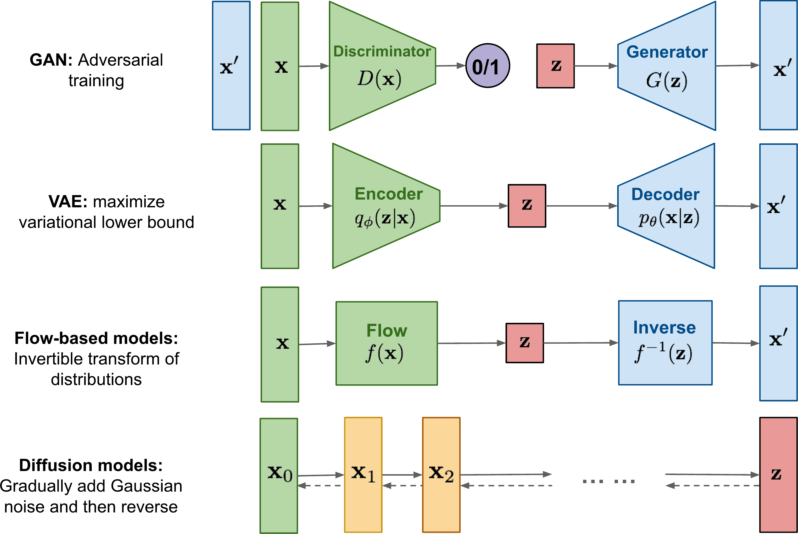

There are several approaches how to represent a probability distribution
$P(⁇→x)$. **Likelihood-based models** represent the probability density function
directly, often using an unnormalized probabilistic model (also called
energy-based model; i.e., specifying a non-zero _score_ or _density_ or
_logits_):
$$P_{→θ}(⁇→x) = \frac{e^{f_{→θ}(⁇→x)}}{Z_{→θ}}.$$

~~~
However, estimating the normalization constant $Z_{→θ} = ∫e^{f_{→θ}(⁇→x)}\d⁇→x$ is
often intractable.

~~~
- We can compute $Z_{→θ}$ by restricting the model architecture (sequence
  modeling, invertible networks in normalizing flows);
~~~
- we can only approximate it (using for example variational inference as in
  VAE);
~~~
- we can use **implicit generative models**, which avoid representing likelihood
  (like GANs).

---
section: GAN
# Generative Adversarial Networks

We have a **generator** $G(→z; →θ_g)$, which given $→z ∼ P(⁇→z)$ generates data $→x$.

~~~
Then we have a **discriminator** $D(→x; →θ_d)$, which given data $→x$ generates a probability
whether $→x$ comes from real data or is generated by a generator.

~~~
The discriminator and generator play the following game:
$$\min_G \max_D 𝔼_{→x ∼ P_\textrm{data}}[\log D(→x)] + 𝔼_{→z ∼ P(⁇→z)}[\log (1 - D(G(→z)))].$$

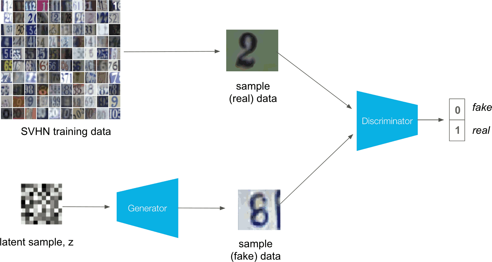

---
# Generative Adversarial Networks

The generator and discriminator are alternately trained, the discriminator by
$$\argmax_{→θ_d} 𝔼_{→x ∼ P_\textrm{data}}[\log D(→x)] + 𝔼_{→z ∼ P(⁇→z)}[\log (1 - D(G(→z)))]$$
and the generator by
$$\argmin_{→θ_g} 𝔼_{→z ∼ P(⁇→z)}[\log (1 - D(G(→z)))].$$

~~~
Basically, the discriminator acts as a trainable loss for the generator.

---
# Generative Adversarial Networks

Because $\log (1 - D(G(→z)))$ can saturate in the beginning of the training,
where the discriminator can easily distinguish real and generated samples,
the generator can be trained by
$$\argmin_{→θ_g} 𝔼_{→z ∼ P(⁇→z)}[-\log D(G(→z))]$$
instead, which results in the same fixed-point dynamics, but much stronger
gradients early in learning.

~~~
On top of that, if you train the generator by using “real” as the gold label
of the discriminator, you naturally get the above loss (which is the negative log
likelihood, contrary to the original formulation).

---
# Generative Adversarial Networks

---
# Generative Adversarial Networks

---
# Conditional GAN

---
# Deep Convolutional GAN

In Deep Convolutional GAN, the discriminator is a convolutional network (with
batch normalization) and the generator is also a convolutional network,
utilizing transposed convolutions.

---
# Deep Convolutional GAN

---
# Deep Convolutional GAN

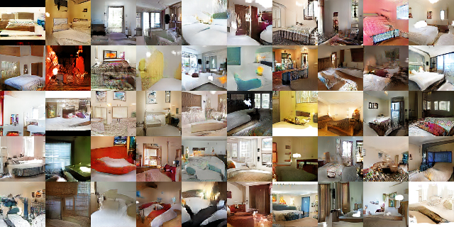

---
# Deep Convolutional GAN

---
# Deep Convolutional GAN

---
# Deep Convolutional GAN

---
# Deep Convolutional GAN

---
# GANs Training — Training Experience

---
# GANs Training – Results of In-House BigGAN Training

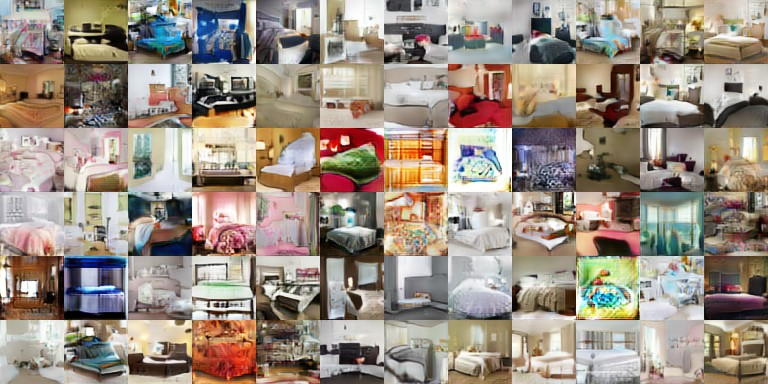

---
section: GANConvergence
# GANs are Problematic to Train

Unfortunately, alternating SGD steps are not guaranteed to reach even
a local optimum of a minimax problem – consider the following one:
$$\min_x \max_y x⋅y.$$

~~~
The update rules of $x$ and $y$ for learning rate $α$ are
$$\begin{bmatrix} x_{n+1} \\ y_{n+1} \end{bmatrix} = \begin{bmatrix} 1 & -α \\ α & 1 \end{bmatrix} \begin{bmatrix} x_n \\ y_n \end{bmatrix}.$$

~~~
The update matrix is a rotation matrix multiplied by a constant $\sqrt{1 + α^2} > 1$
$$\begin{bmatrix} 1 & -α \\ α & 1 \end{bmatrix} = \sqrt{1 + α^2} ⋅ \begin{bmatrix} \cos φ & -\sin φ \\ \sin φ & \cos φ \end{bmatrix},$$
so the SGD will not converge with arbitrarily small step size.

---
# GANs are Problematic to Train

---
# GANs are Problematic to Train

- Mode collapse

  

~~~
  - If the discriminator could see the whole batch, similar samples in it would
    be candidates for fake images.

    - Batch normalization helps a lot with this.

~~~
  - Historical averaging

~~~
- Label smoothing of only positive samples helps with the gradient flow.

---
# Comparison of VAEs and GANs

The Variational Autoencoders:
- are theoretically-pleasing;
~~~
- also provide an encoder, so apart from generation, they can be used as
  unsupervised feature extraction (the VAE encoder is used in various
  modeling architectures);
~~~
- the generated samples tend to be blurry, especially with $L^1$ or $L^2$ loss
  (because of the sampling used in the reconstruction; patch-based discriminator
  with perceptual loss helps).

~~~
The Generative Adversarial Networks:
- offer high sample quality;
~~~
- are difficult to train and suffer from mode collapse.

~~~
In past few years, GANs saw a big development, improving the sample quality
substantially.
~~~
However, since 2019/2020, VAEs have shown remarkable progress
(alleviating the blurriness issue by using perceptual loss and a 2D grid of
latent variables), and are being used for generation too.
~~~
Furthermore, additional approaches (normalizing flows, diffusion models) were
also being explored, with diffusion models becoming the most promising approach
since Q2 of 2021, surpassing both VAEs and GANs.

---
section: DiffusionModels
# Diffusion Models

Currently (as of May 2023), the best architecture for generating images seems to
be the **diffusion models**.

~~~
The diffusion models are deeply connected to **score-based generative models**,
which were developed independently. These two approaches are in fact just
different perspectives of the same model family, and many recent papers utilize
both sides of these models.

---
# Diffusion Models – Diffusion Process, Reverse Process

Given a data point $⁇→x_0$ from a real data distribution $q(⁇→x)$, we define
a $T$-step _diffusion process_ (or the _forward process_) which gradually adds
Gaussian noise to the input image:

$$q(⁇→x_{1:T}|⁇→x_0) = ∏\nolimits_{t=1}^T q(⁇→x_t|⁇→x_{t-1}).$$

~~~
Our goal is to reverse the forward process $q(⁇→x_t|⁇→x_{t-1})$, and generate an
image by starting with $⁇→x_T ∼ 𝓝(→0, ⇉I)$, and then performing the forward
process in reverse.
~~~
We therefore learn a model $p_{→θ}(⁇→x_{t-1}|⁇→x_t)$ to approximate the reverse
of $q(⁇→x_t|⁇→x_{t-1})$, and obtain a _reverse process_:
$$p_{→θ}(⁇→x_{0:T}) = p(⁇→x_T) ∏\nolimits_{t=1}^T p_{→θ}(⁇→x_{t-1}|⁇→x_t).$$

---
# Diffusion Models – The Reverse Process

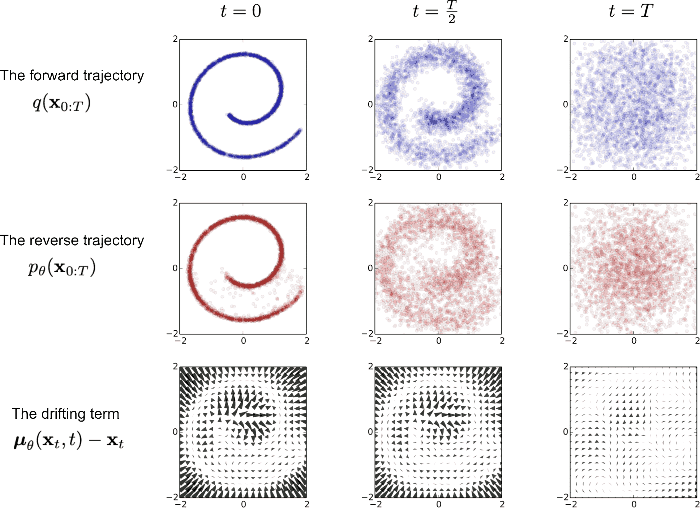

---
# Diffusion Models – Model Overview

The $p_{→θ}(⁇→x_{t-1}|⁇→x_t)$ is commonly modelled using a UNet architecture
with skip connections.

~~~
### Training

During training, we randomly sample a time step $t$, and perform an update
of the parameters $→θ$ in order for $p_{→θ}(⁇→x_{t-1}|⁇→x_t)$ to
better approximate the reverse of $q(⁇→x_t|⁇→x_{t-1})$.

~~~
### Sampling

In order to sample an image, we start by sampling $⁇→x_T ∼ 𝓝(→0, ⇉I)$,
and then perform $T$ steps of the reverse process by sampling
$⁇→x_{t-1} ∼ p_{→θ}(⁇→x_{t-1}|⁇→x_t)$ for $t$ from $T$ down to 1.

---
section: $𝓝$
style: .katex-display { margin: .7em 0 }
# Normal Distribution Reminder

Normal (or Gaussian) distribution is a continuous distribution parametrized by
a mean $μ$ and variance $σ^2$:

$$𝓝(x; μ, σ^2) = \sqrt{\frac{1}{2πσ^2}} \exp \left(-\frac{(x - μ)^2}{2σ^2}\right)$$

~~~
For a $D$-dimensional vector $→x$, the multivariate Gaussian distribution takes
the form
$$𝓝(→x; →μ, ⇉Σ) ≝ \frac{1}{\sqrt{(2π)^D |⇉Σ|}} \exp \left(-\frac{1}{2}(→x-→μ)^T ⇉Σ^{-1} (→x-→μ) \right).$$

~~~
The biggest difference compared to the single-dimensional case is the _covariance
matrix_ $⇉Σ$, which is (in the non-degenerate case, which is the only one
considered here) a _symmetric positive-definite matrix_ of size $D × D$.

~~~
However, in this lecture we will only consider _isotropic_ distribution, where $⇉Σ = σ^2⇉I$:
$$𝓝(→x; →μ, σ^2⇉I) = ∏\nolimits_i 𝓝(x_i; μ_i, σ^2).$$

---
# Normal Distribution Reminder

A normally-distributed random variable $⁇→x ∼ 𝓝(→μ, σ^2⇉I)$ can be written using
the reparametrization trick also as
$$⁇→x = →μ + σ ⁇→e,\textrm{~~where~~}⁇→e ∼ 𝓝(→0, ⇉I).$$

~~~
The sum of two independent normally-distributed random variables $⁇→x_1 ∼ 𝓝(→μ_1, σ_1^2⇉I)$
and $⁇→x_2 ∼ 𝓝(→μ_2, σ_2^2⇉I)$ has normal distribution $⁇𝓝\big(→μ_1 + →μ_2, (σ_1^2 + σ_2^2)⇉I\big)$.

~~~
Therefore, if we have three standard normal random variables $⁇→e_1, ⁇→e_2, ⁇→e ∼ 𝓝(→0, ⇉I)$,
then
$$σ_1 ⁇→e_1 + σ_2 ⁇→e_2 = \sqrt{σ_1^2 + σ_2^2} ⁇→e.$$

---
section: DDPM
# DDPM – The Forward Process

We now describe _Denoising Diffusion Probabilistic Models (DDPM)_.

~~~

Given a data point $⁇→x_0$ from a real data distribution $q(⁇→x)$, we define
a $T$-step _diffusion process_ (or the _forward process_) which gradually adds
Gaussian noise according to some variance schedule $β_1, …, β_T$:

$\displaystyle \kern11em{}\mathllap{q(⁇→x_{1:T}|⁇→x_0)} = ∏_{t=1}^T q(⁇→x_t|⁇→x_{t-1}),$

~~~
$\displaystyle \kern11em{}\mathllap{q(⁇→x_t|⁇→x_{t-1})} = 𝓝(⁇→x_t; \sqrt{1 - β_t} ⁇→x_{t-1}, β_t ⇉I),$

~~~
$\displaystyle \kern11em{}\mathllap{} = \sqrt{1 - β_t} ⁇→x_{t-1} + \sqrt{β_t} ⁇→e\textrm{~~for~~}⁇→e∼𝓝(→0, ⇉I).$

~~~
More noise gets gradually added to the original image $⁇→x_0$, converging to
pure Gaussian noise.

---
# DDPM – The Forward Process

Let $α_t = 1-β_t$ and $ᾱ_t = ∏_{i=1}^t α_i$.
~~~
Then we have

$\displaystyle\kern3em{}\mathllap{⁇→x_t} = \sqrt{α_t} \textcolor{blue}{⁇→x_{t-1}} + \sqrt{1-α_t}⁇→e_t$

~~~
$\displaystyle\kern3em{} = \sqrt{α_t} \textcolor{blue}{\big(\sqrt{α_{t-1}} ⁇→x_{t-2} + \sqrt{1-α_{t-1}}⁇→e_{t-1}\big)} + \sqrt{1-α_t}⁇→e_t$

~~~
$\displaystyle\kern3em{} = \sqrt{α_t α_{t-1}} ⁇→x_{t-2} + \sqrt{α_t(1-α_{t-1}) + (1-α_t)}⁇→ē_{t-1}$

~~~
$\displaystyle\kern3em{} = \sqrt{α_t α_{t-1}} ⁇→x_{t-2} + \sqrt{1 - α_t α_{t-1}}⁇→ē_{t-1}$

~~~
$\displaystyle\kern3em{} = \sqrt{α_t α_{t-1} α_{t-2}} ⁇→x_{t-3} + \sqrt{1 - α_t α_{t-1} α_{t-2}}⁇→ē_{t-2}$

~~~
$\displaystyle\kern3em{} = …$

~~~
$\displaystyle\kern3em{} = \sqrt{ᾱ_t} ⁇→x_0 + \sqrt{1-ᾱ_t}⁇→ē_0$

for standard normal random variables $⁇→e_i$ and $⁇→ē_i$.

~~~
In other words, we have shown that $q(⁇→x_t | ⁇→x_0) = 𝓝\big(\sqrt{ᾱ_t}⁇→x_0, (1-ᾱ_t)⇉I\big)$.

~~~
Therefore, if $ᾱ_t → 0$ as $t → ∞$, the $⁇→x_t$ converges to $𝓝(→0, ⇉I)$ as $t → ∞$.

---
# DDPM – Noise Schedule

Originally, linearly increasing sequence of noise variations
$β_1=0.0001, …, β_T=0.04$ was used.

~~~
However, the resulting sequence $ᾱ_t$ was not ideal (nearly the whole second
half of the diffusion process was mostly just random noise), so later a cosine
schedule was proposed:
$$ᾱ_t = \frac{1}{2}\Big(\cos(t/T ⋅ π)+1\Big),$$
and now it is dominantly used.

~~~
In practice, we want to avoid both the values of 0 and 1, and keep $α_t$ in $[ε, 1-ε]$ range.

---
# DDPM – Noise Schedule

We assume the images $⁇→x_0$ have zero mean and unit variance (we normalize them
to achieve that).
~~~
Then every
$$q(⁇→x_t|⁇→x_0) = \textcolor{red}{\sqrt{ᾱ_t}} ⁇→x_0 + \textcolor{blue}{\sqrt{1-ᾱ_t}}⁇→e$$
has also zero mean and unit variance.

~~~
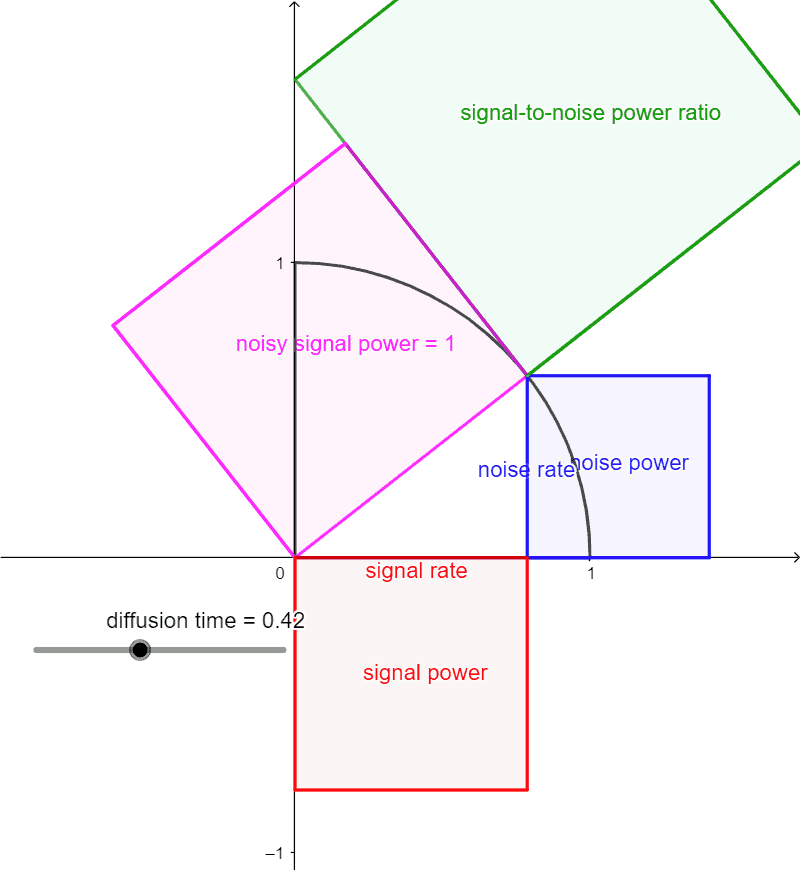

The $\textcolor{red}{\sqrt{ᾱ_t}}$ and $\textcolor{blue}{\sqrt{1-ᾱ_t}}$ can be
considered as the _signal rate_ and the _noise rate_.

~~~
Because $\textcolor{red}{\sqrt{ᾱ_t}}^2 + \textcolor{blue}{\sqrt{1-ᾱ_t}}^2 = 1$,
the signal rate and the noise rate form a circular arc. The proposed cosine
schedule
$$\begin{aligned}
  \textcolor{red}{\sqrt{ᾱ_t}} &= \cos(t/T ⋅ π/2), \\
  \textcolor{blue}{\sqrt{1-ᾱ_t}} &= \sin(t/T ⋅ π/2),
\end{aligned}$$
corresponds to an uniform movement on this arc.

---
# DDPM – The Reverse Process

In order to be able to generate imates, we therefore learn a model
$p_{→θ}(⁇→x_{t-1}|⁇→x_t)$ to approximate the reverse of $q(⁇→x_t|⁇→x_{t-1})$.

~~~
When $β_t$ is small, this reverse is nearly Gaussian, so we represent $p_{→θ}$
as
$$p_{→θ}(⁇→x_{t-1}|⁇→x_t) = 𝓝\big(⁇→x_{t-1}; →μ_{→θ}(⁇→x_t, t), σ_t^2⇉I\big)$$
for some fixed sequence of $σ_1, …, σ_T$.

~~~
The whole reverse process is then
$$p_{→θ}(⁇→x_{0:T}) = p(⁇→x_T) ∏\nolimits_{t=1}^T p_{→θ}(⁇→x_{t-1}|⁇→x_t).$$

---
# DDPM – Loss

We now want to derive the loss. First note that the reverse of $q(⁇→x_t|⁇→x_{t-1})$
is actually tractable when conditioning on $⁇→x_0$:

$\displaystyle\kern9em{}\mathllap{q(⁇→x_{t-1}|⁇→x_t, ⁇→x_0)} = 𝓝\big(⁇→x_{t-1}; \textcolor{blue}{→μ̃_t(⁇→x_t, ⁇→x_0)}, \textcolor{green}{β̃_t}⇉I\big),$

~~~
$\displaystyle\kern9em{}\mathllap{\textcolor{blue}{→μ̃_t(⁇→x_t, ⁇→x_0)}} = \frac{\sqrt{ᾱ_{t-1}}β_t}{1-ᾱ_t}⁇→x_0 + \frac{\sqrt{α_t}(1-ᾱ_{t-1})}{1-ᾱ_t}⁇→x_t,$

~~~
$\displaystyle\kern9em{}\mathllap{\textcolor{green}{β̃_t}} = \frac{1-ᾱ_{t-1}}{1-ᾱ_t}β_t.$

~~~
We present the proof on the next slide for completeness.

---
class: dbend
# Forward Process Reverse Derivation

Starting with the Bayes' rule, we get

$\displaystyle\kern7em{}\mathllap{q(⁇→x_{t-1}|⁇→x_t, ⁇→x_0)} = \textcolor{purple}{q(⁇→x_t | ⁇→x_{t-1}, ⁇→x_0)} \frac{\textcolor{darkcyan}{q(⁇→x_{t-1} | ⁇→x_0)}}{\textcolor{red}{q(⁇→x_t | ⁇→x_0)}}$

~~~
$\displaystyle\kern2em{} ∝ \exp\Big(-\frac{1}{2}\Big(\textcolor{purple}{\frac{(⁇→x_t - \sqrt{α_t}⁇→x_{t-1})^2}{β_t}} + \textcolor{darkcyan}{\frac{(⁇→x_{t-1} - \sqrt{ᾱ_{t-1}}⁇→x_0)^2}{1-ᾱ_{t-1}}} - \textcolor{red}{\frac{(⁇→x_t - \sqrt{ᾱ_t}⁇→x_0)^2}{1-ᾱ_t}}\Big)\Big)$

~~~
$\displaystyle\kern2em{} = \exp\Big(-\frac{1}{2}\Big(\tfrac{⁇→x_t^2 - 2\sqrt{α_t}⁇→x_t\textcolor{orange}{⁇→x_{t-1}} + α_t\textcolor{magenta}{⁇→x_{t-1}^2}}{β_t} + \tfrac{\textcolor{magenta}{⁇→x_{t-1}^2} - 2\sqrt{ᾱ_{t-1}}\textcolor{orange}{⁇→x_{t-1}}⁇→x_0 + ᾱ_{t-1}⁇→x_0^2}{1-ᾱ_{t-1}} + …\Big)\Big)$

~~~
$\displaystyle\kern2em{} = \exp\Big(-\frac{1}{2}\Big(\big(\tfrac{α_t}{β_t} + \tfrac{1}{1-ᾱ_{t-1}}\big)\textcolor{magenta}{⁇→x_{t-1}^2} - 2\big(\tfrac{\sqrt{α_t}}{β_t}⁇→x_t + \tfrac{\sqrt{ᾱ_{t-1}}}{1-ᾱ_{t-1}}⁇→x_0\big)\textcolor{orange}{⁇→x_{t-1}} + …\Big)\Big)$

~~~
From this formulation, we can derive that $q(⁇→x_{t-1}|⁇→x_t, ⁇→x_0) = 𝓝\big(⁇→x_{t-1}; \textcolor{blue}{→μ̃_t(⁇→x_t, ⁇→x_0)}, \textcolor{green}{β̃_t}⇉I\big)$ for

~~~
$\displaystyle\kern5em{}\mathllap{\textcolor{green}{β̃_t}} = 1/\big(\tfrac{α_t}{β_t} + \tfrac{1}{1-ᾱ_{t-1}}\big) = 1/\big(\tfrac{α_t(1-ᾱ_{t-1})+β_t}{β_t(1-ᾱ_{t-1})}\big) = 1/\big(\tfrac{α_t+β_t-ᾱ_t}{β_t(1-ᾱ_{t-1})}\big) = \frac{1-ᾱ_{t-1}}{1-ᾱ_t}β_t,$

~~~
$\displaystyle\kern5em{}\mathllap{\textcolor{blue}{→μ̃_t(⁇→x_t, ⁇→x_0)}} = \big(\tfrac{\sqrt{α_t}}{β_t}⁇→x_t + \tfrac{\sqrt{ᾱ_{t-1}}}{1-ᾱ_{t-1}}⁇→x_0\big) \textcolor{green}{\tfrac{1-ᾱ_{t-1}}{1-ᾱ_t}β_t} = \frac{\sqrt{ᾱ_{t-1}}β_t}{1-ᾱ_t}⁇→x_0 + \frac{\sqrt{α_t}(1-ᾱ_{t-1})}{1-ᾱ_t}⁇→x_t.$

---
# DDPM – Deriving Loss using Jensen's Inequality

$\displaystyle -𝔼_{q(⁇→x_0)}\big[\log p_{→θ}(⁇→x_0)\big] = -𝔼_{q(⁇→x_0)}\big[\log 𝔼_{p_{→θ}(⁇→x_{1:T})}[p_{→θ}(⁇→x_0)]\big]$

~~~
$\displaystyle \kern2em{} = -𝔼_{q(⁇→x_0)}\Big[\log 𝔼_{q(⁇→x_{1:T}|⁇→x_0)}\Big[\tfrac{p_{→θ}(⁇→x_{0:T})}{q(⁇→x_{1:T}|⁇→x_0)}\Big]\Big]$

~~~
$\displaystyle \kern2em{} ≤ -𝔼_{q(⁇→x_{0:T})}\Big[\log \tfrac{p_{→θ}(⁇→x_{0:T})}{q(⁇→x_{1:T}|⁇→x_0)}\Big] = 𝔼_{q(⁇→x_{0:T})}\Big[\log \tfrac{q(⁇→x_{1:T}|⁇→x_0)}{p_{→θ}(⁇→x_{0:T})}\Big]$

~~~
$\displaystyle \kern2em{} = 𝔼_{q(⁇→x_{0:T})}\Big[-\log p_{→θ}(⁇→x_T) + ∑\nolimits_{t=2}^T\log \tfrac{q(⁇→x_t|⁇→x_{t-1})}{p_{→θ}(⁇→x_{t-1}|⁇→x_t)} + \log \tfrac{q(⁇→x_1|⁇→x_0)}{p_{→θ}(⁇→x_0|⁇→x_1)}\Big]$

~~~
$\displaystyle \kern2em{} = 𝔼_{q(⁇→x_{0:T})}\Big[-\log p_{→θ}(⁇→x_T) + ∑\nolimits_{t=2}^T\log \Big(\tfrac{q(⁇→x_{t-1}|⁇→x_t,⁇→x_0)}{p_{→θ}(⁇→x_{t-1}|⁇→x_t)}\tfrac{q(⁇→x_t|⁇→x_0)}{q(⁇→x_{t-1}|⁇→x_0)}\Big) + \log \tfrac{q(⁇→x_1|⁇→x_0)}{p_{→θ}(⁇→x_0|⁇→x_1)}\Big]$

~~~
$\displaystyle \kern2em{} = 𝔼_{q(⁇→x_{0:T})}\Big[-\log p_{→θ}(⁇→x_T) + ∑\nolimits_{t=2}^T\log \tfrac{q(⁇→x_{t-1}|⁇→x_t,⁇→x_0)}{p_{→θ}(⁇→x_{t-1}|⁇→x_t)} + \log \tfrac{q(⁇→x_T|⁇→x_0)}{q(⁇→x_1|⁇→x_0)} + \log \tfrac{q(⁇→x_1|⁇→x_0)}{p_{→θ}(⁇→x_0|⁇→x_1)}\Big]$

~~~
$\displaystyle \kern2em{} = 𝔼_{q(⁇→x_{0:T})}\Big[\log \tfrac{q(⁇→x_T|⁇→x_0)}{p_{→θ}(⁇→x_T)} + ∑\nolimits_{t=2}^T\log \tfrac{q(⁇→x_{t-1}|⁇→x_t,⁇→x_0)}{p_{→θ}(⁇→x_{t-1}|⁇→x_t)} -\log p_{→θ}(⁇→x_0|⁇→x_1)\Big]$

~~~
$\displaystyle \kern2em{} = 𝔼_{q(⁇→x_{0:T})}\Big[\underbrace{\scriptsize D_\textrm{KL}(q(⁇→x_T|⁇→x_0) \| p_{→θ}(⁇→x_T))}_{L_T} + ∑\nolimits_{t=2}^T\underbrace{\scriptsize D_\textrm{KL}(q(⁇→x_{t-1}|⁇→x_t,⁇→x_0) \| p_{→θ}(⁇→x_{t-1}|⁇→x_t)}_{L_t} \underbrace{-\log p_{→θ}(⁇→x_0|⁇→x_1)}_{L_0}\Big]$

---
# DDPM – Deriving Loss using Jensen's Inequality

The whole loss is therefore composed of the following components:

~~~
- $L_T = D_\textrm{KL}\big(q(⁇→x_T|⁇→x_0) \| p_{→θ}(⁇→x_T)\big)$ is constant
  with respect to $→θ$ and can be ignored,

~~~
- $L_t = D_\textrm{KL}\big(q(⁇→x_{t-1}|⁇→x_t,⁇→x_0) \| p_{→θ}(⁇→x_{t-1}|⁇→x_t)\big)$
  is KL divergence between two Gaussians, so it can be computed explicitly as

  $$L_t = 𝔼\bigg[\frac{1}{2\|σ_t⇉I\|^2}\Big\| →μ̃_t(⁇→x_t, ⁇→x_0) - →μ_{→θ}(⁇→x_t, t) \Big\|^2\bigg]$$
~~~
- $L_0 = -\log p_{→θ}(⁇→x_0|⁇→x_1)$ can be used to generate discrete $⁇→x_0$
  from the continuous $⁇→x_1$; we will ignore it.

---
# DDPM – Reparametrizing Model Prediction

Recall that $q(⁇→x_{t-1}|⁇→x_t, ⁇→x_0) = 𝓝\big(⁇→x_{t-1}; \textcolor{blue}{→μ̃_t(⁇→x_t, ⁇→x_0)}, \textcolor{green}{β̃_t}⇉I\big)$ for

$\displaystyle\kern5em{}\mathllap{\textcolor{blue}{→μ̃_t(⁇→x_t, ⁇→x_0)}} = \frac{\sqrt{ᾱ_{t-1}}β_t}{1-ᾱ_t}⁇→x_0 + \frac{\sqrt{α_t}(1-ᾱ_{t-1})}{1-ᾱ_t}⁇→x_t,$

$\displaystyle\kern5em{}\mathllap{\textcolor{green}{β̃_t}} = \frac{1-ᾱ_{t-1}}{1-ᾱ_t}β_t.$

~~~
Because $⁇→x_t = \sqrt{ᾱ_t} ⁇→x_0 + \sqrt{1-ᾱ_t}⁇→e_t$, we get $⁇→x_0 = \textcolor{red}{\frac{1}{\sqrt{ᾱ_t}}\big(⁇→x_t - \sqrt{1-ᾱ_t}⁇→e_t\big)}$.

~~~
Substituting $⁇→x_0$ to $→μ̃_t$, we get

$\displaystyle\kern5em{}\mathllap{\textcolor{blue}{→μ̃_t(⁇→x_t, ⁇→x_0)}} = \frac{\sqrt{ᾱ_{t-1}}β_t}{1-ᾱ_t}\textcolor{red}{\frac{1}{\sqrt{ᾱ_t}}\Big(⁇→x_t - \sqrt{1-ᾱ_t}⁇→e_t\Big)} + \frac{\sqrt{α_t}(1-ᾱ_{t-1})}{1-ᾱ_t}⁇→x_t$

~~~
$\displaystyle\kern5em{} = \Big(\frac{\sqrt{ᾱ_{t-1}}β_t}{1-ᾱ_t}\frac{1}{\sqrt{ᾱ_t}} + \frac{\sqrt{α_t}(1-ᾱ_{t-1})}{1-ᾱ_t}\Big)⁇→x_t - \Big(\frac{\sqrt{ᾱ_{t-1}}β_t}{1-ᾱ_t}\frac{\sqrt{1-ᾱ_t}}{\sqrt{ᾱ_t}}\Big)⁇→e_t$

~~~
$\displaystyle\kern5em{} = \frac{β_t + α_t(1-ᾱ_{t-1})}{(1-ᾱ_t)\sqrt{α_t}}⁇→x_t - \Big(\frac{β_t}{\sqrt{1-ᾱ_t}\sqrt{α_t}}\Big)⁇→e_t = \textcolor{blue}{\frac{1}{\sqrt{α_t}}\Big(⁇→x_t - \frac{1-α_t}{\sqrt{1-ᾱ_t}}⁇→e_t\Big)}.$

---
# DDPM – Reparametrizing Model Prediction

We change our model to predict $→ε_{→θ}(⁇→x_t, t)$ instead of
$→μ_{→θ}(⁇→x_t, t)$.
~~~
The loss $L_t$ then becomes

$\displaystyle\kern3em{}\mathllap{L_t} = 𝔼\bigg[\frac{1}{2\|σ_t⇉I\|^2}\Big\| \textcolor{blue}{→μ̃_t(⁇→x_t, ⁇→x_0)} - \textcolor{green}{→μ_{→θ}(⁇→x_t, t)} \Big\|^2\bigg]$

~~~
$\displaystyle\kern3em{} = 𝔼\bigg[\frac{1}{2\|σ_t⇉I\|^2}\Big\| \textcolor{blue}{\frac{1}{\sqrt{α_t}}\Big(⁇→x_t - \frac{1-α_t}{\sqrt{1-ᾱ_t}}⁇→e_t\Big)} - \textcolor{green}{\frac{1}{\sqrt{α_t}}\Big(⁇→x_t - \frac{1-α_t}{\sqrt{1-ᾱ_t}}→ε_{→θ}(⁇→x_t, t)\Big)} \Big\|^2\bigg]$

~~~
$\displaystyle\kern3em{} = 𝔼\bigg[\frac{(1-α_t)^2}{2α_t(1-ᾱ_t)\|σ_t⇉I\|^2}\Big\| ⁇→e_t - →ε_{→θ}(⁇→x_t, t) \Big\|^2\bigg]$

~~~
$\displaystyle\kern3em{} = 𝔼\bigg[\frac{(1-α_t)^2}{2α_t(1-ᾱ_t)\|σ_t⇉I\|^2}\Big\| ⁇→e_t - →ε_{→θ}\big(\sqrt{ᾱ_t} ⁇→x_0 + \sqrt{1-ᾱ_t}⁇→e_t, t\big) \Big\|^2\bigg].$

~~~
The authors found that training without the weighting term performs better, so
the final loss is
$$L_t^\textrm{simple} = 𝔼_{t∈\{1..T\},⁇→x_0,⁇→e_t}\Big[\big\| ⁇→e_t - →ε_{→θ}\big(\sqrt{ᾱ_t} ⁇→x_0 + \sqrt{1-ᾱ_t}⁇→e_t, t\big) \big\|^2\Big].$$

~~~
Note that both losses have the same optimum if we used independent $→ε_{→θ_t}$ for every $t$.

---
# DDPM – Training and Sampling Algorithms

~~~
Sampling using the proposed algorithm is slow – it is common to use $T=1000$
steps during sampling.

~~~
The value of $σ_t^2$ is chosen to be either $β_t$ or $β̃_t$, or any value
in between (it can be proven that these values correspond to upper and lower
bounds on the reverse process entropy).

~~~
Both of these issues will be alleviated later, when we present DDIM providing
an updated sampling algorithm, which runs in several tens of steps and does not
use $σ_t^2$.

---
# DDPM – Diffusion Models Architecture

The DDPM models the noise prediction $→ε_{→θ}(⁇→x_t, t)$ using a UNet
architecture with pre-activated ResNet blocks.

~~~
- The current time step is represented using the Transformer sinusoidal
  embeddings and added “in the middle” of every residual block (after the
  first convolution).

~~~
- Additionally, on several lower-resolution levels, a self-attention
  block (an adaptation of the Transformer self-attention, which considers
  the 2D grid of features as a sequence of feature vectors) is commonly used.

  

---
# Diffusion Models Architecture – ImaGen

~~~

---
# Diffusion Models Architecture – ImaGen

~~~

~~~
There are just minor differences in the ImaGen architecture – for example the
place where the time sinusoidal embeddings are added.

---
# Conditional Models, Classifier-Free Guidance

In many cases we want the generative model to be conditional.
~~~
We have already seen how to condition it on the current time step. Additionally,
we might consider also conditioning on
- an image (e.g., for super-resolution): the image is then resized and
  concatenated with the input noised image (and optionally in other places,
  like after every resolution change);

~~~
- a text: the usual approach is to encode the text using some pre-trained
  encoder, and then to introduce an “image-text” attention layer (usually
  after the self-attention layers).

~~~
To make the effect of conditioning stronger during sampling, we might
also employ _classifier-free guidance_:
~~~
- During training, we sometimes train $→ε_{→θ}(⁇→x_t, t, y)$ with the conditioning $y$,
  and sometimes we train $→ε_{→θ}(⁇→x_t, t, \varnothing)$ without the conditioning.
~~~
- During sampling, we pronounce the effect of the conditioning by taking
  the unconditioned noise and adding the difference between conditioned and
  unconditioned noise _weighted by the weight_ $w$ (Stable Diffusion uses
  $w=7.5$):
  $$→ε_{→θ}(⁇→x_t, t, \varnothing) + w\big(→ε_{→θ}(⁇→x_t, t, y) - →ε_{→θ}(⁇→x_t, t, \varnothing)\big).$$

---
section: DDIM
# Denoising Diffusion Implicit Models

We now describe _Denoising Diffusion Implicit Models (DDIM)_, which utilize
a different forward process.

~~~
This forward process is designed to:
- allow faster sampling,

~~~
- have the same “marginals” $q(⁇→x_t | ⁇→x_0) = 𝓝\big(\sqrt{ᾱ_t}⁇→x_0, (1-ᾱ_t)⇉I\big)$.

~~~
The second condition will allow us to use the same loss as in DDPM – therefore,
the training algorithm is exactly identical do DDPM, only the sampling algorithm
is different.

~~~
Note that in the slides, only a special case of DDIM is described; the original
paper describes a more general forward process. However, the special case
presented here is almost exclusively used.

---
# Denoising Diffusion Implicit Models – The Forward Process

The forward process of DDIM can be described using

$$q_0(⁇→x_{1:T}|⁇→x_0) = q_0(⁇→x_T | ⁇→x_0) ∏\nolimits_{t=2}^T q_0(⁇→x_{t-1}|⁇→x_t, ⁇→x_0),$$

where

~~~
- $q_0(⁇→x_T | ⁇→x_0) = 𝓝\big(\sqrt{ᾱ_T}, (1-ᾱ_T)⇉I\big)$,

~~~
- $q_0(⁇→x_{t-1} | ⁇→x_t, ⁇→x_0) = 𝓝\Big(\sqrt{ᾱ_{t-1}}⁇→x_0 + \sqrt{1-ᾱ_{t-1}}\big(\textcolor{green}{\tfrac{⁇→x_t - \sqrt{ᾱ_t}⁇→x_0}{\sqrt{1-ᾱ_t}}}\big), 0⋅⇉I\Big)$.

~~~
With these definitions, we can prove by induction that $q_0(⁇→x_t | ⁇→x_0) = 𝓝\big(\sqrt{ᾱ_t}⁇→x_0, (1-ᾱ_t)⇉I\big)$:

~~~
$\displaystyle\kern3em{}\mathllap{⁇→x_{t-1}} = \sqrt{ᾱ_{t-1}}⁇→x_0 + \sqrt{1-ᾱ_{t-1}}\big(\tfrac{\textcolor{blue}{⁇→x_t} - \sqrt{ᾱ_t}⁇→x_0}{\sqrt{1-ᾱ_t}}\big)$

~~~
$\displaystyle\kern3em{} = \sqrt{ᾱ_{t-1}}⁇→x_0 + \sqrt{1-ᾱ_{t-1}}\big(\tfrac{\textcolor{blue}{\sqrt{ᾱ_t}⁇→x_0 + \sqrt{1-ᾱ_t}⁇→e_t} - \sqrt{ᾱ_t}⁇→x_0}{\sqrt{1-ᾱ_t}}\big) = \sqrt{ᾱ_{t-1}}⁇→x_0 + \sqrt{1-ᾱ_{t-1}}\textcolor{green}{⁇→e_t}$.

~~~
The real “forward” $q_0(⁇→x_t | ⁇→x_{t-1}, ⁇→x_0)$ can be expressed using Bayes'
theorem using the above definition, but we do not actually need it.

---
# Denoising Diffusion Implicit Models – The Reverse Process

The definition of $q_0(⁇→x_{t-1} | ⁇→x_t, ⁇→x_0)$ provides us also with
a sampling algorithm – after sampling the initial noise $⁇→x_T ∼ 𝓝(→0, ⇉I)$,
we perform the following for $t$ from $T$ down to 1:
$$\begin{aligned}
→x_{t-1} 
  &= \sqrt{ᾱ_{t-1}}\textcolor{blue}{⁇→x_0} + \sqrt{1-ᾱ_{t-1}}→ε_{→θ}(→x_t, t) \\
  &= \sqrt{ᾱ_{t-1}}\Big(\textcolor{blue}{\tfrac{→x_t-\sqrt{1-ᾱ_t}→ε_{→θ}(→x_t, t)}{\sqrt{ᾱ_t}}}\Big) + \sqrt{1-ᾱ_{t-1}}→ε_{→θ}(→x_t, t).
\end{aligned}$$

~~~
An important property of $q_0$ is that it can also model several
steps at once:

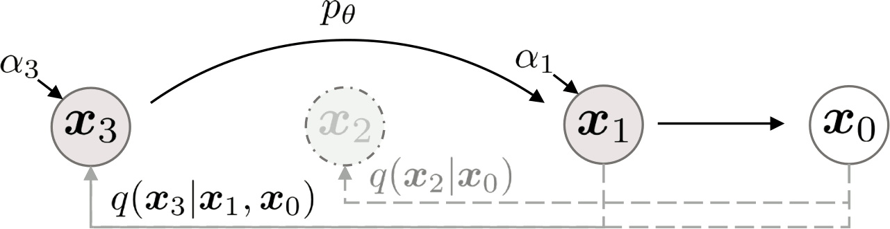

$$q_0(⁇→x_{t'} | ⁇→x_t, ⁇→x_0) = 𝓝\big(\sqrt{ᾱ_{t'}}⁇→x_0 + \sqrt{1-ᾱ_{t'}}\big(\tfrac{⁇→x_t - \sqrt{ᾱ_t}⁇→x_0}{\sqrt{1-ᾱ_t}}\big), ⇉0\big).$$

---
# Denoising Diffusion Implicit Models – Accelerated Sampling

We base our accelerated sampling algorithm on the “multistep” $q_0(⁇→x_{t'} | ⁇→x_t, ⁇→x_0)$.

~~~
Let $t_S=T, t_{S-1}, …, t_1$ be a subsequence of the process steps (usually,
a uniform subsequence of $T, …, 1$ is used). Starting from the initial
noise $⁇→x_T ∼ 𝓝(→0, ⇉I)$, we perform $S$ sampling steps for $i$ from
$S$ down to 1:

$$→x_{t_{i-1}} = \sqrt{ᾱ_{t_{i-1}}}\Big(\tfrac{→x_{t_i}-\sqrt{1-ᾱ_{t_i}}→ε_{→θ}(→x_{t_i}, t_i)}{\sqrt{ᾱ_{t_i}}}\Big) + \sqrt{1-ᾱ_{t_{i-1}}}→ε_{→θ}(→x_{t_i}, t_i).$$

~~~
The sampling procedure can be described in words as follows:
- using the current time step $t_i$, we compute the estimated
  noise $→ε_{→θ}(→x_{t_i}, t_i)$;
~~~
- by utilizing the current signal rate $\sqrt{ᾱ_{t_i}}$ and noise
  rate $\sqrt{1-ᾱ_{t_i}}$, we estimate $⁇→x_0$;
~~~
- we obtain $→x_{t_{i-1}}$ by combining the estimated signal $⁇→x_0$ and
  noise $→ε_{→θ}(→x_{t_i}, t_i)$ using the signal and noise rates of the time
  step $t_{i-1}$.

---
# DDIM – Accelerated Sampling Examples

---
section: StableDiffusion
# Stable Diffusion – Semantic and Perceptual Compression

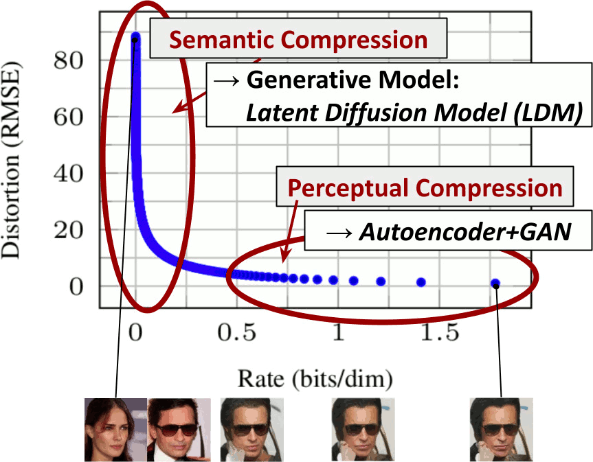

---
# Stable Diffusion – Architecture

---
section: NCSN
class: dbend
# Score Matching

Recall that loglikelihood-based models explicit represent the density
function, commonly using an unnormalized probabilistic model
$$p_{→θ}(⁇→x) = \frac{e^{f_{→θ}(⁇→x)}}{Z_{→θ}},$$
and it is troublesome to ensure the tractability of the normalization constant
$Z_{→θ}$.

~~~
One way how to avoid the normalization is to avoid the explicit density
$p_{→θ}(⁇x)$, and represent a **score function** instead, where the score
function is the gradient of the log density:
$$s_{→θ}(⁇→x) = ∇_{⁇→x} \log p_{→θ}(⁇→x),$$

~~~
because
$$s_{→θ}(⁇→x) = ∇_{⁇→x} \log p_{→θ}(⁇→x) = ∇_{⁇→x} \log \frac{e^{f_{→θ}(⁇→x)}}{Z_{→θ}} = ∇_{⁇→x} f_{→θ}(⁇→x) - \underbrace{∇_{⁇→x} \log Z_{→θ}}_0 = ∇_{⁇→x} f_{→θ}(⁇→x).$$

---
class: dbend
# Langevin Dynamics

When we have a score function $∇_{⁇→x} \log p_{→θ}(⁇→x)$, we can use it to
perform sampling from the distribution $p_{→θ}(⁇→x)$ by using **Langevin
dynamics**, which is an algorithm akin to SGD, but performing sampling
instead of optimum finding.
~~~
Starting with $⁇→x_0$, we iteratively set
$$⁇→x_{i+1} ← ⁇→x_i + ε∇_{⁇→x_i} \log p_{→θ}(⁇→x_i) + \sqrt{2ε}\,⁇→z_i,\textrm{~~where~~}→z_i ∼ 𝓝(→0, ⇉I).$$

~~~
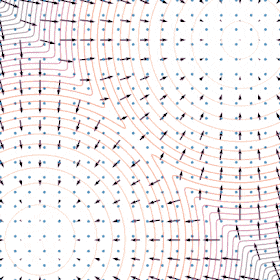

When $ε → 0$ and $K → ∞$, $⁇→x_K$ obtained by the Langevin dynamics
converges to a sample from the distribution $p_{→θ}(⁇→x)$.

---
class: dbend
# Score-Based Generative Modeling

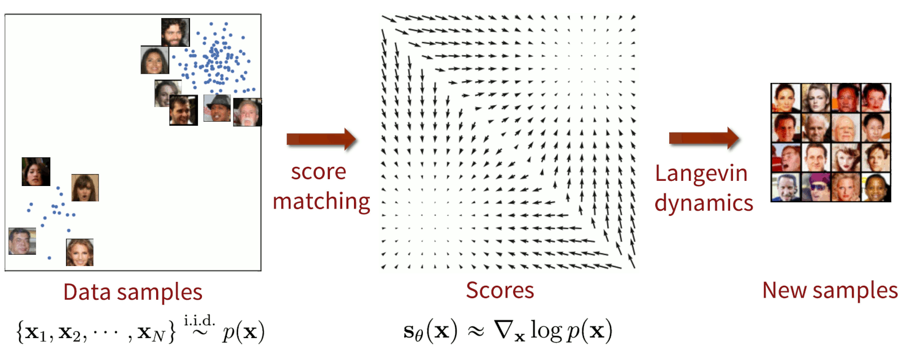

---
class: dbend
# Noise Conditional Score Network

However, estimating the score function from data is inaccurate
in low-density regions.

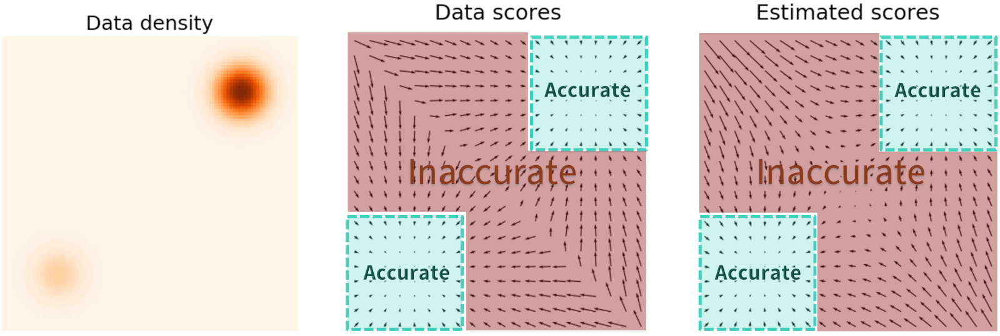

~~~
In order to accurately estimate the score function in low-density
regions, we perturb the data distribution by isotropic Gaussian noise
with various noise rates $σ_t$:
$$q_{σ_t}(⁇→x̃) ≝ 𝔼_{⁇→x ∼ p(⁇→x)} \big[𝓝(⁇→x̃; ⁇→x, {σ_t}^2 ⇉I)\big],$$
~~~
where the noise distribution $q_{σ_t}(⁇→x̃|⁇→x) = 𝓝(⁇→x̃;⁇→x, σ_t^2 ⇉I)$
as analogous to the forward process in the diffusion models.

---
class: dbend
style: .katex-display { margin: .8em 0 }
# Noise Conditional Score Network

To train the score function $→s_{→θ}(⁇→x, σ_t) = ∇_{⁇→x} \log q_{σ_t}(⁇→x)$, we need to minimize
the following objective:
$$𝔼_{t, ⁇→x̃ ∼ q_{σ_t}}\Big[\big\|→s_{→θ}(⁇→x̃, σ_t) - ∇_{⁇→x̃} \log q_{σ_t}(⁇→x̃)\big\|^2\Big].$$

~~~
It can be shown (see _P. Vincent: A connection between score matching and
denoising autoencoders_) that it is equivalent to minimize the _denoising score
matching_ objective:
$$𝔼_{t, ⁇→x ∼ p(⁇→x), ⁇→x̃ ∼ q_{σ_t}(⁇→x̃|⁇→x)}\Big[\big\|→s_{→θ}(⁇→x̃, σ_t) - ∇_{→x̃} \log q_{σ_t}(⁇→x̃|⁇→x)\big\|^2\Big].$$

~~~
In our case, $∇_{⁇→x̃} \log q_{σ_t}(⁇→x̃|⁇→x) = ∇_{⁇→x̃} \frac{-\|⁇→x̃-⁇→x\|^2}{2σ_t^2} = -\frac{⁇→x̃-⁇→x}{σ_t^2}$.
~~~
Because $⁇→x̃ = ⁇→x + σ_t ⁇→e$ for standard normal random variable $⁇→e ∼ 𝓝(→0,
⇉I)$, we can rewrite the objective to

$$𝔼_{t, ⁇→x ∼ p(⁇→x), ⁇→e ∼ 𝓝(→0, ⇉I)}\Big[\big\|→s_{→θ}(⁇→x+σ_t ⁇→e, σ_t) - \frac{-⁇→e}{σ_t}\big\|^2\Big],$$

so the score function basically estimates the noise given a noised image.

---
class: dbend
# Noise Conditional Score Network

Once we have trained the score function for various noise rates $σ_t$, we can
sample using annealed Langevin dynamics, where we utilize using gradually
smaller noise rates $σ_t$.

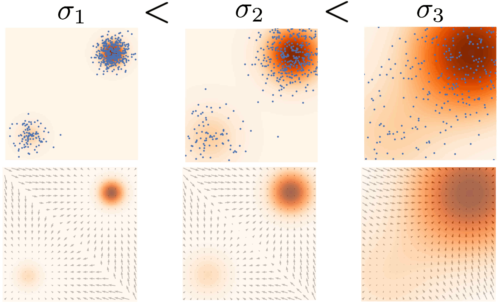

~~~
Such a procedure is reminiscent to the reverse diffusion process sampling.

---
section: Reading
# Development of GANs

- Martin Arjovsky, Soumith Chintala, Léon Bottou: **Wasserstein GAN** https://arxiv.org/abs/1701.07875
- Ishaan Gulrajani, Faruk Ahmed, Martin Arjovsky, Vincent Dumoulin, Aaron Courville: **Improved Training of Wasserstein GANs** https://arxiv.org/abs/1704.00028
- Tero Karras, Timo Aila, Samuli Laine, Jaakko Lehtinen: **Progressive Growing of GANs for Improved Quality, Stability, and Variation** https://arxiv.org/abs/1710.10196
- Takeru Miyato, Toshiki Kataoka, Masanori Koyama, Yuichi Yoshida: **Spectral Normalization for Generative Adversarial Networks** https://arxiv.org/abs/1802.05957
- Zhiming Zhou, Yuxuan Song, Lantao Yu, Hongwei Wang, Jiadong Liang, Weinan Zhang, Zhihua Zhang, Yong Yu: **Understanding the Effectiveness of Lipschitz-Continuity in Generative Adversarial Nets** https://arxiv.org/abs/1807.00751
- Andrew Brock, Jeff Donahue, Karen Simonyan: **Large Scale GAN Training for High Fidelity Natural Image Synthesis** https://arxiv.org/abs/1809.11096
- Tero Karras, Samuli Laine, Timo Aila: **A Style-Based Generator Architecture for Generative Adversarial Networks** https://arxiv.org/abs/1812.04948

---
# BigGAN

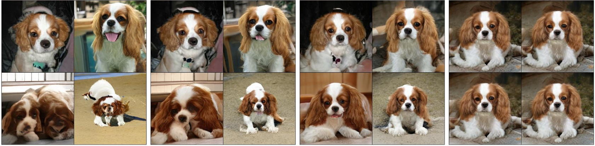

---
# BigGAN

---
# Development of VAEs

- Aaron van den Oord, Oriol Vinyals, Koray Kavukcuoglu: **Neural Discrete
  Representation Learning** https://arxiv.org/abs/1711.00937

- Ali Razavi, Aaron van den Oord, Oriol Vinyals: **Generating Diverse
  High-Fidelity Images with VQ-VAE-2** https://arxiv.org/abs/1906.00446

- Patrick Esser, Robin Rombach, Björn Ommer: **Taming Transformers for
  High-Resolution Image Synthesis** https://arxiv.org/abs/2012.09841

- Aditya Ramesh, Mikhail Pavlov, Gabriel Goh, Scott Gray, Chelsea Voss, Alec
  Radford, Mark Chen, Ilya Sutskever: **Zero-Shot Text-to-Image Generation**
  https://arxiv.org/abs/2102.12092

- Robin Rombach, Andreas Blattmann, Dominik Lorenz, Patrick Esser, Björn Ommer:
  **High-Resolution Image Synthesis with Latent Diffusion Models**
  https://arxiv.org/abs/2112.10752

---
# Development of Diffusion Models

- Yang Song, Stefano Ermon: **Generative Modeling by Estimating Gradients of the
  Data Distribution** https://arxiv.org/abs/1907.05600

- Jonathan Ho, Ajay Jain, Pieter Abbeel: **Denoising Diffusion Probabilistic
  Models** https://arxiv.org/abs/2006.11239

- Jiaming Song, Chenlin Meng, Stefano Ermon: **Denoising Diffusion Implicit
  Models** https://arxiv.org/abs/2010.02502

- Alex Nichol, Prafulla Dhariwal: **Improved Denoising Diffusion Probabilistic
  Models** https://arxiv.org/abs/2102.09672

- Prafulla Dhariwal, Alex Nichol: **Diffusion Models Beat GANs on Image
  Synthesis** https://arxiv.org/abs/2105.05233

- Robin Rombach, Andreas Blattmann, Dominik Lorenz, Patrick Esser, Björn Ommer:
  **High-Resolution Image Synthesis with Latent Diffusion Models**
  https://arxiv.org/abs/2112.10752

---
# SR3 Super-Resolution via Diffusion

- Chitwan Saharia, Jonathan Ho, William Chan, Tim Salimans, David J. Fleet, M. Norouzi:
  **Image Super-Resolution via Iterative Refinement** https://arxiv.org/abs/2104.07636

<video controls style="width: 84%">
   <source src="https://iterative-refinement.github.io/images/super_res_movie.m4v" type="video/mp4">
</video>

---
# Diffusion-Based Text-Conditional Image Generation

- Alex Nichol et al.: **GLIDE: Towards Photorealistic Image Generation and
  Editing with Text-Guided Diffusion Models** https://arxiv.org/abs/2112.10741

---
# Diffusion-Based Text-Conditional Image Generation

---
# Diffusion-Based Text-Conditional Image Generation

- Chitwan Saharia, William Chan, Saurabh Saxena, Lala Li, Jay Whang, et al.:
  **Photorealistic Text-to-Image Diffusion Models with Deep Language
  Understanding** https://arxiv.org/abs/2205.11487

---
# Normalizing Flows

- Laurent Dinh, David Krueger, Yoshua Bengio: **NICE: Non-linear Independent Components Estimation** https://arxiv.org/abs/1410.8516

- Laurent Dinh, Jascha Sohl-Dickstein, Samy Bengio: **Density estimation using Real NVP** https://arxiv.org/abs/1605.08803

- Diederik P. Kingma, Prafulla Dhariwal: **Glow: Generative Flow with Invertible 1x1 Convolutions** https://arxiv.org/abs/1807.03039

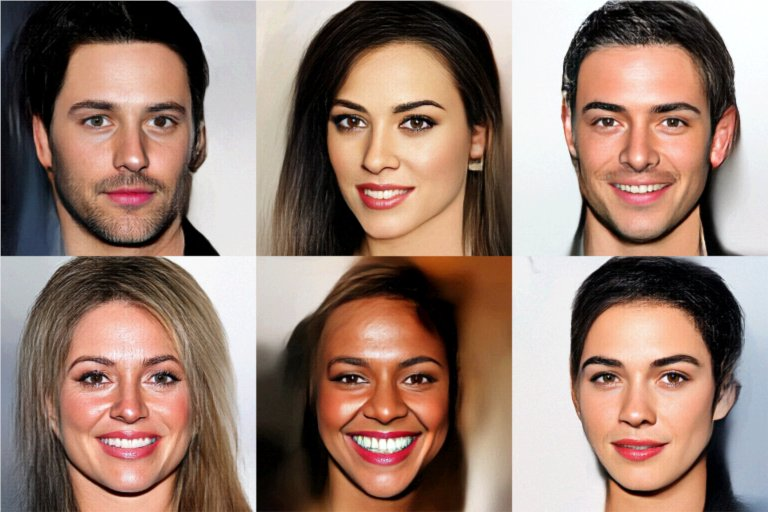
