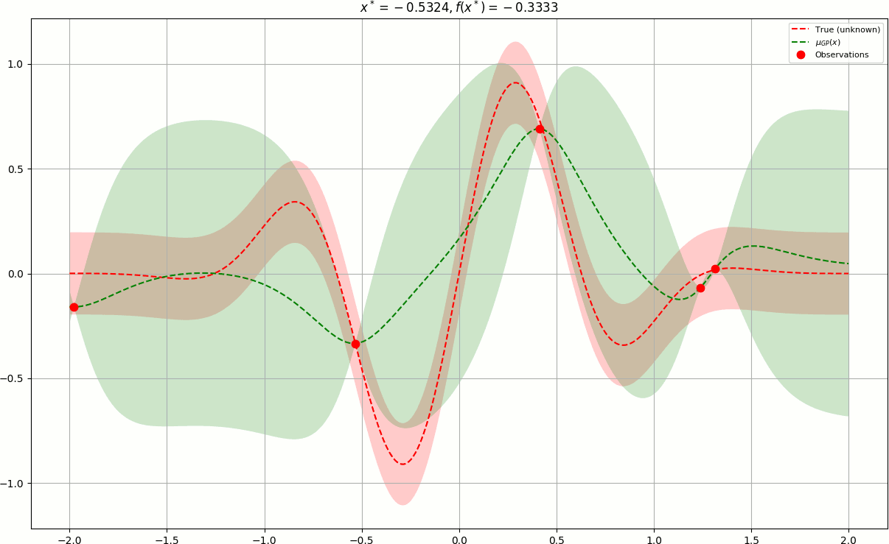
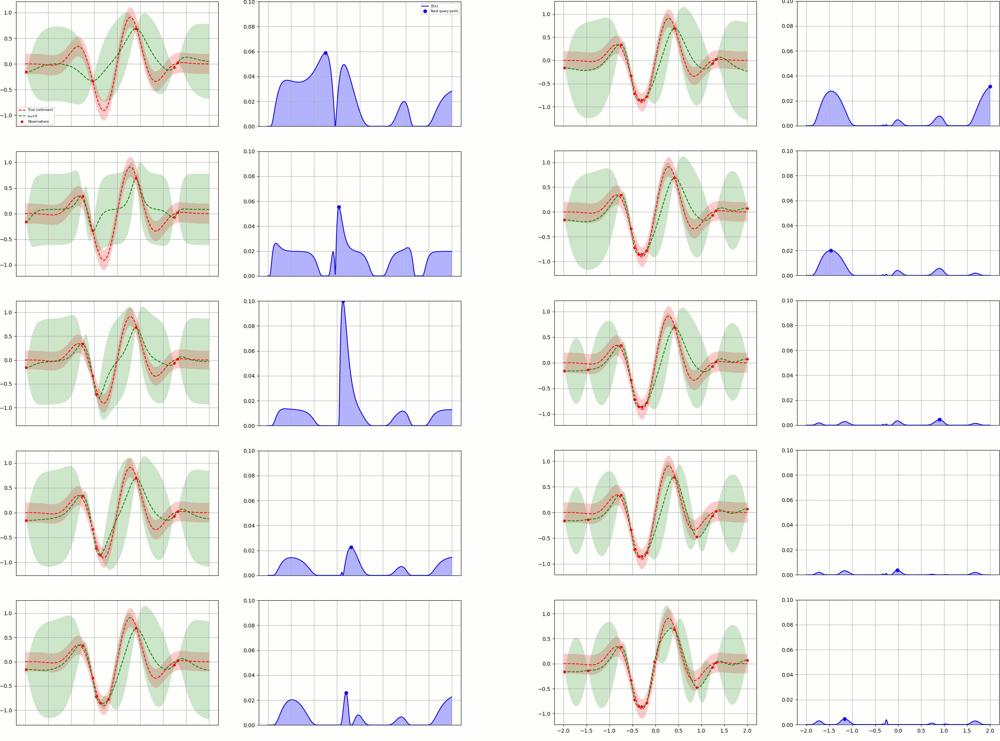
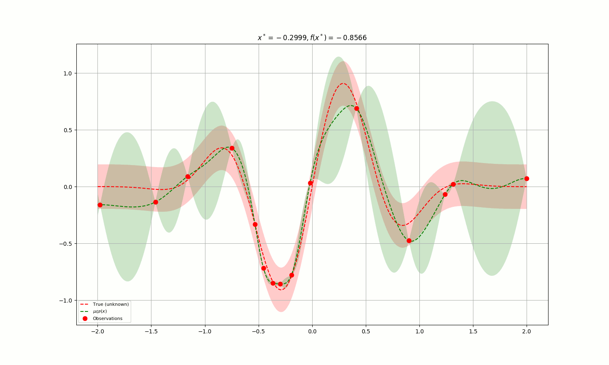
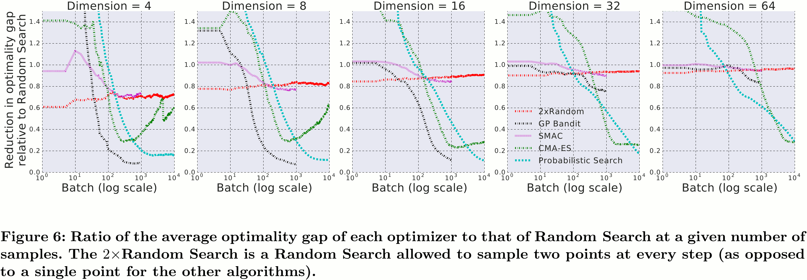
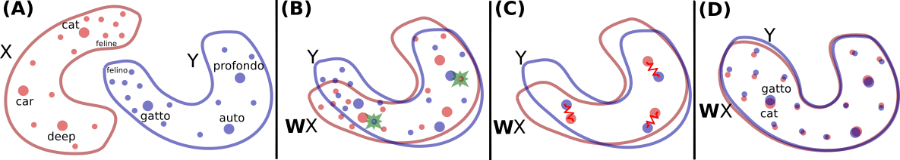

class: title
## NPFL114, Lecture 13

# Practical Methodology, TF Development, Advanced Architectures


.author[
Milan Straka
]

---
class: middle, center
# Practical Methodology

# Practical Methodology

---
# Hyperparameters Selection

- Grid search

--

- Random search

--

- Reinforcement learning


--

- Bayesian optimization using Gaussian processes

---
# Bayesian optimization using GP

Stochastic process $X\_\mathcal T$ is a _Gaussian process_ if for every finite set of indices
$t\_1, \ldots, t\_k$ from $\mathcal T$,
$$Y = (X\_{t\_1}, \ldots, X\_{t\_k})$$
is a multivariate Gaussian random variable.

---
# Bayesian optimization using GP

We model neural network loss function as a Gaussian process. Prior distribution
is usually parametrized using a Matérn 5/2 kernel
$K\_{M52}(x, x') = θ\_0 \left(1 + \sqrt{5}||x - x'||\_2 + \frac{5}{3}||x - x'||\_2^2\right)e^{-\sqrt{5}||x-x'||\_2}$.

--

The posterior distribution (i.e., distribution over all possible functions after
sampling several points of the loss function) can be computed in closed form.

--

We choose next candidates from the posterior using an _acquisition function_.
One of the commonly used ones is _expected improvement_:
$$→x\_\textit{next} = \argmax\_→x 𝔼[\max(\textit{best~solution~so~far} - \textit{model}(→x), 0)].$$
Luckily, such acquisition function can also be expressed in closed form.

---
class: middle
# Bayesian optimization using GP



---
class: center
# Bayesian optimization using GP



---
class: middle
# Bayesian optimization using GP



---
# Bayesian optimization using GP

No open-source _out of the box_ solution integrated with TensorFlow.

--

Google has Google Vizier (see _Google Vizier: A Service for Black-Box Optimization_ paper for description).

--

Implementation of GP minimization available in multiple packages, for example
`scikit-optimize` (`skopt.gp_minimize`), `GPyOpt`, and many others.

--



---
class: middle, center
# TF Development

# TF Development

---
# TF Eager

TF Eager mode discards (at least publicly) computation graphs and sessions; all
computations are performed immediately.

```python
import tensorflow.contrib.eager as tfe

tfe.enable_eager_execution()

print(tf.random_normal([2, 3]))
```

--

- Asynchronous mode in TF 1.8 and later.

---
# TF Eager

- Only object interface, not the functional one

```python
dense = tf.layers.Dense(10)

dense(input)
```

--

- helper classes for tracking layers (`tfe.Network` and `tf.keras.Model`):

```python
class CNN(tfe.Network):
    def __init__(self):
        super(CNN, self).__init__(name='')
        self.dense1 = self.track_layer(tf.layers.Dense(100))
        self.dense2 = self.track_layer(tf.layers.Dense(100))
    def call(self, inputs):
        inputs = self.dense1(inputs)
        return self.dense2(inputs)

cnn=CNN(); ...; print(cnn.variables)
```

---
# TF Eager

- Gradients are computed using explicit `tfe.GradientTape`:

```python
with tfe.GradientTape() as tape:
    logits = model(input)
    loss = tf.losses.sparse_softmax_cross_entropy(labels,
                                                  logits)

gradients = tape.gradients(loss, model.variables)
```

--

- Summaries only with the new interface `tensorflow.contrib.summary`.

--

- New interface for metrics `tfe.metrics`

```python
accuracy = tfe.metrics.Accuracy("test/accuracy")
for data in test_set:
    ...
    accuracy(gold_labels, predictions)

return accuracy.result() # Also generates a summary
```

---
# TF Eager

The eager mode is great for processing structured data like sentences/words/characters,
trees, graphs, …

However, it is unsuitable for many HW architectures (GPUs, TPUs, mobile phones, etc).


---
# TF Estimator

The `tf.estimator.Estimator` offers high-level API.

--

- Distributed computation.

--

- Dataset manipulation.

--

- Automatic summaries.

--

- checkpoints and restoration.

--

- Train, evaluation and predict modes.

--

- However, currently _not compatible_ with eager mode.

---
# TF Estimator

The `tf.estimator.Estimator` is created using a `model_fn`, `params` and many
options.

```python
def model_fn(features, labels, mode, params):
    images = features["images"]
    ...
    if mode == tf.estimator.ModeKeys.PREDICT:
        return tf.estimator.EstimatorSpec(
            mode=mode, predictions={"labels": predictions})
    ...
    if mode == tf.estimator.ModeKeys.TRAIN:
        return tf.estimator.EstimatorSpec(mode=mode,
        loss=loss, train_op=train_op, eval_metric_ops={
            "accuracy": tf.metrics.accuracy(labels,
                                            predictions)})
    ...
    if mode == tf.estimator.ModeKeys.EVAL:
        return tf.estimator.EstimatorSpec(mode=mode,
        loss=loss, eval_metric_ops={
            "accuracy": tf.metrics.accuracy(labels,
                                            predictions)})
```
---
# TF Estimator

- The individual operations are executed using `train`, `predict` and `evaluate`.

--

-  All these operations accept many hooks which can customize the behaviour.

--

- The input of these operations is taken from `input_fn`, which should return
  a `tf.data.Dataset` generating pairs `(features, labels)`, where `features`
  and `labels` can be either `Tensor`s, or dictionaries of `Tensor`s.

---
# tf.data API

The `tf.data.Dataset` represents a sequence of elements.

- Can be created from a source
    - `tf.data.Dataset.from_tensor_slices`,
    - `tf.data.Dataset.from_generator`
    - `tf.data.TextLineDataset`
    - `tf.data.TFRecordDataset`
- Can be generated by applying transformations to existing datasets
    - `tf.data.Dataset.shuffle`
    - `tf.data.Dataset.batch`
    - `tf.data.Dataset.repeat`
    - `tf.data.Dataset.{map, flat_map, filter}`
    - `tf.data.Dataset.prefetch`
    - many more

---
# tf.data API

The `tf.data.Iterator` allows iterating a dataset.

--

- The `Iterator.get_next()` returns an operation yielding next element (usually
  a batch).

--

- The simplest way to create an `Iterator` is `dataset.make_one_shot_iterator`.

--

- The iterator throws `tf.errors.OutOfRangeError` when reaching the end.

```python
for _ in range(episodes):
  iterator = dataset.make_one_shot_iterator()

  while True:
    try:
      sess.run(...)
    except tf.errors.OutOfRangeError:
      break

```
---
class: middle, center
# Advanced Architectures

# Advanced Architectures

---
class: middle
# WaveNet


---
class: middle
# WaveNet


---
class: middle
# WaveNet


---
class: middle
# WaveNet


---
# Word Translation Without Parallel Data



--

$$⇉W = \argmin\_{⇉W'} ||⇉W' ⇉X - ⇉Y||\_\mathrm F$$

--

Close form solution:
$$⇉W = ⇉U ⇉V^T,\textrm{~where~}⇉U⇉Σ⇉V^T = \operatorname{SVD}(⇉Y ⇉X^T)$$

--

However, such solution needs aligned data. Instead, we employ adversarian training.

---
class: middle
# Word Translation Without Parallel Data


---
class: middle
# Memory-augmented NNs


---
class: middle
# Memory-augmented NNs


---
class: center
# Memory-augmented NNs


